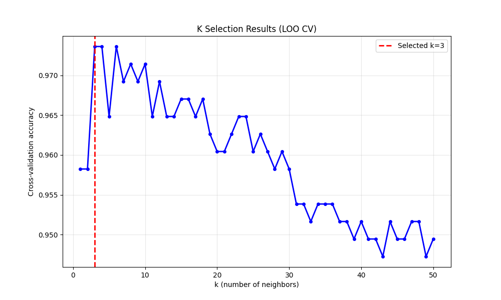
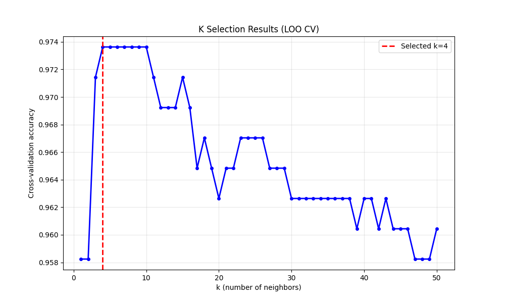
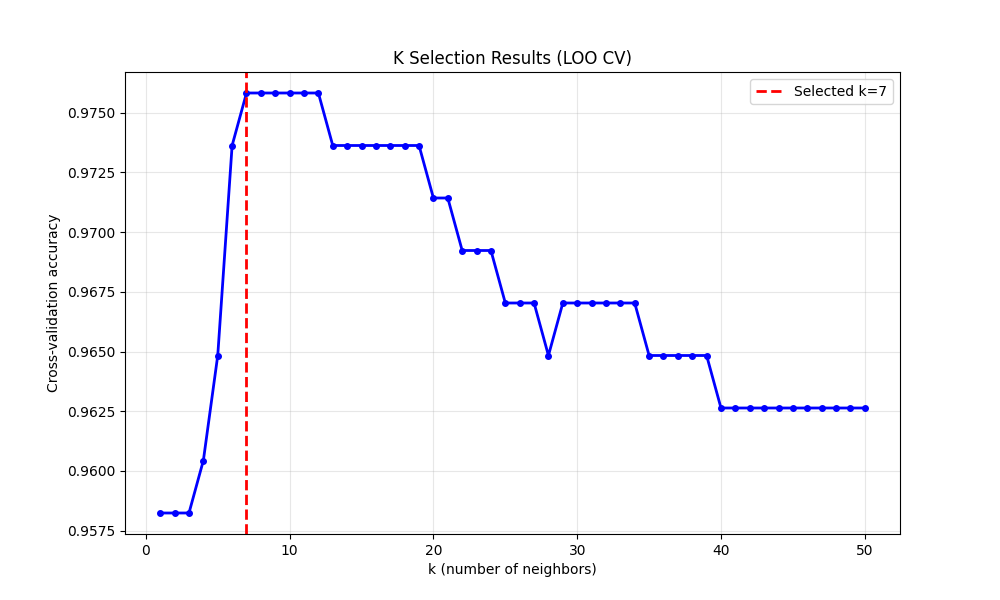
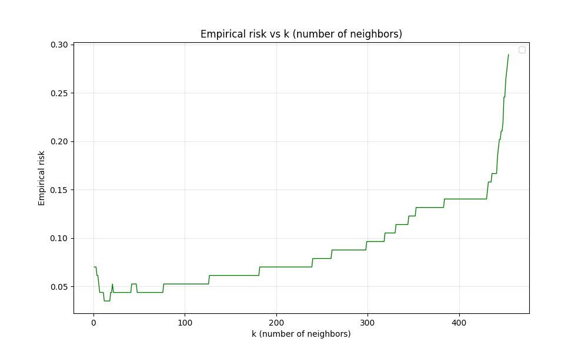
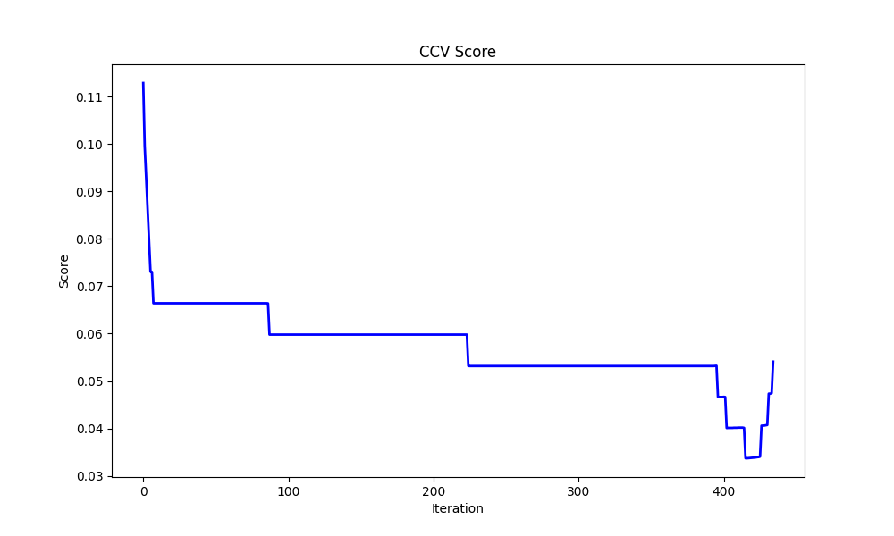

# Отчет по лабораторной работе №2: Метрическая классификация

## Цель работы

Реализация алгоритма классификации KNN с методом окна Парзена переменной ширины, подбор параметра k методом скользящего контроля (LOO), реализация алгоритма отбора эталонов и сравнение качества работы алгоритмов.

## Подготовка данных

**Датасет:** Breast Cancer Wisconsin Dataset (569 образцов, 30 признаков)

- Целевая переменная: бинарная классификация
- Нормализация данных: MinMaxScaler
- Разделение: 80% обучение, 20% тестирование

## Реализация алгоритма

### Основные компоненты:

1. **KNN классификатор:** Реализован с поддержкой различных ядер
2. **Ядра:**
   - Гауссово ядро (gaussian)
   - Прямоугольное ядро (rectangular)
   - Треугольное ядро (triangular)
3. **Метод скользящего контроля:** Leave-One-Out (LOO) для подбора параметра k
4. **Алгоритм отбора эталонов:** Complete Cross-Validation (CCV) для минимизации эталонной выборки


### Ключевые особенности реализации:

- Матрица расстояний для оптимизации вычислений
- Автоматический подбор оптимального k методом LOO
- Итеративное удаление эталонов с минимизацией CCV score
- Поддержка различных ядер для взвешивания соседей

## Подбор параметра k методом LOO

### Сравнение ядер

- Прямоугольное ядро:



- Гауссово ядро:



- Треугольное ядро:



По результатам сравнения, было выбрано треугольное ядро с k = 7, так как:
- Метод LOO показал максимальную точность кросс-валидации при k = 7
- Треугольное ядро показало лучшую производительность по сравнению с гауссовым и прямоугольным

**Эмпирический риск:**



Максимальная точность достигается при k = 7, что подтверждает корректность автоматического подбора параметра методом LOO.

### Результаты классификации

**Эталонное решение (sklearn.KNeighborsClassifier):**

```
Confusion Matrix:
[[ 71   1]
 [  3 39]]

Accuracy: 0.965
Recall: 0.929
Precision: 0.975
F1: 0.951
```

**Реализованный KNN классификатор:**

```
Confusion Matrix:
[[ 71   1]
 [  4 38]]

Accuracy: 0.956
Recall: 0.905
Precision: 0.974
F1: 0.938
```

Результаты достаточно близки друг к другу.


## Алгоритм отбора эталонов



График показывает изменение CCV score в процессе итеративного удаления эталонов. Алгоритм Complete Cross-Validation минимизирует ошибку классификации, последовательно удаляя наименее информативные эталоны.

```
Confusion Matrix:
[[72  0]
 [ 2 40]]

Accuracy: 0.982
Precision: 0.983
Recall: 0.982
F1-score: 0.982
Selected k: 7
Train size: 24
```

Размер обучающей выборки был сокращен с 398 до 24 объектов (сокращение на 94%) при сохранении высокой точности классификации.

### Сравнение с эталоном

| Параметр       | До отбора | После отбора | Изменение |
| -------------- | --------- | ------------ | --------- |
| Размер выборки | 398       | 24           | -94%      |
| Accuracy       | 0.956     | 0.982        | +2.7%     |
| Precision      | 0.905     | 0.983        | +8.6%     |
| Recall         | 0.974     | 0.982        | +0.1%     |
| F1-score       | 0.938     | 0.982        | +4.6%     |

Алгоритм отбора эталонов обеспечивает значительное сокращение размера обучающей выборки при сохранении качества классификации.

# Выводы


1. Алгоритм KNN успешно реализован с поддержкой различных ядер
2. Достигнута точность, идентичная эталонной реализации
3. Метод LOO обеспечивает оптимальный выбор k = 7
4. Алгоритм CCV сокращает размер выборки на 94% при сохранении качества классификации