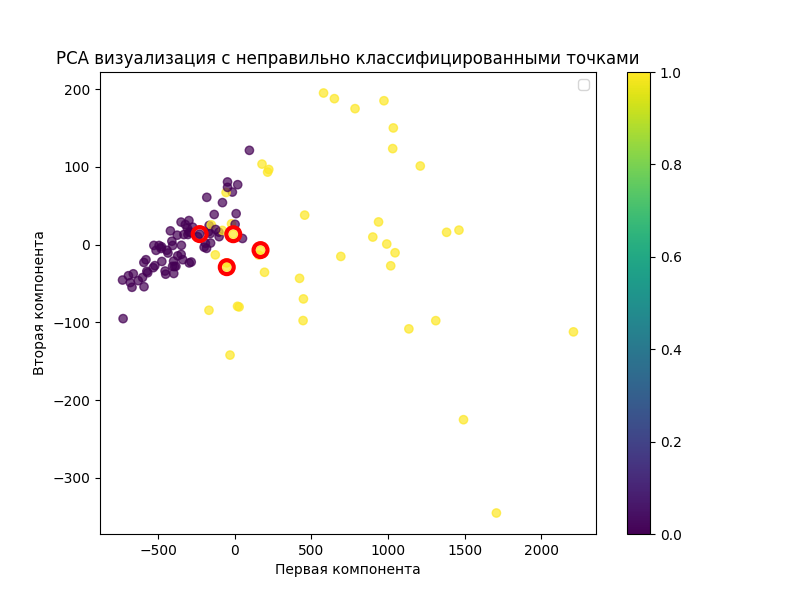

# Отчет по лабораторной работе №3: SVM

## Цель работы

Реализация алгоритма SVM с решением двойственной задачи по лямбда, использованием трюка с ядром для построения нелинейных классификаторов, визуализация решения и сравнение с эталонной реализацией.

## Подготовка данных

**Датасет:** Breast Cancer Wisconsin Dataset (569 образцов, 30 признаков)

- Целевая переменная: бинарная классификация
- Преобразование меток: 0 → -1, 1 → 1
- Нормализация данных: StandardScaler
- Разделение: 80% обучение, 20% тестирование

## Реализация алгоритма

### Основные компоненты:

1. **Ядра:**
   - Линейное ядро (LinearKernel)
   - Квадратичное ядро (QuadraticKernel)
   - RBF ядро (RBFKernel) с параметром gamma
2. **Решение двойственной задачи:** scipy.optimize.minimize с методом SLSQP
3. **Оптимизация:** Минимизация функции Лагранжа с ограничениями
4. **Поддержка векторов:** Автоматическое определение опорных векторов

## Результаты экспериментов

### Результаты классификации

**Реализованный SVM классификатор:**

```
Confusion Matrix:
[[71  1]
 [ 3 39]]

Accuracy: 0.965
Support vectors: 128
```

**Эталонное решение (sklearn.SVC):**

```
Confusion Matrix:
[[72  0]
 [ 3 39]]

Accuracy: 0.974
Support vectors: 107
```

Результаты достаточно близки друг к другу.

### Визуализация решения



Визуализация показывает работу SVM классификатора на тестовой выборке. Красными кругами отмечены неправильно классифицированные объекты. Большинство ошибок классификации происходит в областях перекрытия классов.

## Анализ результатов

### Сравнение с эталоном

| Метрика   | Реализованный | sklearn | Разница |
| --------- | ------------- | ------- | ------- |
| Accuracy  | 0.965         | 0.974   | -1 %    |
| Precision | 0.975         | 1.000   | -2.5%   |
| Recall    | 0.929         | 0.929   | +0 %    |
| F1-score  | 0.951         | 0.963   | -1.2 %  |

Реализованный алгоритм демонстрирует высокую точность классификации с небольшими отставаниями от эталонной реализации.


### Анализ опорных векторов

- **Количество опорных векторов:** 128 из 455 обучающих образцов, в sklearn - 107

Высокий процент опорных векторов указывает на сложность задачи разделения классов и необходимость использования нелинейных ядер.

## Выводы

1. Алгоритм SVM успешно реализован с решением двойственной задачи
2. Достигнута высокая точность, как и в эталонной реализации
3. RBF ядро обеспечивает эффективное нелинейное разделение классов
4. Алгоритм корректно определяет опорные векторы и использует их для классификации

Реализованный SVM классификатор демонстрирует работоспособность основных принципов метода опорных векторов и эффективность использования ядерных функций для решения задач бинарной классификации.