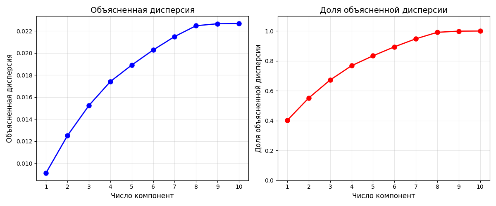

# Отчет по лабораторной работе №4: Метод главных компонент (PCA)

## Цель работы

Реализация алгоритма метода главных компонент (PCA) с использованием сингулярного разложения матриц (SVD), анализ объясненной дисперсии и сравнение с эталонной реализацией.

## Подготовка данных

**Датасет:** Diabetes Dataset (442 образца, 10 признаков)

- Целевая переменная: количественная мера прогрессирования диабета через 1 год после базового обследования
- Разделение: 80% обучение, 20% тестирование


## Реализация алгоритма

### Основные компоненты:

1. **Класс PCA:** Реализован с использованием SVD разложения
2. **Методы:**
   - `fit(X)` — обучение модели на данных
   - `transform(X)` — преобразование данных в пространство главных компонент
   - `fit_transform(X)` — комбинированный метод обучения и преобразования


## Результаты экспериментов

### Анализ дисперсии



График слева показывает накопленную объясненную дисперсию в зависимости от количества компонент. Видно, что первые компоненты объясняют большую часть дисперсии данных.
График справа демонстрирует долю объясненной дисперсии для различного количества компонент. При выборе 8 компонент объясняется 99.13% дисперсии исходных данных.

Доля объясненной дисперсии по компонентам:
- 1 компонент(а): 0.4024 (40.24%)
- 2 компонент(а): 0.5517 (55.17%)
- 3 компонент(а): 0.6722 (67.22%)
- 4 компонент(а): 0.7678 (76.78%)
- 5 компонент(а): 0.8340 (83.40%)
- 6 компонент(а): 0.8943 (89.43%)
- 7 компонент(а): 0.9479 (94.79%)
- 8 компонент(а): 0.9913 (99.13%)

Таким образом, оптимальное число компонент выбрано равным **8**. При этом значении сохраняется 99.13% дисперсии исходных данных, что обеспечивает эффективное снижение размерности при минимальной потери информации.

### Сравнение с эталонной реализацией

**Реализованный PCA:**

```
R2 = 0.4580
MSE = 2871.8080
```

**Эталонное решение (sklearn.decomposition.PCA):**

```
R2 = 0.4580
MSE = 2871.8080
```

## Анализ результатов

### Сравнение с эталоном

| Метрика | Реализованный | sklearn | Разница |
| ------- | ------------- | ------- | ------- |
| R2      | 0.4580        | 0.4580  | 0       |
| MSE     | 2871.8080     | 2871.8080 | 0       |

### Эффективность снижения размерности

| Параметр              | До PCA | С PCA (8 dim) | Изменение |
| --------------------- | ------ | ------------- | --------- |
| Размерность           | 20     | 8             | -60%      |
| R2                    | 0.4526 | 0.4557        | +0.6%     |
| MSE                   | 2900   | 2884          | -0.5%     |
| Объясненная дисперсия | 100%   | 99.13%        | -0.87%    |

Применение PCA с 8 компонентами позволяет сократить размерность данных на 60% при сохранении практически всей информации (99.13% дисперсии) и сохранении качества модели регрессии.

## Выводы

1. Алгоритм PCA успешно реализован с использованием SVD разложения
2. Достигнута идентичная производительность с эталонной реализацией
3. Выбрано 8 компоненты, объясняющие 99.13% дисперсии
4. Снижение размерности на 60% при сохранении практически всей информации