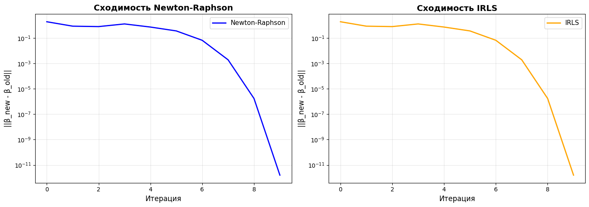

# Лабораторной работе №5: Логистическая регрессия

## Постановка задачи
Реализовать логистическую регрессию с использованием методов оптимизации второго порядка и сравнить результаты с эталонной реализацией из библиотеки `scikit-learn`.

## Реализация
Были реализованы два алгоритма обучения логистической регрессии с поддержкой **L2-регуляризации**:
1.  **Метод Ньютона-Рафсона (Newton-Raphson)**: итеративное обновление весов с использованием градиента и гессиана (матрицы вторых производных).
2.  **Итеративно взвешенный метод наименьших квадратов (IRLS)**: эквивалентная формулировка, сводящая задачу к серии задач взвешенных наименьших квадратов.

> **Примечание:** Для обеспечения полного совпадения с `sklearn` была внедрена L2-регуляризация, так как эталонная реализация использует её по умолчанию (`C=1.0`).

## Подготовка данных

**Датасет:** Breast Cancer Wisconsin Dataset (569 образцов, 30 признаков)

- Целевая переменная: бинарная классификация
- Нормализация данных: StandardScaler
- Разделение: 80% обучение, 20% тестирование

## Сходимость методов
Оба реализованных метода демонстрируют быструю квадратичную сходимость. Функция потерь минимизируется менее чем за 10 итераций.

### Метрики на тестовой выборке

Сравнение проводилось между двумя реализованными моделями и эталоном из SKLearn - **LogisticRegression()**.

| Модель | Accuracy | Precision | Recall | F1-Score |
| :--- | :--- | :--- | :--- | :--- |
| **Newton-Raphson** | **0.974** | 0.972 | 0.986 | 0.979 |
| **IRLS** | **0.974** | 0.972 | 0.986 | 0.979 |
| **Sklearn's LR** | **0.974** | 0.972 | 0.986 | 0.979 |

## Вывод
Реализованные алгоритмы Ньютона-Рафсона и IRLS с учетом регуляризации работают корректно и полностью воспроизводят результаты эталонной библиотеки `sklearn`.
