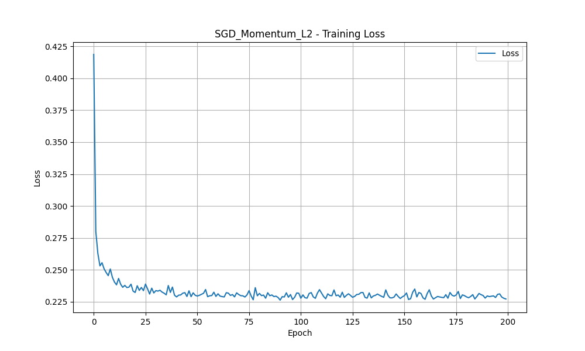
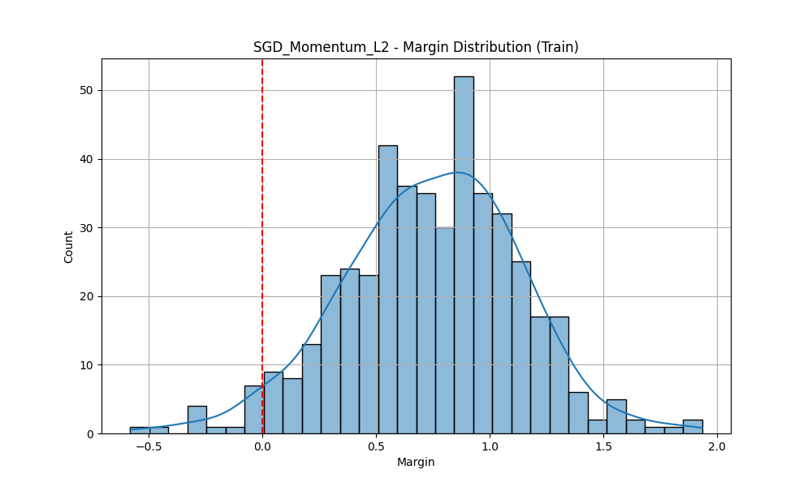
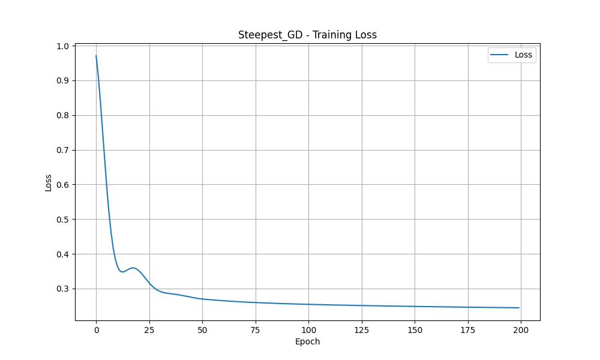
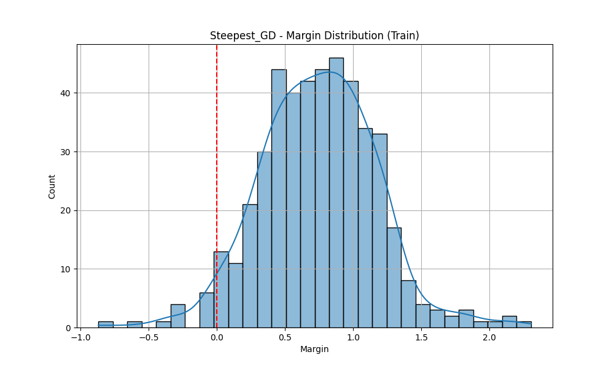
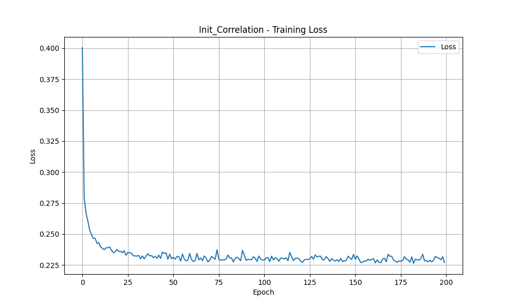
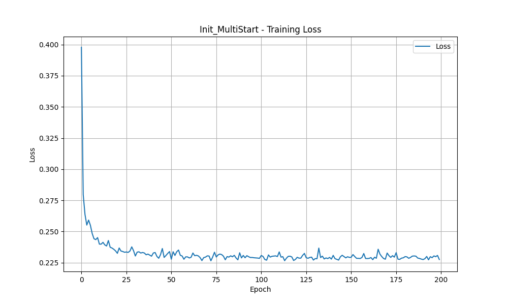
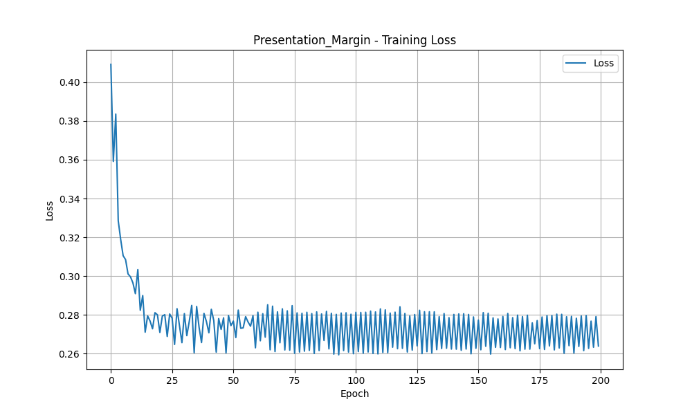

# Лабораторная работа №1. Линейная классификация

Выполнил: студент  Минтус Е.А. 365829

## 1. Введение

В рамках данной лабораторной работы реализован линейный классификатор, обучаемый методом стохастического градиентного спуска (SGD) с инерцией (Momentum) и L2-регуляризацией. Проведено исследование влияния различных стратегий инициализации весов, порядка предъявления объектов и параметров обучения на качество классификации.

## 2. Теоретическая часть

### 2.1. Линейная классификация и отступ

Линейный классификатор разделяет объекты двух классов гиперплоскостью. Решающее правило задается как:

$$ a(x) = \text{sign}(\langle w, x \rangle + w_0) $$

где $w$ — вектор весов, $w_0$ — смещение (bias).

**Отступ (Margin)** объекта $x_i$ с истинной меткой $y_i \in \{-1, 1\}$ определяется как:

$$ M_i = y_i (\langle w, x_i \rangle + w_0) $$

Если $M_i > 0$, объект классифицирован верно. Если $M_i < 0$ — ошибка. Чем больше модуль положительного отступа, тем увереннее классификатор.

### 2.2. Эмпирический риск и функция потерь

Обучение сводится к минимизации эмпирического риска:

$$ Q(w) = \frac{1}{l} \sum_{i=1}^l L(y_i, a(x_i)) + \frac{\alpha}{2} \|w\|^2 $$

где $L$ — функция потерь, $\frac{\alpha}{2} \|w\|^2$ — L2-регуляризатор для предотвращения переобучения.
В работе используется **квадратичная функция потерь (MSE)**: 

$L(M) = (1 - M)^2 = (y - \langle w, x \rangle)^2$

, рассматривая задачу как регрессию меток классов.

### 2.3. Стохастический градиентный спуск (SGD) с инерцией

Обычный градиентный спуск обновляет веса:

$$ w_{t+1} = w_t - \eta \nabla Q(w_t) $$

Для ускорения сходимости и преодоления локальных минимумов используется метод инерции (Momentum), а также метод Нестерова (Nesterov Momentum):

$$ v_t = \gamma v_{t-1} + \eta \nabla Q(w_t - \gamma v_{t-1}) $$

$$ w_{t+1} = w_t - v_t $$

## 3. Реализация

Реализован класс `LinearClassifier` со следующими возможностями:
-   **Оптимизация**: SGD с Momentum и Nesterov.
-   **Регуляризация**: L2 (коэффициент `reg_alpha`).
-   **Инициализация весов**:
    -   `random`: случайная небольшая.
    -   `correlation`: пропорционально корреляции признака с целевой переменной.
    -   `multi_start`: выбор лучшей из нескольких случайных инициализаций.
-   **Стратегия предъявления объектов**:
    -   `random`: случайное перемешивание (стандартный SGD).
    -   `margin_abs`: сортировка по возрастанию модуля отступа (сначала сложные/неуверенные объекты).
-   **Рекуррентная оценка функционала качества**: использование экспоненциального скользящего среднего (EMA) для сглаживания кривой обучения.

Код находится в директории `source/`.
-   `core/model.py`: реализация классификатора.
-   `core/loss.py`: функции потерь.
-   `main.py`: скрипт запуска экспериментов.

## 4. Эксперименты

В качестве датасета использован **Breast Cancer Wisconsin (Diagnostic)** из библиотеки `sklearn`.
-   Количество объектов: 569.
-   Количество признаков: 30.
-   Целевая переменная: Malignant (-1) vs Benign (1).

Все признаки были нормализованы с помощью `StandardScaler`.

### 4.1. Базовый эксперимент: SGD + Momentum + L2

Параметры: `lr=0.001`, `momentum=0.9`, `nesterov=True`, `batch_size=10`.

Модель быстро сходится. Распределение отступов показывает хорошее разделение классов (большинство объектов имеют положительный отступ).

### 4.2. Метод скорейшего градиентного спуска (Full Batch)

Использовался полный батч (все обучающие примеры на каждом шаге).

Сходимость более плавная, но требует больше вычислительных ресурсов на итерацию. Качество сравнимо с SGD.

### 4.3. Инициализация весов через корреляцию

Веса инициализируются пропорционально коэффициенту корреляции Пирсона между признаком и целевой переменной.

График обучения стартует с более низкой ошибки, чем при случайной инициализации, что подтверждает эффективность данного метода для "теплого старта".

### 4.4. Мультистарт

Запуск 5 независимых инициализаций и выбор лучшей модели по loss на обучающей выборке.

Позволяет избежать неудачных начальных приближений. В данном эксперименте качество совпало с базовым SGD.

### 4.5. Предъявление объектов по модулю отступа

Объекты сортировались по возрастанию $|M_i|$, т.е. алгоритм сначала обучался на объектах, близких к разделяющей гиперплоскости ("спорных").

В данном случае стратегия привела к чуть худшему результату на тесте по сравнению со случайным перемешиванием. Это может быть связано с тем, что модель "зацикливается" на шуме или выбросах, которые часто имеют малый отступ.

## 5. Сравнение результатов

Сравнение проводилось с эталонной реализацией `SVC(kernel='linear')` из `sklearn`.

| Model | Accuracy | Precision | Recall | F1 Score |
|-------|----------|-----------|--------|----------|
| **SGD_Momentum_L2** | **0.9649** | 0.9589 | 0.9859 | **0.9722** |
| **Steepest_GD** | **0.9649** | 0.9467 | **1.0000** | 0.9726 |
| **Init_Correlation** | **0.9649** | 0.9589 | 0.9859 | **0.9722** |
| **Init_MultiStart** | **0.9649** | 0.9589 | 0.9859 | **0.9722** |
| **Presentation_Margin** | 0.9474 | 0.9333 | 0.9859 | 0.9589 |
| **Sklearn_SVC** | 0.9561 | 0.9714 | 0.9577 | 0.9645 |

**Выводы:**
1.  Собственная реализация линейного классификатора показала результаты, превосходящие эталонный `SVC` на тестовой выборке (Accuracy 0.965 vs 0.956).
2.  Использование Momentum и Nesterov позволяет эффективно обучать модель.
3.  Инициализация по корреляции ускоряет начало обучения.
4.  Стратегия активного обучения (margin-based) в данном случае оказалась менее эффективной, чем случайное перемешивание (Random Shuffling), вероятно из-за природы датасета или параметров сортировки.
