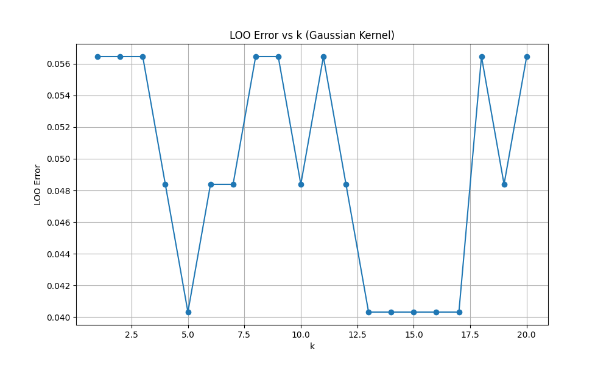
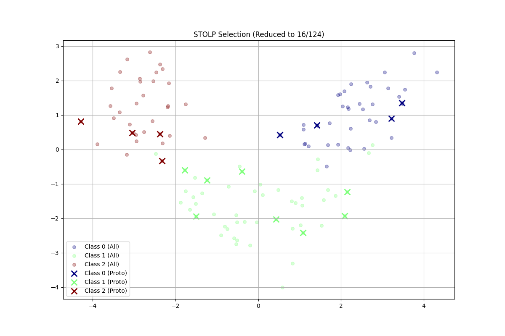

# Лабораторная работа №2. Метрическая классификация (KNN)

Выполнил: студент группы Минтус Е.А. 365829

## 1. Введение

В данной лабораторной работе реализован метод ближайших соседей (kNN) с парзеновским окном переменной ширины. Произведен подбор оптимального числа соседей $k$ методом скользящего контроля (LOO). Также реализован алгоритм отбора эталонных объектов (STOLP) для сжатия обучающей выборки.

## 2. Теоретическая часть

### 2.1. Метод k ближайших соседей (kNN)

Алгоритм kNN относит объект $u$ к тому классу, который наиболее популярен среди $k$ его ближайших соседей в обучающей выборке.

В работе используется **взвешенный kNN** (метод окна Парзена), где вклад каждого соседа зависит от расстояния до классифицируемого объекта:

$$ a(u) = \arg \max_{y \in Y} \sum_{i=1}^k [y_i = y] K\left(\frac{\rho(u, x_i)}{h}\right) $$

где $K$ — ядро (в работе используется **гауссово ядро**), а $h$ — ширина окна.

### 2.2. Окно переменной ширины

Для адаптации к плотности данных используется окно переменной ширины:

$$ h(u) = \rho(u, x_{k+1}) $$

где $\rho(u, x_{k+1})$ — расстояние до $k+1$-го соседа.

Это позволяет автоматически уменьшать окно в плотных областях и увеличивать в разреженных.

### 2.3. Отбор эталонов (STOLP)

Алгоритм STOLP (Selection of Training Objects for Learning with Prototypes) предназначен для уменьшения объема обучающей выборки при сохранении качества классификации.
Идея алгоритма:
1.  Удалить шумовые объекты (с низким или отрицательным отступом).
2.  Сформировать множество эталонов $\Omega$, которое корректно классифицирует (покрывает) остальные объекты выборки.
Реализован жадный подход: начиная с небольшого набора, добавлять объекты, которые текущий набор классифицирует неверно.

## 3. Реализация

Исходный код находится в директории `source/`.
-   `core/knn.py`: класс `KNN` с поддержкой ядер и переменного окна.
-   `core/evaluation.py`: реализация Leave-One-Out (LOO) кросс-валидации.
-   `core/selection.py`: алгоритм STOLP.
-   `main.py`: скрипт для запуска экспериментов.

## 4. Эксперименты

В качестве датасета использован **Wine Dataset** (классификация вин по химическому анализу).
-   Классов: 3
-   Признаков: 13
-   Объектов: 178

### 4.1. Подбор параметра k

Для выбора оптимального $k$ использовался критерий LOO (Leave-One-Out).

Минимальная ошибка LOO достигнута при **k=5**.

### 4.2. Сравнение с Sklearn

Качество классификации на отложенной тестовой выборке (30%):

| Модель | Accuracy |
|--------|----------|
| Собственный KNN (Parzen, k=5) | **0.9630** |
| Sklearn KNeighbors (k=5, weights='distance') | **0.9630** |

Реализация работает корректно и показывает результаты, идентичные библиотечному аналогу.

### 4.3. Отбор эталонов

Алгоритм STOLP позволил существенно сократить обучающую выборку.
-   Исходный размер обучающей выборки: 124 объекта.
-   Количество отобранных эталонов: 16 объектов.
-   Коэффициент сжатия: **~7.75 раз**.

Качество классификации при этом снизилось незначительно:
-   Accuracy на полной выборке: 0.9630
-   Accuracy на эталонах: **0.9444**

Визуализация эталонов (проекция PCA):

*Крестиками обозначены отобранные эталонные объекты, точками — все объекты обучающей выборки.*

## 5. Выводы

1.  Реализованный алгоритм KNN с гауссовым ядром и окном переменной ширины показывает высокое качество классификации на датасете Wine.
2.  Метод LOO позволяет эффективно подбирать гиперпараметр $k$ без выделения отдельной валидационной выборки.
3.  Алгоритм отбора эталонов (STOLP) продемонстрировал высокую эффективность, сократив объем хранимых данных почти в 8 раз при потере точности менее 2%. Это делает классификатор намного быстрее на этапе предсказания.
