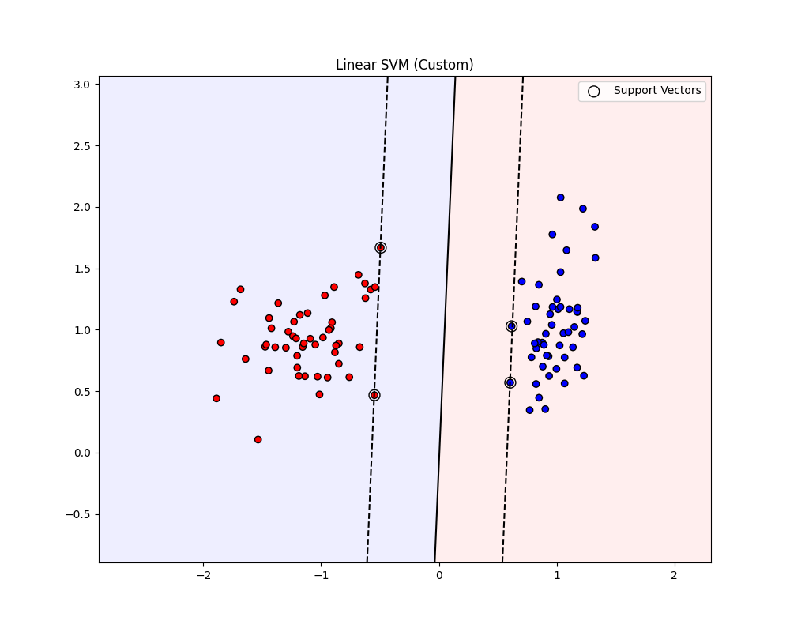
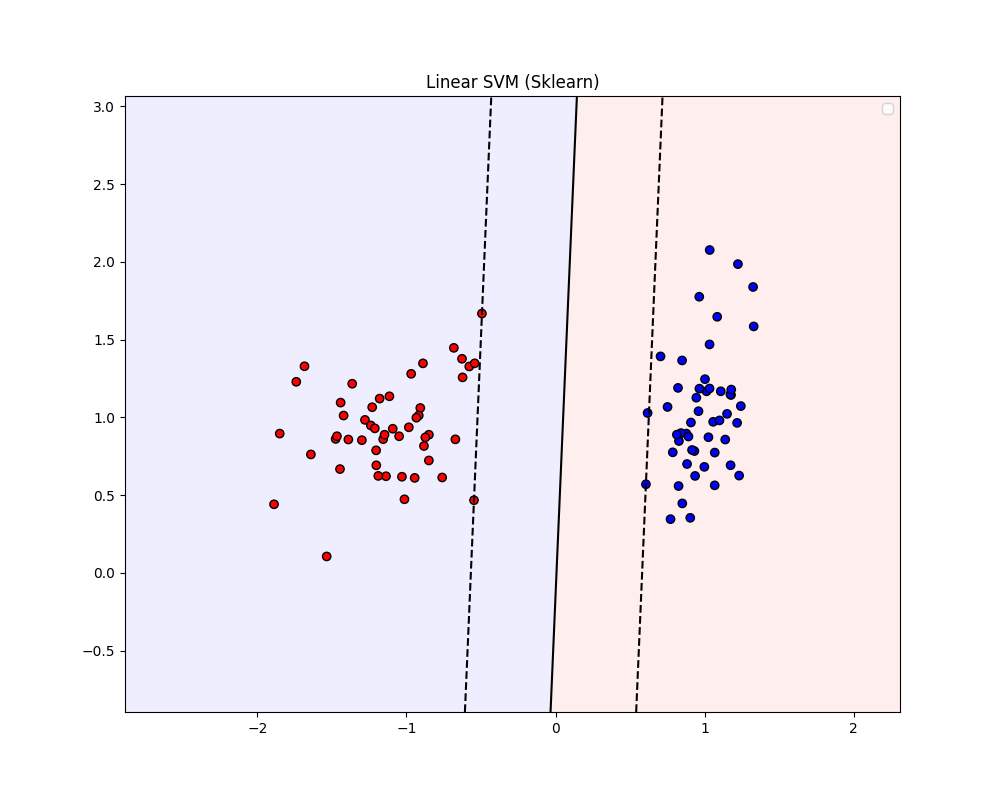
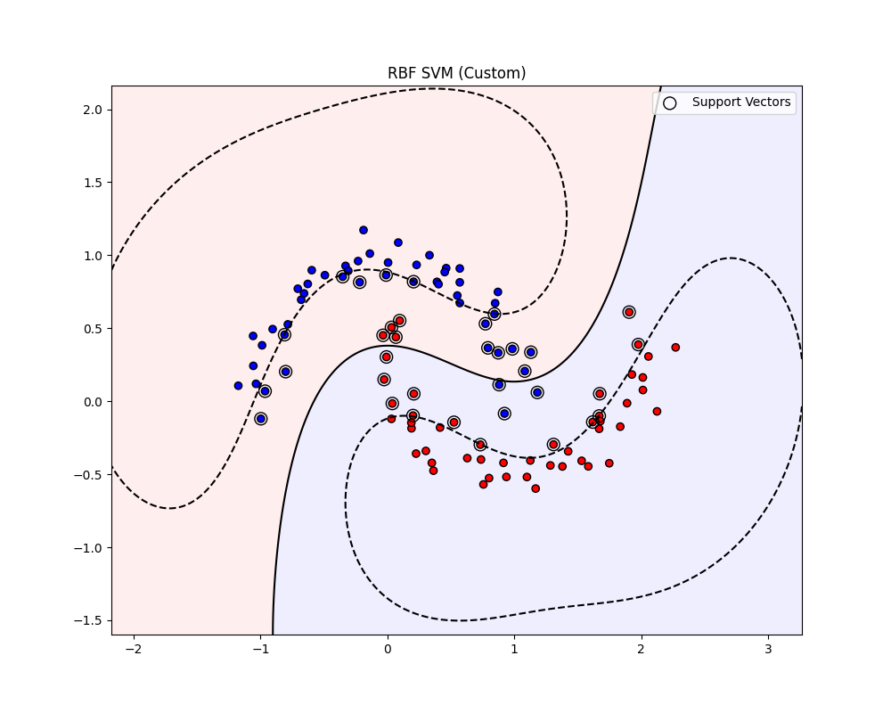
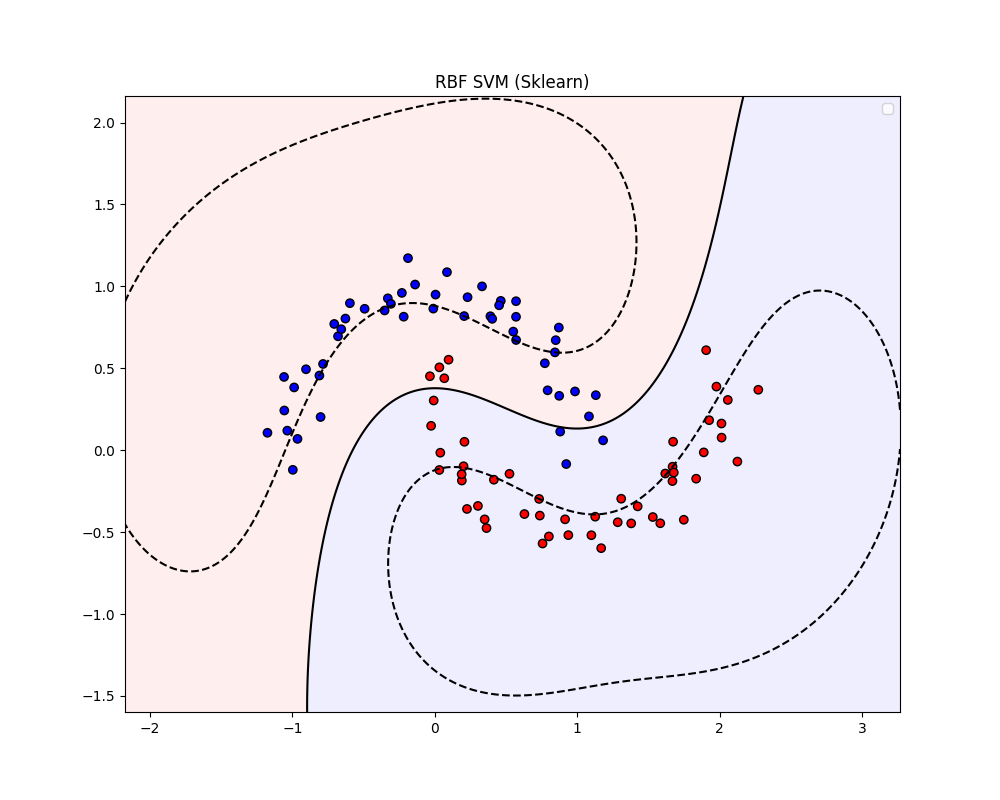

# Лабораторная работа №3. Метод опорных векторов (SVM)

Выполнил: студент группы Минтус Е.А. 365829

## 1. Введение

В данной лабораторной работе реализован метод опорных векторов (SVM) для задачи бинарной классификации. Решение двойственной задачи квадратичного программирования выполнено с использованием библиотеки `scipy.optimize`. Также реализован "kernel trick" для построения нелинейных разделяющих поверхностей (полиномиальное и RBF ядра).

## 2. Теоретическая часть

### 2.1. Постановка задачи

SVM строит разделяющую гиперплоскость $ \langle w, x \rangle + b = 0 $, максимизируя отступ между классами.
Двойственная задача оптимизации (Dual Problem) формулируется относительно множителей Лагранжа $\alpha$:

$$ \max_{\alpha} \left( \sum_{i=1}^l \alpha_i - \frac{1}{2} \sum_{i,j=1}^l \alpha_i \alpha_j y_i y_j K(x_i, x_j) \right) $$

при ограничениях:
1. $0 \le \alpha_i \le C$ (для Soft Margin SVM)
2. $\sum_{i=1}^l \alpha_i y_i = 0$

Здесь $K(x_i, x_j)$ — функция ядра. Вектор весов восстанавливается как 

$w = \sum \alpha_i y_i x_i$

(только для линейного ядра), а смещение $b$ вычисляется по опорным векторам.

### 2.2. Ядра (Kernels)

Для разделения линейно неразделимых данных пространство исходных признаков отображается в спрямляющее пространство большей размерности.
Используемые ядра:
*   **Линейное**: $K(x, z) = \langle x, z \rangle$
*   **Полиномиальное**: $K(x, z) = (\langle x, z \rangle + c)^d$
*   **Радиально-базисное (RBF)**: $K(x, z) = \exp(-\gamma \|x - z\|^2)$

## 3. Реализация

Исходный код находится в директории `source/`.
-   `core/svm.py`: класс `SVM`, реализующий обучение через `scipy.optimize.minimize` (алгоритм SLSQP).
-   `core/kernels.py`: реализации функций ядер.
-   `main.py`: скрипт для запуска экспериментов и визуализации.

## 4. Эксперименты

### 4.1. Линейно разделимые данные

Использован синтетический датасет `make_classification`.

**Собственная реализация Linear SVM:**

**Sklearn Linear SVC:**

Обе реализации построили идентичную разделяющую гиперплоскость и выделили одинаковое количество опорных векторов.

### 4.2. Нелинейные данные (Make Moons)

Использован датасет "Два полумесяца", который невозможно разделить линейно. Применено RBF ядро ($\gamma=0.5$).

**Собственная реализация RBF SVM:**

**Sklearn RBF SVC:**

Решения визуально совпадают. Нелинейная граница корректно огибает классы.

### 4.3. Сравнение метрик

| Dataset | Model | Accuracy | Support Vectors |
|---------|-------|----------|-----------------|
| Linear | Custom SVM | 1.00 | 4 |
| Linear | Sklearn SVC | 1.00 | 4 |
| Moons (RBF) | Custom SVM | 0.93 | 35 |
| Moons (RBF) | Sklearn SVC | 0.93 | 35 |

## 5. Выводы

1.  Реализованный алгоритм SVM корректно решает двойственную задачу оптимизации и находит оптимальную разделяющую гиперплоскость.
2.  Использование ядер (Kernel Trick) позволяет успешно классифицировать данные сложной структуры (как в примере с Moons).
3.  Результаты собственной реализации полностью совпадают с эталонной реализацией `sklearn.svm.SVC` как по точности, так и по числу опорных векторов.
