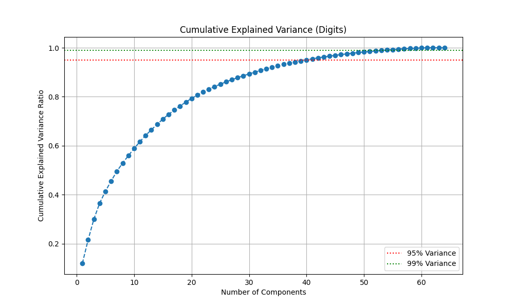
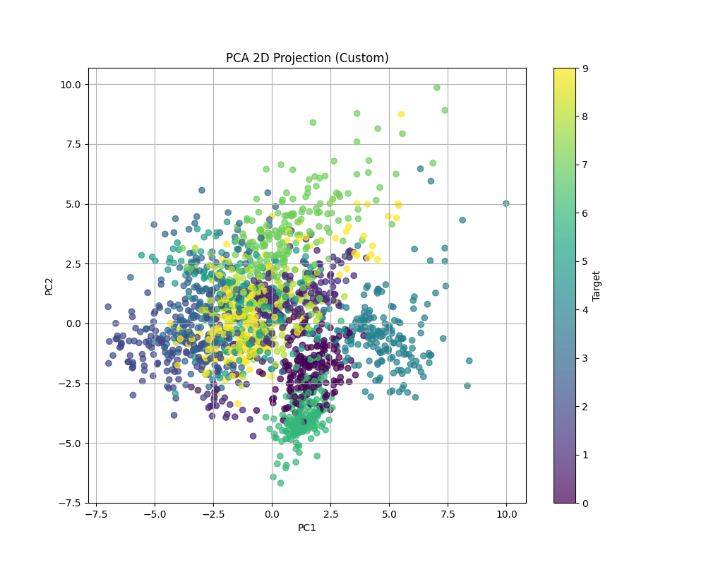
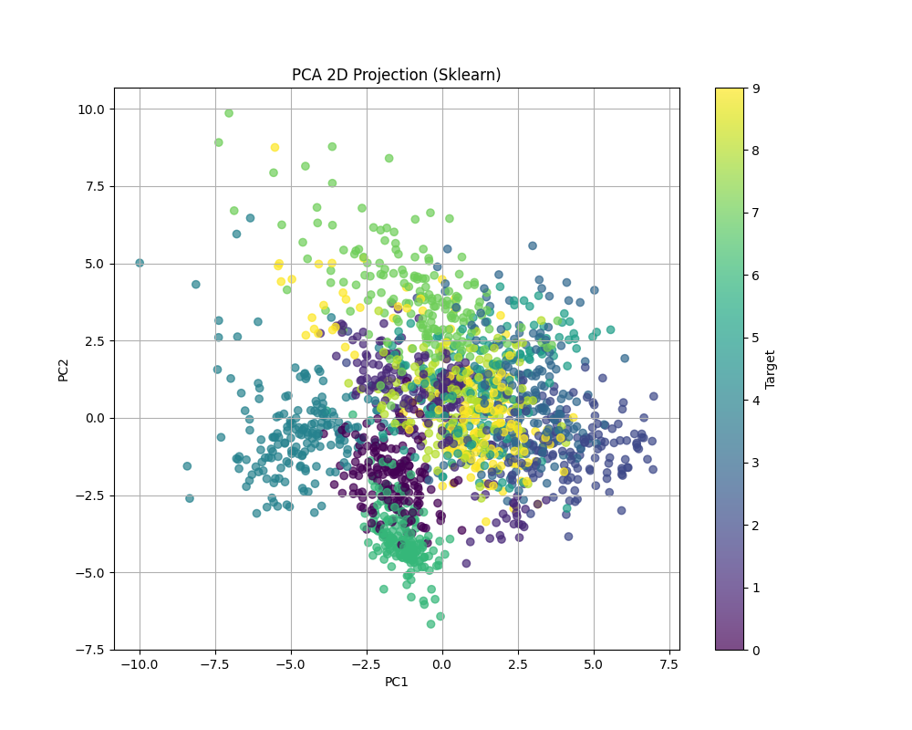

# Лабораторная работа №4. Метод главных компонент (PCA)

Выполнил: студент группы Минтус Е.А. 365829

## 1. Введение

В данной лабораторной работе реализован алгоритм Principal Component Analysis (PCA) через сингулярное разложение (SVD). Проведено исследование на датасете рукописных цифр (Digits), определена эффективная размерность данных и выполнено сравнение с эталонной реализацией из `sklearn`.

## 2. Теоретическая часть

PCA — метод снижения размерности данных, который находит ортогональные направления (главные компоненты), вдоль которых дисперсия данных максимальна.

**Связь с SVD:**
Для центрированной матрицы данных $X$ ($n \times m$), сингулярное разложение имеет вид:

$$ X = U \Sigma V^T $$

где:
*   $U$ — левые сингулярные векторы (собственные векторы $XX^T$).
*   $\Sigma$ — диагональная матрица сингулярных чисел.
*   $V$ — правые сингулярные векторы (собственные векторы ковариационной матрицы $X^T X$, т.е. **главные компоненты**).

Дисперсия, объясняемая $i$-й компонентой: $\lambda_i = \frac{\sigma_i^2}{n-1}$.

## 3. Реализация

Исходный код находится в директории `source/`.
-   `core/pca.py`: класс `PCA`, реализующий метод `fit` (через `np.linalg.svd`) и `transform`.
-   `main.py`: скрипт для запуска экспериментов и сравнения.

## 4. Эксперименты

Использован датасет **Digits** (8x8 изображений цифр, 64 признака).
Данные были предварительно стандартизированы (`StandardScaler`).

### 4.1. Эффективная размерность

Построен график накопленной объясненной дисперсии.

*   Чтобы сохранить **95%** дисперсии, необходимо **40** компонент (из 64 исходных).
*   Чтобы сохранить **99%** дисперсии, необходимо **54** компоненты.

### 4.2. Визуализация в 2D

Проекция данных на первые две главные компоненты.

**Custom PCA:**

**Sklearn PCA:**

Проекции идентичны (с точностью до отражения осей, что является допустимым в PCA). Цветом обозначены классы (цифры от 0 до 9). Видно, что даже в 2D пространстве классы начинают группироваться.

### 4.3. Сравнение с Sklearn

Произведено сравнение объясненной дисперсии и косинусного сходства главных компонент.

*   Максимальная разница в `explained_variance_ratio`: **2.71e-16** (на уровне машинной точности).
*   Косинусное сходство первых 5 компонент: **1.000000** (векторы коллинеарны).

## 5. Выводы

1.  Реализованный через SVD алгоритм PCA работает корректно и полностью совпадает с эталонной реализацией `sklearn.decomposition.PCA`.
2.  Анализ сингулярных чисел позволяет эффективно определять необходимую размерность пространства для сжатия данных с минимальной потерей информации.
3.  PCA является мощным инструментом для визуализации многомерных данных.
