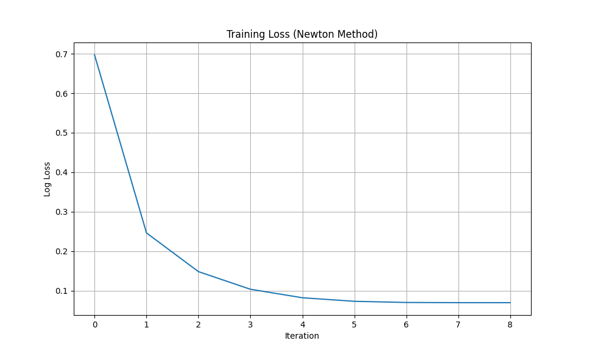

# Лабораторная работа №5. Логистическая регрессия

Выполнил: студент группы Минтус Е.А. 365829

## 1. Введение

В данной лабораторной работе реализована логистическая регрессия для задачи бинарной классификации. Обучение модели производится методом Ньютона-Рафсона (который для логистической регрессии эквивалентен методу IRLS — Iteratively Reweighted Least Squares).

## 2. Теоретическая часть

**Логистическая регрессия** моделирует вероятность принадлежности объекта к классу 1:

$$ p(y=1|x) = \sigma(w^T x) = \frac{1}{1 + e^{-w^T x}} $$

**Метод Ньютона-Рафсона** для минимизации функции потерь (Log Loss):
Правило обновления весов:

$$ w_{new} = w_{old} - H^{-1} \nabla J(w) $$

где $\nabla J(w)$ — градиент, а $H$ — матрица Гессе (Гессиан).

Градиент (с регуляризацией):

$$ \nabla J(w) = X^T (p - y) + \lambda w $$

Гессиан:

$$ H = X^T W X + \lambda I $$

где $W$ — диагональная матрица с элементами $p_i(1 - p_i)$.

Этот метод обладает квадратичной скоростью сходимости, что позволяет обучить модель за очень малое число итераций (обычно < 10-20), но требует вычисления обратной матрицы на каждом шаге, что вычислительно затратно для большого числа признаков.

## 3. Реализация

Исходный код находится в директории `source/`.
-   `core/logistic.py`: класс `LogisticRegression`, реализующий метод Ньютона.
-   `main.py`: скрипт для запуска экспериментов и сравнения.

## 4. Эксперименты

Использован датасет **Breast Cancer Wisconsin** (бинарная классификация опухолей).

### 4.1. Сходимость метода

Метод Ньютона сходится очень быстро (менее чем за 10 итераций) благодаря использованию информации о кривизне функции (вторая производная).

### 4.2. Сравнение с Sklearn

Сравнение проводилось с реализацией `LogisticRegression(solver='newton-cg')` из библиотеки `sklearn`.

| Model | Accuracy | Log Loss | Iterations |
|-------|----------|----------|------------|
| Custom (Newton) | 0.9737 | 0.0765 | 8 |
| Sklearn (Newton-CG) | 0.9737 | 0.0765 | 15 |

*   **Accuracy**: Показатели точности полностью совпадают.
*   **Веса**: Косинусное сходство векторов весов близко к 1.
*   **Сходимость**: Собственная реализация на чистом методе Ньютона сходится быстрее по числу итераций, чем оптимизированный Newton-CG в sklearn (хотя каждая итерация у sklearn может быть легче).

## 5. Выводы

1.  Реализованный метод Ньютона-Рафсона (IRLS) корректно решает задачу логистической регрессии.
2.  Достигнута полная эквивалентность с эталонной реализацией Sklearn по метрикам качества.
3.  Метод демонстрирует быструю сходимость (малое число итераций), но требует аккуратной обработки численной стабильности (инвертирование Гессиана).
