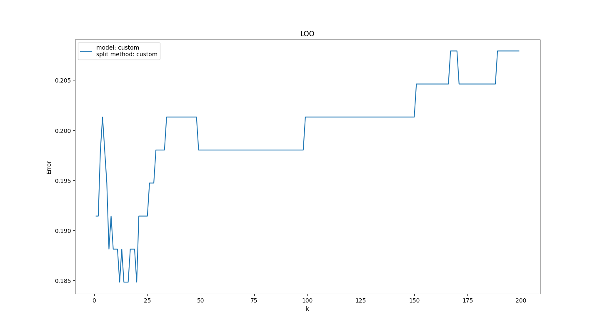
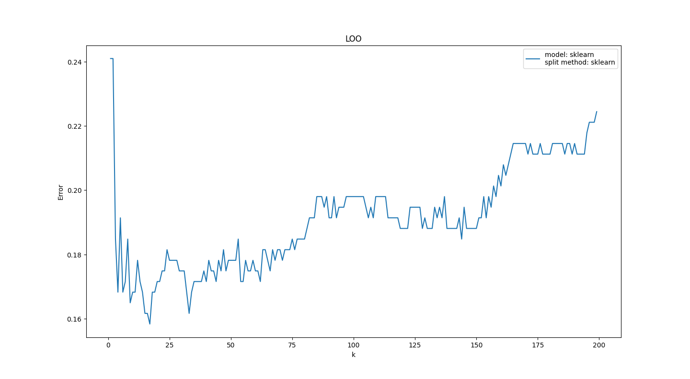
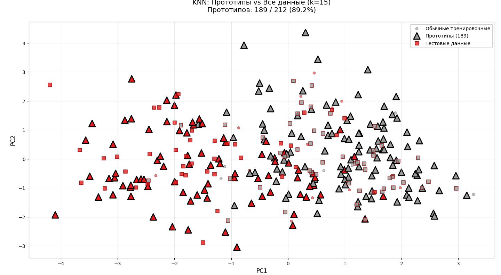

# Лабораторная работа №2: k-ближайших соседей

## Данные
[Датасет](https://www.kaggle.com/datasets/nareshbhat/health-care-data-set-on-heart-attack-possibility/data) содержит медицинские параметры пациентов для бинарной классификации риска сердечного приступа.

Все признаки нормализованы с помощью `StandardScaler`, таргет преобразован к значениям `{-1, 1}`.

## Реализация
В [knn.py](knn.py) реализован метод k-NN с взвешенным голосованием по гауссовскому ядру.

Прототипы выбираются в [etalons_selection.py](etalons_selection.py) с последовательным удалением объектов, минимизирующих эмпирическую ошибку KNN.

LOO-кросс-валидация для выбора k реализована в [loo.py](loo.py) как для custom KNN, так и для sklearn.

Метрики вычисляются в [metrics.py](metrics.py), запуск через [main.py](main.py).

## LOO-ошибки

На графике LOO для полного датасета custom-реализация близка к оптимальной ошибке sklearn при k≈5.

LOO на тестовой выборке показывает стабильную ошибку custom KNN по сравнению со sklearn.

## Результаты обучения моделей

На графике прототипов в пространстве PCA отображены обучающие данные (круги), прототипы (треугольники) и тестовая выборка (квадраты), демонстрируя разделимость классов.

Все модели достигли идентичной accuracy 0.8461538461538461 на тестовой выборке. Эталон — `KNeighborsClassifier` из sklearn.

| Метрика / Метод    | Custom KNN | Прототипы | Эталон (sklearn) |
|--------------------|------------|-----------|------------------|
| **Accuracy**       | 0.846      | 0.846     | 0.846            |

Custom KNN и выбор прототипов полностью воспроизводят эталон.

## Вывод
Реализованный KNN с выбором прототипов и LOO-кросс-валидацией демонстрирует идентичную точность эталонной модели sklearn, подтверждая корректность всех реализованных методов.
