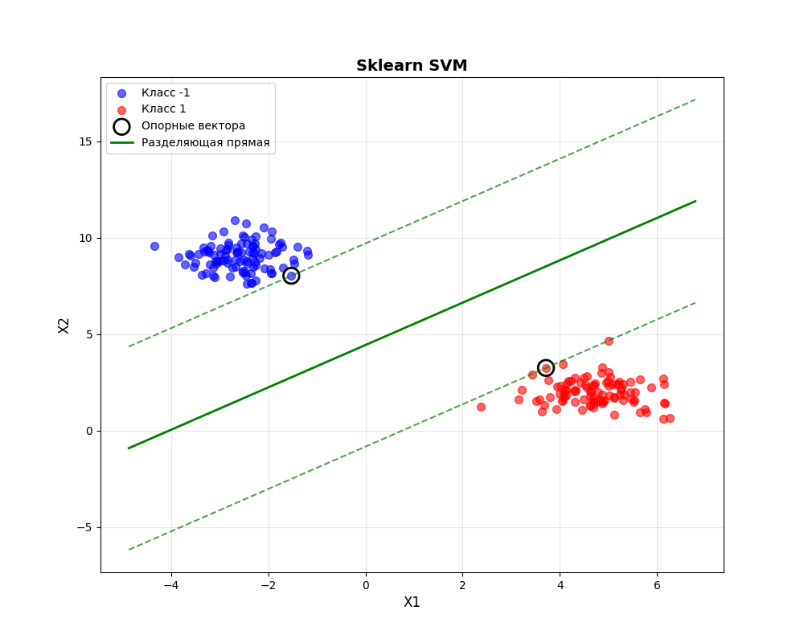
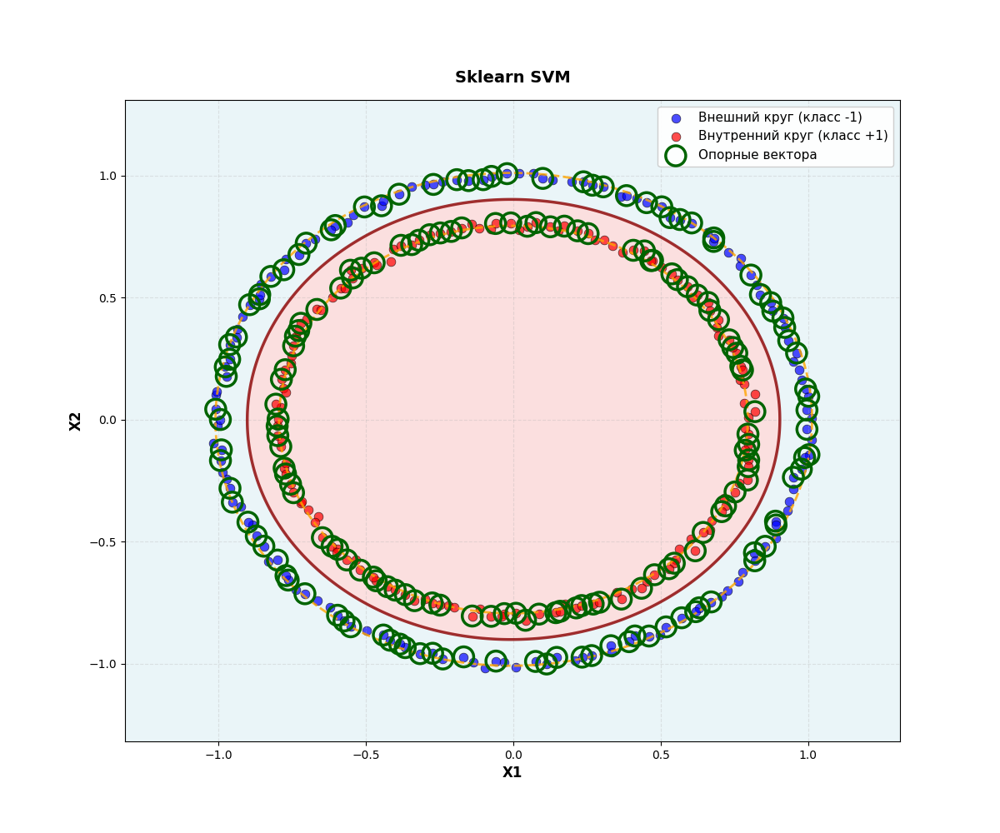
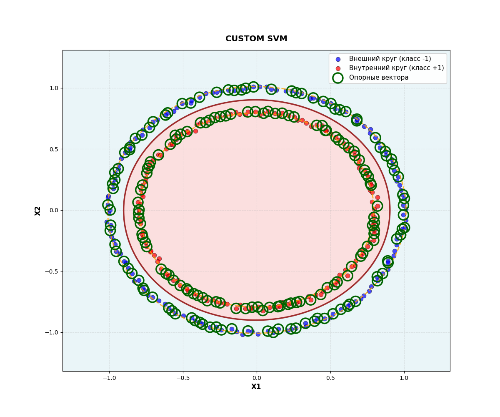
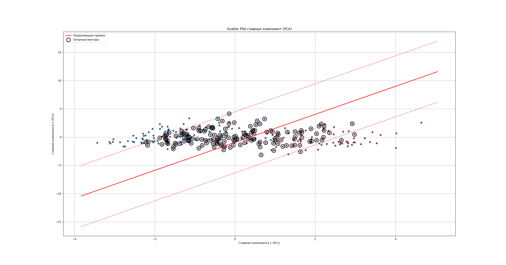
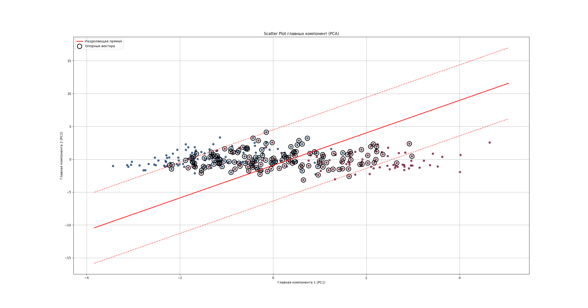

# Лабораторная работа №1

## Данные
[Датасет](https://www.kaggle.com/datasets/nareshbhat/health-care-data-set-on-heart-attack-possibility/data) аналогичен датасету из 1 лабораторной.

Все признаки были нормализованы, а таргет был приведен к значениям {-1, 1}.

Визуализация данных датасета:

## Реализация
В [svm.py](source/svm.py) была реализована реализация классификатора с использованием метода SVM.

Для проверки моделей можно запустить файлы:

`synthetic_linear.py` - проверка на синтетических линейно разделимых данных

`synthetic_circular.py` - проверка на синтетических круговых разделимых данных

`main.py` - проверка на датасете 

## Графики 
### Синтетические линейно разделимые данные:

### Синтетические круговые разделимые данные:

### Датасет:

## Результаты обучения моделей

для синтетических данных модели показали идентичные результаты и одинаковое кол-во опорных векторов.

результаты на датасете:

| Метрика / Метод | Реализация | Эталон |
|-------|-------|-------|
| Accuracy | 0.8571428571428571 | 0.8571428571428571 |
| Precision| 0.8490566037735849 | 0.8490566037735849 |
| Recall | 0.9 | 0.9 |
|F1-score | 0.8737864077669903 | 0.8737864077669903 |

## Вывод
    Реализованный классификатор демонстрирует идентичные результаты с эталонной моделью, что подтверждает корректность реализованных методов и обосновано единственным решением задачи оптимизации в основе SVM.