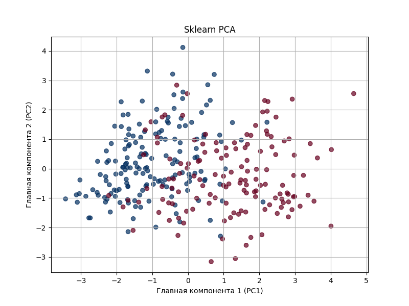
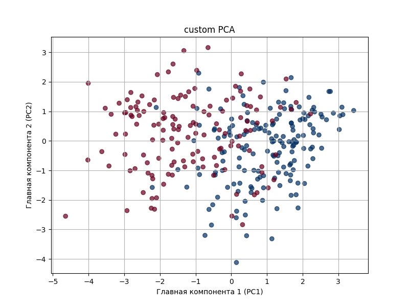
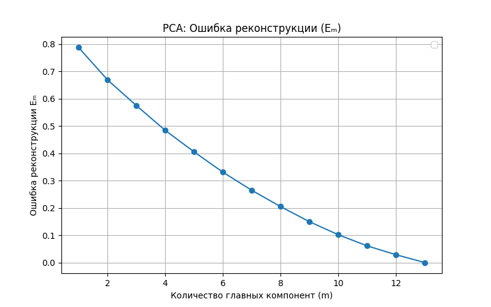
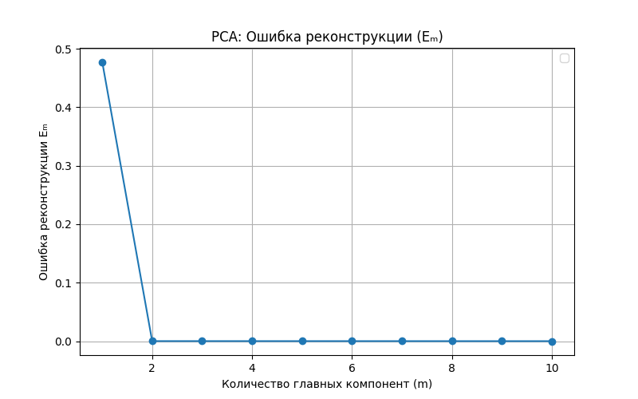

# Лабораторная работа №4

## Данные
[Датасет](https://www.kaggle.com/datasets/nareshbhat/health-care-data-set-on-heart-attack-possibility/data) аналогичен датасету из 1 лабораторной.

## Реализация
В [pca.py](source/pca.py) была реализована собственная версия метода главных компонент (PCA) для снижения размерности данных.

Реализация включает:
- Класс `CustomPCA` с интерфейсом, аналогичным sklearn.decomposition.PCA:
  - Метод `fit` для обучения PCA на данных
  - Метод `transform` для преобразования данных в пространство главных компонент
  - Метод `fit_transform` для совмещенного обучения и преобразования
  - Метод `reconstruct` для восстановления исходных данных из PCA-представления

## Графики и анализ

### Сравнение PCA-визуализации (2D)

Была построена визуализация данных в двумерном пространстве главных компонент с использованием как эталонной реализации (`sklearn.decomposition.PCA`), так и собственной реализации `CustomPCA`. Результаты визуально идентичны: структура данных и распределение точек полностью совпадают. Незначительное отличие — зеркальное отражение компонент - объясняется тем, что направление собственных векторов не влияет на результат: если $ \mathbf{v} $ - собственный вектор, то -$ \mathbf{v} $ также является допустимым решением. Это не влияет на качество преобразования и корректность метода.

### Анализ ошибки реконструкции (график $ E_m $) на реальном датасете

На графике зависимости нормированной ошибки реконструкции $ E_m $ от количества используемых главных компонент видно, что ошибка снижается плавно, без резких «падений». Это означает, что **ни одна из компонент не доминирует**, и все признаки вносят сопоставимый вклад в структуру данных. Следовательно, эффективное снижение размерности в данном случае невозможно — отбрасывание любой компоненты приведёт к потере информации.

### Анализ ошибки реконструкции на синтетических данных
Для демонстрации случая, когда снижение размерности действительно эффективно, была проведена проверка на синтетических данных с искусственной мультиколлинеарностью. В этих данных 10 признаков были сгруппированы в две скрытые переменные (две основные причины вариативности), что идеально подходит для PCA.

График $ E_m $ для синтетических данных демонстрирует резкое падение ошибки после первых двух компонент. Это означает, что первые две главные компоненты объясняют подавляющую часть дисперсии, а последующие — шум. Таким образом, **размерность можно эффективно снизить с 10 до 2 компонент** без существенной потери информации.

## Вывод
Реализованный `CustomPCA` демонстрирует полное соответствие визуальных и численных результатов с реализацией из `sklearn`. Зеркальное отражение компонент обусловлено неопределённостью направления собственных векторов и не влияет на корректность работы метода.

Анализ реального датасета показал, что PCA не позволяет эффективно снизить размерность — все компоненты значимы. Это говорит о том, что медицинские признаки, используемые в датасете, являются независимо важными для прогнозирования риска сердечного приступа.

На синтетических данных продемонстрирован типичный случай эффективного применения PCA: при наличии скрытых факторов и мультиколлинеарности метод позволяет выявить основные оси вариативности и существенно сократить размерность.
