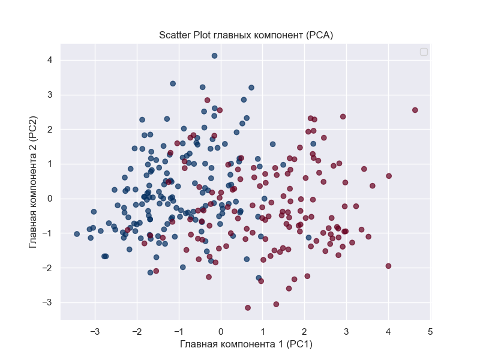
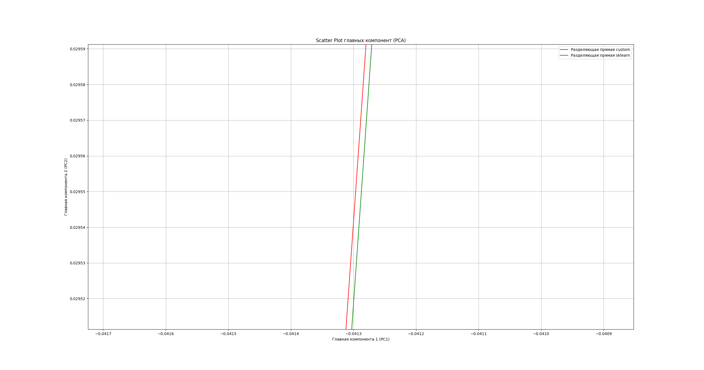

# Лабораторная работа №5

## Данные
[Датасет](https://www.kaggle.com/datasets/nareshbhat/health-care-data-set-on-heart-attack-possibility/data) аналогичен датасету из 1 лабораторной.

Все признаки были нормализованы, а таргет был приведен к значениям {-1, 1}.

Визуализация данных датасета:

## Реализация
В [logres.py](source/logres.py) был реализован классификатор на основе логистической регрессии с использованием метода 2 порядка.

Для проверки можно запустить файлы:

`etalon.py` - эталонная реализация

`main.py` - сравнение результатов кастомной реализации с эталонной из sklearn 

## Результаты обучения моделей

Модели показали идентичные результаты, различие в весах моделей происходит после 4-5 разрядов.

На графике видно что разделяющие прямые выглядят идентично, и только при большом приближении видно разницу.

метрики на датасете:

| Метрика / Метод | Реализация | Эталон |
|-------|-------|-------|
| Accuracy | 0.8021978021978022 | 0.8021978021978022 |
| Precision| 0.82 | 0.82 |
| Recall | 0.82 | 0.82 |
|F1-score | 0.82 | 0.82 |

## Вывод
    Реализованный классификатор демонстрирует идентичные результаты с эталонной моделью, что подтверждает корректность реализованного метода.
