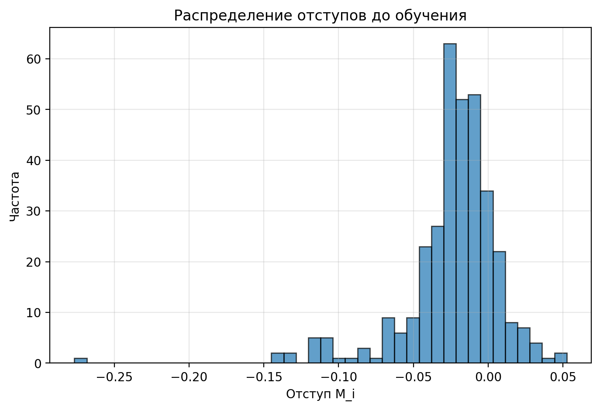
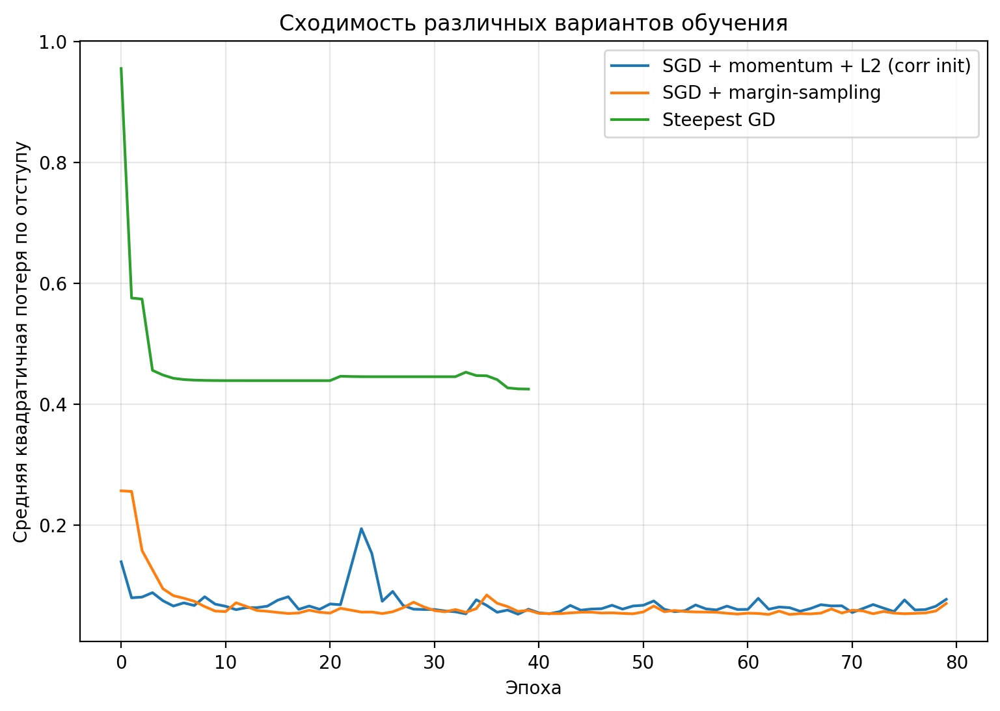
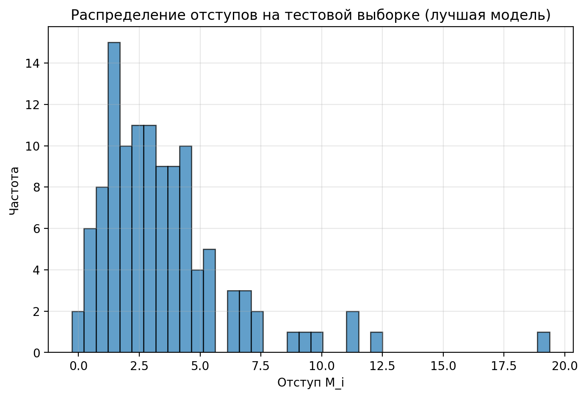

Лабораторная работа №1. Линейная классификация
=============================================

В этой директории реализована лабораторная работа №1 по условию из `tasks/task-01/README.md`.

Основные библиотеки: **numpy**, **pandas**, **matplotlib**.
Для загрузки реального датасета рака молочной железы используется
`sklearn.datasets.load_breast_cancer` (без использования моделей sklearn).

Структура
---------

- `source/data_utils.py` — генерация или загрузка датасета, разбиение на train/val/test, масштабирование признаков.
- `source/linear_classifier.py` — линейный классификатор, отступ, квадратичная функция потерь, градиенты, методы оптимизации:
  SGD, SGD с инерцией, L2‑регуляризация, рекуррентная оценка функционала качества, скорейший градиентный спуск,
  предъявление объектов по модулю отступа, инициализация весов (случайная, по корреляции), мультистарт.
- `source/main.py` — запуск экспериментов, визуализация отступов и кривых обучения, оценка качества и сравнение с эталонной моделью.

Как запустить
-------------

Из корня репозитория:

```bash
python -m students.mukhomediarova_ar.lab1.source.main
```

По умолчанию скрипт загружает датасет Breast Cancer из `sklearn.datasets.load_breast_cancer`
и преобразует метки в \{-1, 1\}. Если sklearn недоступен, можно:

- положить рядом с `source/main.py` файл `data.csv` с бинарной целевой переменной `target` (или последним столбцом);
- либо будет сгенерирован простой синтетический двумерный датасет с двумя классами.

Результаты экспериментов
------------------------

- **Датасет и разбиение**:
  - используется датасет Breast Cancer Wisconsin из `sklearn.datasets`;
  - разбиение: 341 объектов в train, 113 в val, 115 в test.

- **Отступы до обучения** (случайная инициализация весов):
  - минимальный отступ: -0.277;
  - максимальный отступ: 0.052;
  - средний отступ: -0.024;
  - гистограмма отступов сохранена в `results/margins_before_training.png`.

  

- **SGD с инерцией и L2‑регуляризацией, инициализация по корреляции (`SGD_corr`)**:
  - ошибка на train: 0.015;
  - ошибка на val: 0.018;
  - рекуррентная оценка функционала качества (EMA) после обучения: 0.0764.

- **Мультистарт (несколько запусков SGD со случайной инициализацией)**:
  - лучшая ошибка на train: 0.009;
  - ошибка на val: 0.018.

- **Предъявление объектов по модулю отступа (margin‑sampling)**:
  - ошибка на val: 0.035.

- **Скорейший градиентный спуск (Steepest GD)**:
  - ошибка на val: 0.027.

- **Сравнение методов оптимизации**:
  - по валидационной выборке лучшим оказался метод `SGD_corr`
    (SGD c momentum и L2‑регуляризацией, инициализация весов по корреляции);
  - график сходимости основных вариантов обучения сохранён в
    `results/optimization_methods.png`.




- **Качество лучшей модели на тестовой выборке** (метод `SGD_corr`):
  - accuracy: 0.9913;
  - precision: 0.9865;
  - recall: 1.0000;
  - F1‑мера: 0.9932;
  - распределение отступов на тесте сохранено в `results/margins_test_best.png`.




- **Сравнение с эталонной линейной моделью (least squares)**:
  - наша модель (`SGD_corr`) даёт accuracy 0.9913;
  - baseline‑модель (решение в смысле наименьших квадратов с L2) даёт accuracy 0.9826;
  - разница в точности ≈ +0.87 процентных пункта в пользу реализованного SGD‑классификатора.

Выводы
------

- **Инициализация по корреляции признаков с целевой переменной** в сочетании с SGD с инерцией
  и L2‑регуляризацией позволяет получить наилучшее качество на валидации и тесте.
- **Мультистарт** со случайной инициализацией улучшает результаты по сравнению с одним случайным запуском,
  однако по валидационной ошибке не превосходит модель с корреляционной инициализацией.
- **Предъявление объектов по модулю отступа** и **скорейший градиентный спуск** демонстрируют корректную сходимость,
  но дают более высокую ошибку на валидационной выборке для данного датасета.
- Реализованный линейный классификатор по качеству **превосходит простую эталонную линейную модель** (least squares),
  при этом использует явную оптимизацию эмпирического риска с квадратичной функцией потерь по отступу и L2‑регуляризацией.

