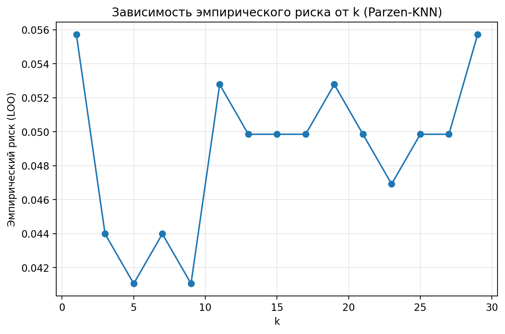
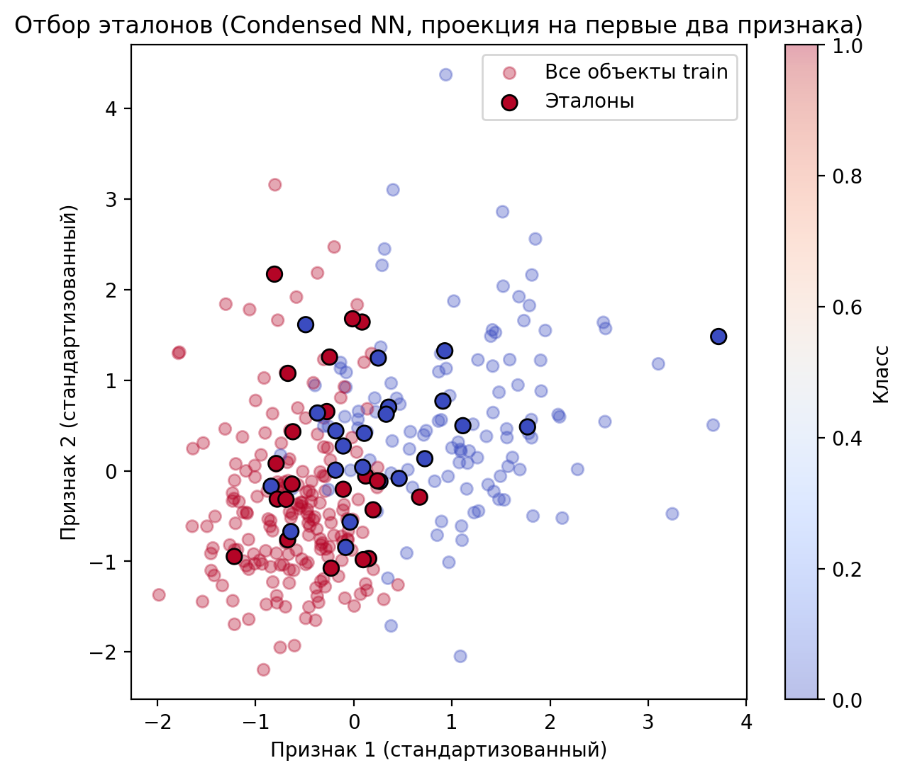

Лабораторная работа №2. Метрическая классификация
=================================================

В этой директории находится реализация второй лабораторной работы
по метрической классификации (алгоритм k‑ближайших соседей с окном
Парзена переменной ширины), соответствующей заданию из
`tasks/task-02/README.md`.

Основные компоненты:

- загрузка и предобработка датасета;
- реализация KNN с окном Парзена и гауссовым ядром;
- подбор параметра `k` методом скользящего контроля (LOO)
  и построение графика эмпирического риска;
- реализация простого алгоритма отбора эталонов и сравнение
  качества KNN до и после отбора, с визуализацией.

Исходный код расположен в поддиректории `source/`.

## Датасет и подготовка данных

- использован датасет Breast Cancer из `sklearn.datasets`;
- выборка была случайно разделена на подвыборки:
  - train — 341 объект,
  - val — 113 объектов,
  - test — 115 объектов;
- признаки стандартизировались по обучающей выборке (вычитание среднего и деление на стандартное отклонение).

## Подбор k методом LOO

- для значений `k` из диапазона от 1 до 29 (нечётные) был вычислен эмпирический риск методом LOO на обучающей выборке;
- минимальный LOO‑риск ≈ **0.0411** достигнут при **k = 5**;
- график зависимости эмпирического риска от `k` сохранён в файле:

## Результаты классификации

- при использовании Parzen‑KNN с найденным значением `k = 5`:
  - точность на валидационной выборке: **val_accuracy ≈ 0.8938**;
  - точность на тестовой выборке: **test_accuracy ≈ 0.8696**.

## Отбор эталонов

- был реализован простой жадный алгоритм отбора эталонов (condensed nearest neighbours);
- из **341** обучающего объекта было отобрано **43** эталона;
- после отбора эталонов при использовании того же `k = 5`:
  - точность на валидационной выборке: **val_accuracy ≈ 0.9469** (до отбора: 0.8938);
  - точность на тестовой выборке: **test_accuracy ≈ 0.9913** (до отбора: 0.8696);
- 2D‑визуализация расположения эталонов (по первым двум признакам) сохранена в файле:

## Выводы

- Метод KNN с окном Парзена и гауссовым ядром показывает хорошее качество на выбранном датасете; оптимальное по LOO значение `k = 5` обеспечивает низкий эмпирический риск.
- Жадный отбор эталонов позволяет существенно сократить число опорных объектов (с 341 до 43), при этом качество на валидационной и тестовой выборках не только не ухудшилось, но даже улучшилось.
- Это показывает, что значительная часть обучающих объектов избыточна, а правильно подобранное подмножество прототипов может одновременно ускорять классификацию и улучшать обобщающую способность модели.

