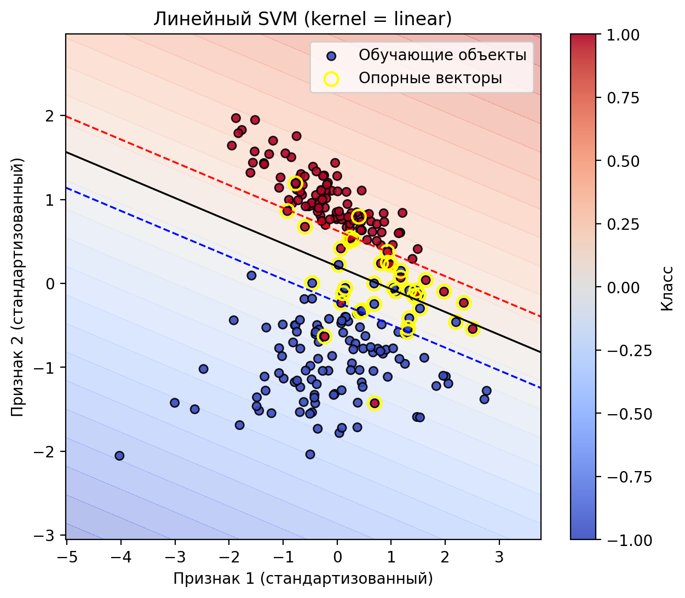
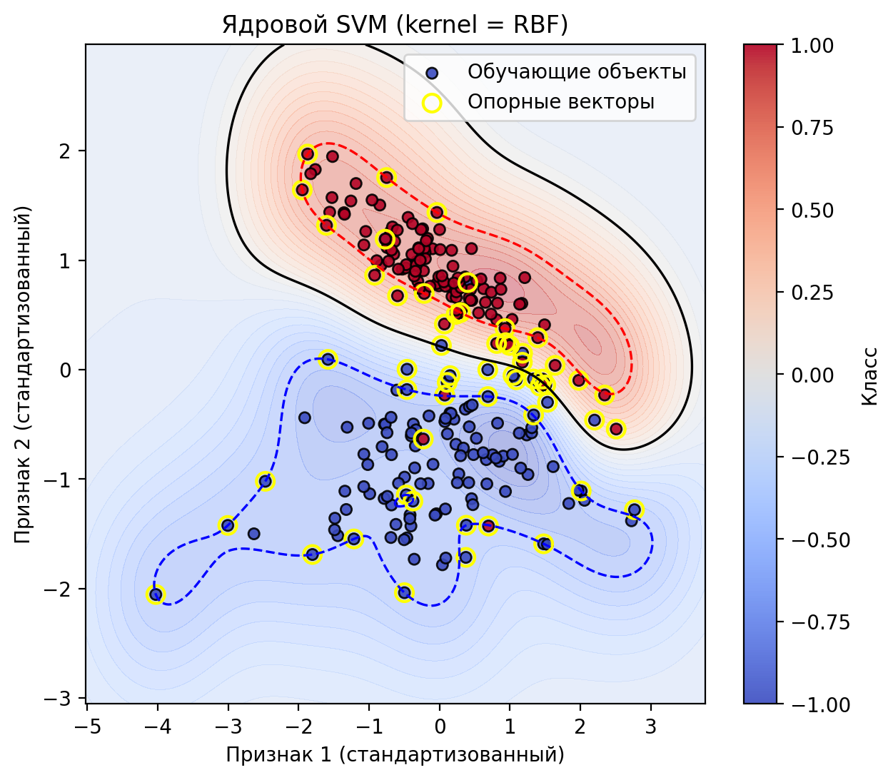
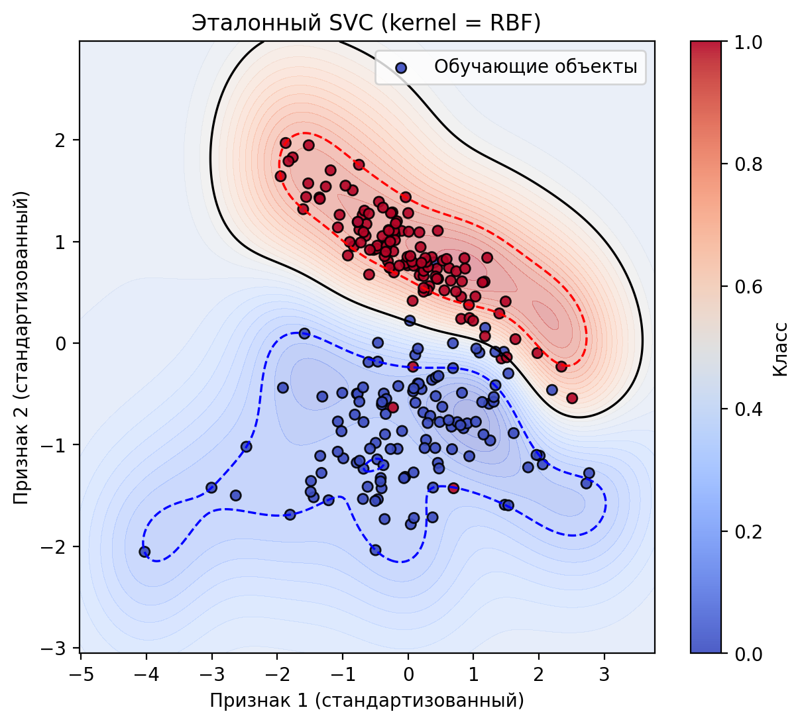

Лабораторная работа №3. SVM
===========================

В этой директории находится реализация третьей лабораторной работы
по методу опорных векторов (SVM), соответствующей заданию из
`tasks/task-03/README.md`.

Основные компоненты:

- загрузка и предобработка двумерного датасета для бинарной классификации;
- реализация SVM в двойственной постановке с использованием
  `scipy.optimize.minimize`;
- поддержка как линейного ядра, так и RBF‑ядра (kernel trick);
- построение линейного классификатора и нелинейного (ядрового) варианта;
- визуализация границы раздела и опорных векторов;
- сравнение качества с эталонным решением (ядровой SVM из `sklearn.svm.SVC`,
  если библиотека доступна в среде запуска).

Исходный код расположен в поддиректории `source/`,
графики сохраняются в поддиректории `results/`.

## Краткое описание экспериментов

- используется двумерный датасет для бинарной классификации,
  загружаемый/генерируемый через `sklearn.datasets.make_classification`
  (или синтетический аналог при отсутствии `sklearn`);
- целевые метки переводятся в формат \{-1, 1\}, признаки стандартизируются
  по обучающей выборке;
- реализован `KernelSVM` в двойственной постановке с произвольным ядром:
  матрица ядра строится по выборке, далее двойственная задача решается с
  помощью `scipy.optimize.minimize` (метод SLSQP) с ограничениями
  `0 <= alpha_i <= C` и `sum(alpha_i * y_i) = 0`;
- после оптимизации восстанавливаются опорные векторы, коэффициенты и
  смещение `b`, реализованы методы `decision_function`, `predict` и
  вычисление отступов;
- обучаются две модели: линейный SVM (линейное ядро) и ядровой SVM
  с RBF‑ядром; для обеих оценивается accuracy на val и test;
- для линейного и RBF‑вариантов визуализируется граница решения и
  опорные векторы (2D‑проекция признаков);
- при наличии `sklearn` дополнительно обучается эталонная модель
  `sklearn.svm.SVC` с RBF‑ядром и теми же гиперпараметрами (C, gamma),
  после чего проводится сравнение accuracy с собственной реализацией.

## Результаты

- размерности выборок: `train = 240`, `val = 80`, `test = 80`;
- **линейный SVM (linear kernel)**:
  - accuracy на валидации: `val_accuracy ≈ 0.9875`;
  - accuracy на тесте: `test_accuracy ≈ 0.9875`;
- **ядровой SVM (RBF‑ядро)**:
  - accuracy на валидации: `val_accuracy ≈ 0.9500`;
  - accuracy на тесте: `test_accuracy ≈ 0.9875`;
- **эталонный `sklearn.svm.SVC` (RBF‑ядро)**:
  - accuracy на валидации: `val_accuracy ≈ 0.9500`;
  - accuracy на тесте: `test_accuracy ≈ 0.9875`;
- визуализации границ решения и опорных векторов сохранены в файлах:
  
  
  

## Выводы

- Собственная реализация SVM в двойственной постановке с линейным ядром
  показывает очень высокое качество на выбранном двумерном датасете
  (accuracy почти 0.99 на валидации и тесте).
- При использовании RBF‑ядра наша реализация и эталонная `sklearn.svm.SVC`
  дают практически совпадающие результаты как на валидации, так и на тесте,
  что подтверждает корректность реализации двойственной задачи и трюка
  с ядром.
- Линейное и RBF‑ядро дают сопоставимое качество на тесте, однако на
  валидации линейный SVM показывает себя немного лучше; это согласуется
  с тем, что исходный датасет (после стандартизации) достаточно хорошо
  разделим гиперплоскостью.

