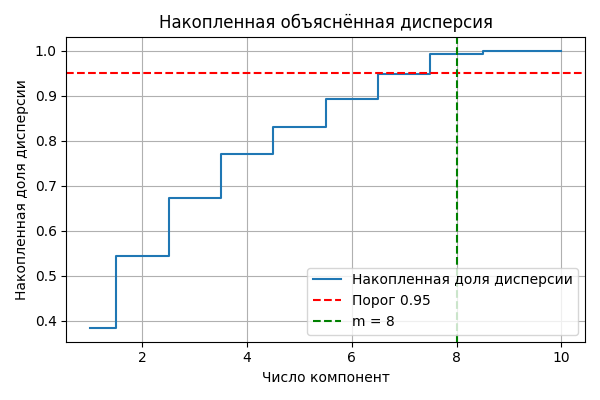

Лабораторная работа №4. PCA
===========================

В этой директории находится реализация четвёртой лабораторной работы
по методу главных компонент (PCA), соответствующей заданию из
`tasks/task-04/README.md`.

Основные компоненты
-------------------

- **выбор датасета для линейной регрессии**:
  используется регрессионный датасет *Diabetes* из `sklearn.datasets`;
- **реализация PCA через сингулярное разложение (SVD)**:
  класс `PCASVD` в файле `source/pca.py`;
- **"эталонная" реализация PCA через спектральное разложение ковариационной матрицы**:
  класс `PCAEigen` в файле `source/pca.py`, используемый для численного
  сравнения с SVD‑реализацией;
- **определение эффективной размерности**:
  функция `choose_effective_dim` (порог по накопленной доле объяснённой
  дисперсии, по умолчанию 95%);
- **линейная регрессия до и после снижения размерности**:
  собственная реализация гребневой регрессии (L2‑регуляризация) в файле
  `source/main.py`;
- **визуализация**:
  построение scree‑plot, графика накопленной объяснённой дисперсии
  и scatter‑диаграммы в пространстве первых двух главных компонент
  (сохранение в поддиректорию `results/`).

Структура проекта
-----------------

- `source/data_utils.py` — загрузка и разбиение регрессионного датасета
  Diabetes на обучающую, валидационную и тестовую выборки с
  стандартизацией признаков по train;
- `source/pca.py` — реализация PCA:
  - `PCASVD` — PCA через SVD;
  - `PCAEigen` — PCA через собственные значения ковариационной матрицы;
  - `choose_effective_dim` — выбор эффективной размерности по порогу
    накопленной доли дисперсии;
- `source/main.py` — запуск эксперимента:
  - сравнение `PCASVD` и `PCAEigen` (собственные значения и векторы
    совпадают с точностью до знака);
  - оценка эффективной размерности (для Diabetes порог 95% достигается
    при относительно небольшом числе компонент);
  - обучение линейной регрессии в исходном пространстве и в
    пространстве первых `m` главных компонент, сравнение MSE и R²
    на валидационной и тестовой выборках;
  - сохранение графиков в директорию `results/`.

Результаты и выводы
-------------------

- Собственная реализация PCA через SVD и реализация через
  спектральное разложение ковариационной матрицы дают совпадающие
  спектры собственных значений и совпадающие направления главных
  компонент (с точностью до знака, что ожидаемо).
- Для датасета Diabetes большая часть дисперсии (≈95%) объясняется
  первыми несколькими главными компонентами; при пороге по
  накопленной доле дисперсии 0.95 эффективная размерность составляет
  `m = 8` (из исходных 10 признаков).
- Размерности выборок после разбиения: `train = 284`, `val = 70`,
  `test = 88`.
- Численные результаты линейной регрессии (L2 = 0.01):
  - **исходное пространство признаков (10 признаков)**:
    `Val MSE ≈ 2492.0`, `R² ≈ 0.551`; `Test MSE ≈ 2604.3`, `R² ≈ 0.589`;
  - **пространство первых 8 главных компонент**:
    `Val MSE ≈ 2546.1`, `R² ≈ 0.542`; `Test MSE ≈ 2622.5`, `R² ≈ 0.586`.
- Линейная регрессия в пространстве главных компонент показывает
  качество, очень близкое к регрессии в исходном пространстве
  признаков (потеря по MSE/R² минимальна), при меньшем числе
  признаков и лучшей обусловленности задачи.

