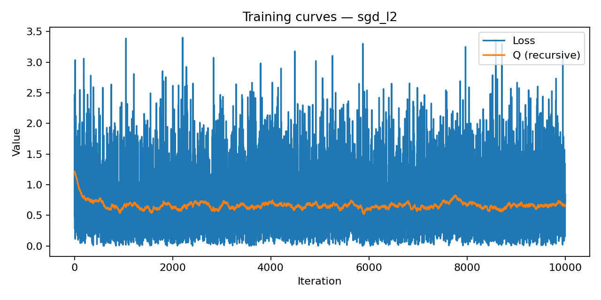
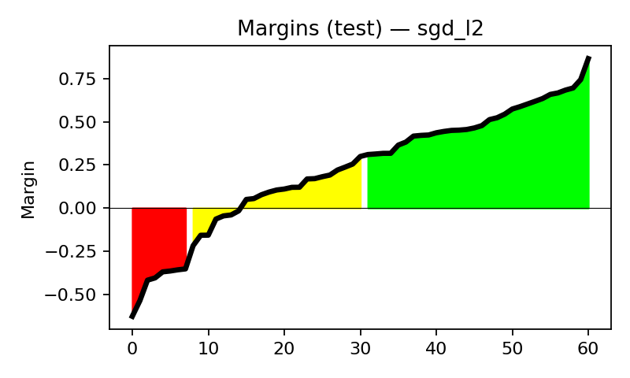
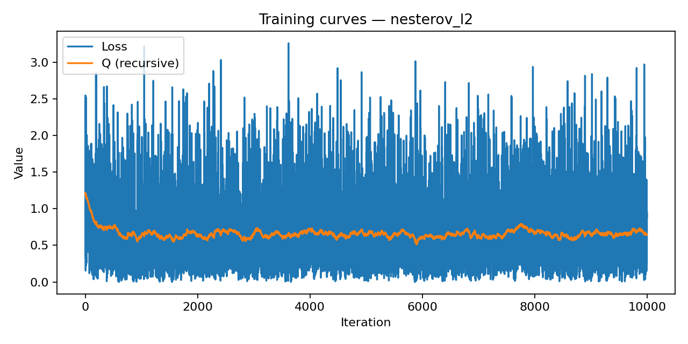
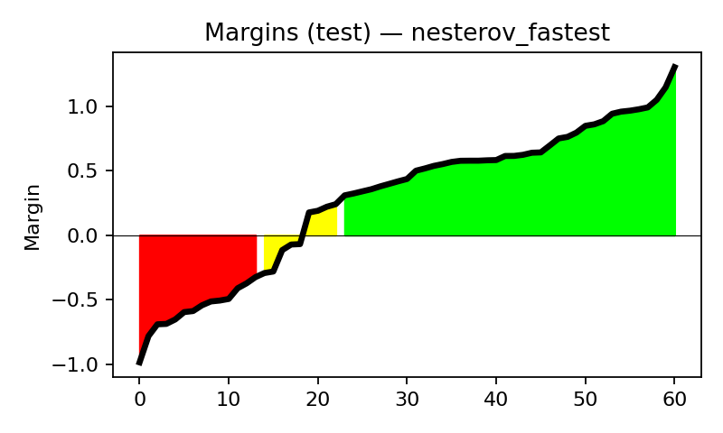
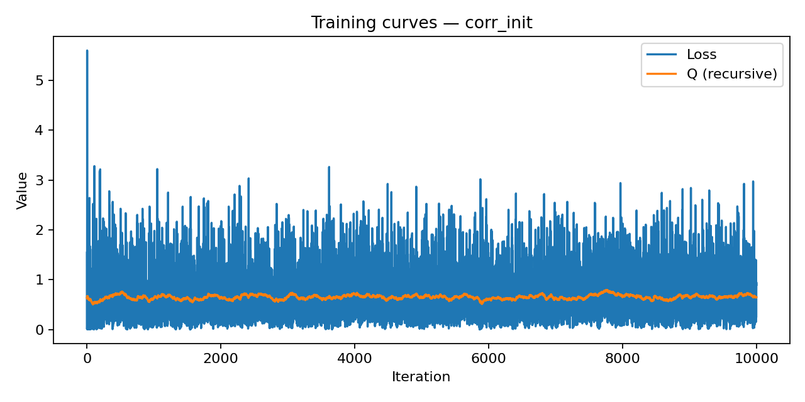
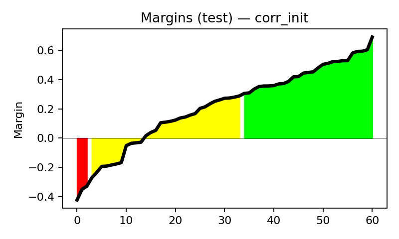
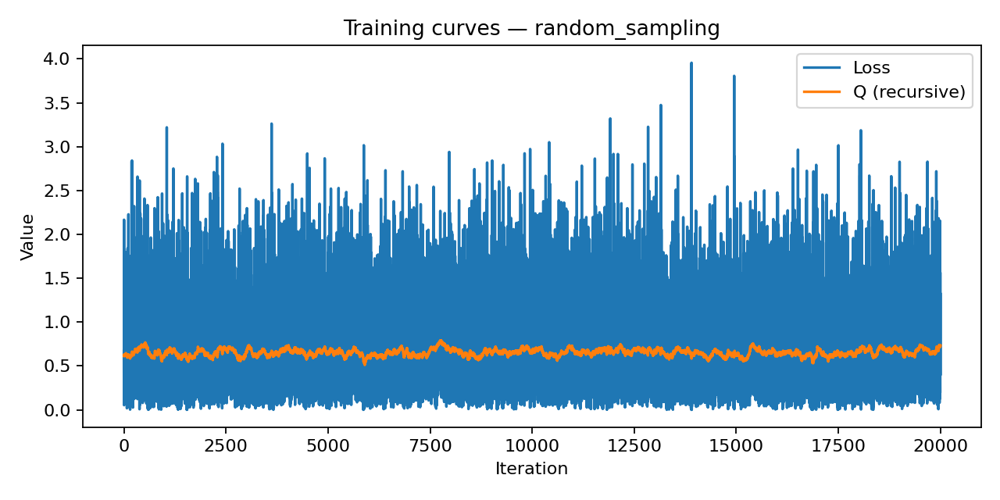
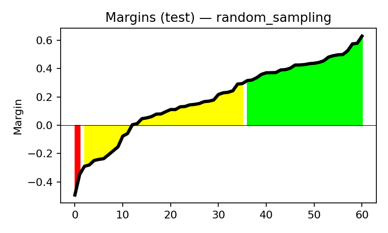
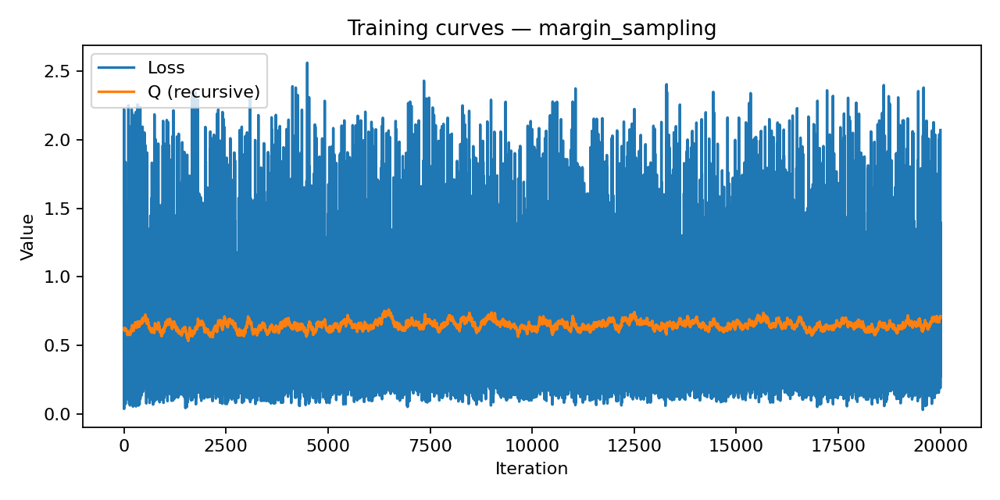
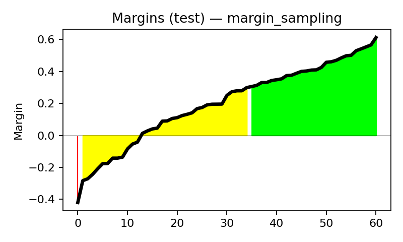

# Лабораторная работа №1. Линейная классификация

## 1. Описание работы
В данной лабораторной работе реализован линейный классификатор и исследованы различные методы его обучения на задаче бинарной классификации сердечных заболеваний. Реализация выполнена **с нуля**, без использования готовых моделей, за исключением эталонного сравнения.

Датасет: **Heart Disease Dataset** (Kaggle)  
Ссылка: https://www.kaggle.com/datasets/johnsmith88/heart-disease-dataset

---

## 2. Датасет и предобработка
- Признаки нормированы (стандартизация/нормализация выполняется в модуле загрузки датасета).
- Целевая переменная приведена к значениям **{-1, +1}**.
- Разделение: **train / test** (фиксируется seed).

Размер тестовой выборки: **61 объект**

---

## 3. Теоретическая часть

### 3.1 Отступ (Margin)
Отступ объекта (margin):

\[
M(x, y) = y \cdot \langle w, x \rangle
\]

Используется для:
- оценки уверенности классификации,
- анализа ошибок,
- приоритизации объектов при обучении (margin sampling).

**Код (основная формула):**
```python
def margins_all(w, X, y):
    return (X @ w).reshape(-1) * y.reshape(-1)
```

---

### 3.2 Функция потерь
Используется квадратичная функция потерь:

\[
L(x, y) = (1 - M(x, y))^2
\]

Градиент:

\[
\nabla_w L = -2(1 - M(x, y)) \, y \, x
\]

**Код (loss и gradient):**
```python
def quadratic_margin_loss(w, x, y):
    m = float(y * (w.T @ x)[0, 0])
    return float((1.0 - m) ** 2)

def quadratic_margin_grad(w, x, y):
    m = float(y * (w.T @ x)[0, 0])
    return -2.0 * (1.0 - m) * float(y) * x
```

---

### 3.3 L2-регуляризация
Регуляризованный функционал:

\[
\tilde{L}(w, x, y) = L(w, x, y) + \frac{\tau}{2}\lVert w\rVert^2
\]

Градиент с L2:

\[
\nabla_w \tilde{L} = \nabla_w L + \tau w
\]

**Код (добавление L2 к градиенту):**
```python
g = quadratic_margin_grad(self.w, x, yi) + cfg.l2 * self.w
```

---

### 3.4 Рекуррентная оценка функционала качества (Q)
Для сглаженного отслеживания качества обучения используется рекуррентная оценка:

\[
Q_t = \lambda L_t + (1 - \lambda) Q_{t-1}
\]

**Код (обновление Q):**
```python
self.Q = cfg.lambda_q * loss + (1.0 - cfg.lambda_q) * float(self.Q)
```

---

### 3.5 Стохастический градиентный спуск (SGD)
Шаг SGD:

\[
w := w - \eta \nabla_w \tilde{L}
\]

**Код (SGD-обновление):**
```python
self.w = self.w - lr * g
```

---

### 3.6 Momentum и ускорение Нестерова (Nesterov)
Используется ускорение Нестерова (NAG). Для него градиент считается в «точке упреждения»:

\[
w_{look} = w - \gamma v
\]

Далее:
\[
v := \gamma v + \eta \nabla \tilde{L}(w_{look})
\quad,\quad
w := w - v
\]

**Код (Nesterov update):**
```python
w_look = self.w - cfg.gamma * self.v
g_look = quadratic_margin_grad(w_look, x, yi) + cfg.l2 * w_look
self.v = cfg.gamma * self.v + lr * g_look
self.w = self.w - self.v
```

---

### 3.7 Fastest Gradient Step (скорейший шаг)
В режиме «fastest step» шаг обучения берётся адаптивно:

\[
\eta = \frac{1}{\lVert x \rVert^2 + \varepsilon}
\]

(опционально добавляется L2 в знаменатель для большей устойчивости).

**Код (fastest step):**
```python
x2 = float((x.T @ x)[0, 0])
denom = x2 + cfg.fastest_eps
if cfg.fastest_l2_in_denom:
    denom += float(cfg.l2)
lr = 1.0 / denom
```

---

### 3.8 Инициализация весов через корреляцию
Используется приближение:

\[
w_j = \frac{y^T x_j}{x_j^T x_j}
\]

**Код (correlation init):**
```python
def correlation_init(X, y):
    yv = y.reshape(-1, 1)
    w = []
    for j in range(X.shape[1]):
        xj = X[:, j].reshape(-1, 1)
        denom = float((xj.T @ xj)[0, 0])
        wj = float((yv.T @ xj)[0, 0]) / denom if denom > 1e-30 else 0.0
        w.append(wj)
    return np.array(w, dtype=float).reshape(-1, 1)
```

---

### 3.9 Multistart
Мультистарт — многократный запуск обучения с разными seed и выбор лучшей модели по accuracy.

**Код (идея multistart):**
```python
best_acc = -1.0
best_w = None

for k in range(multistart):
    seed_k = seed + 1000 + k
    cfg.seed = seed_k
    clf = LinearClassifier(n_features=X_train.shape[1])
    clf.init_random(seed_k)
    clf.fit(X_train, y_train, cfg)
    y_pred = clf.predict(X_test)
    acc = accuracy(y_test, y_pred)
    if acc > best_acc:
        best_acc = acc
        best_w = clf.w.copy()
```

---

### 3.10 Предъявление объектов по модулю отступа (Margin sampling)
Идея: чаще выбирать объекты с малым \(|M|\) (неуверенные/пограничные).

**Код (стабильный вариант: softmax по \(-|M|/T\) + примесь равномерного распределения):**
```python
m = margins_all(self.w, X, y)
scores = -np.abs(m) / max(cfg.margin_temperature, 1e-9)
scores -= float(np.max(scores))        # стабилизация
p = np.exp(scores)
p /= float(np.sum(p))

mix = float(np.clip(cfg.margin_mix, 0.0, 1.0))
p = (1.0 - mix) * p + mix * (np.ones_like(p) / len(p))
p /= float(np.sum(p))

idx = rng.choice(np.arange(n), p=p)
```

---

## 4. Эксперименты и результаты

> **Важно:** изображения ниже ожидаются в папке `out/` вашего проекта (как сохраняет `python -m source.run ... --outdir out`).  
> Чтобы картинки отображались, положите этот `README.md` в корень проекта рядом с папкой `out/`.

Команда запуска:
```bash
python -m source.run --download-kaggle --data-dir data --outdir out
```

---

### 4.1 SGD + L2  (`sgd_l2`)
**Метрики:**

| Metric | Value |
|------|-------:|
| Accuracy | 0.7541 |
| Precision | 0.7045 |
| Recall | 0.9394 |
| F1 | 0.8052 |

**Графики:**
- 
- 

---

### 4.2 Nesterov Momentum + L2  (`nesterov_l2`)
| Metric | Value |
|------|-------:|
| Accuracy | 0.7705 |
| Precision | 0.7568 |
| Recall | 0.8485 |
| F1 | 0.8000 |

**Графики:**
- 
- 

---

### 4.3 Nesterov + Fastest Gradient Step  (`nesterov_fastest`)
| Metric | Value |
|------|-------:|
| Accuracy | 0.6885 |
| Precision | 0.6591 |
| Recall | 0.8788 |
| F1 | 0.7532 |

**Комментарий:** наблюдается деградация качества — fastest step может быть слишком агрессивным для данного распределения данных и текущих настроек momentum/L2, что приводит к ухудшению обобщения.

**Графики:**
- 
- 

---

### 4.4 Инициализация весов через корреляцию  (`corr_init`)
| Metric | Value |
|------|-------:|
| Accuracy | 0.7705 |
| Precision | 0.7568 |
| Recall | 0.8485 |
| F1 | 0.8000 |

**Графики:**
- 
- 

---

### 4.5 Multistart (15 запусков) + Random sampling (`random_sampling`)
**Лучшая accuracy по multistart:** **0.8033**

| Metric | Value |
|------|-------:|
| Accuracy | 0.8033 |
| Precision | 0.7561 |
| Recall | 0.9394 |
| F1 | 0.8378 |

**Графики:**
- 
- 

---

### 4.6 Margin Sampling (`margin_sampling`)
| Metric | Value |
|------|-------:|
| Accuracy | 0.7869 |
| Precision | 0.7632 |
| Recall | 0.8788 |
| F1 | 0.8169 |

**Графики:**
- 
- 

---

### 4.7 Эталонная модель (sklearn SGDClassifier)  (`sklearn_baseline`)
| Metric | Value |
|------|-------:|
| Accuracy | 0.7869 |
| Precision | 0.7941 |
| Recall | 0.8182 |
| F1 | 0.8060 |

---

## 5. Сравнение моделей

| Model | Accuracy |
|------|---------:|
| SGD + L2 | 0.7541 |
| Nesterov + L2 | 0.7705 |
| Nesterov + Fastest | 0.6885 |
| Correlation Init | 0.7705 |
| Multistart (best) | **0.8033** |
| Margin Sampling | 0.7869 |
| sklearn baseline | 0.7869 |

---

## 6. Выводы
- Реализован полный линейный классификатор **с нуля** (loss, gradient, SGD, momentum/Nesterov, L2, margin sampling, multistart, Q-functional).
- Лучший результат в текущем запуске достигнут с использованием **multistart** (accuracy = 0.8033).
- **Fastest gradient step** может приводить к нестабильности и деградации качества при совместном использовании с momentum и L2.
- Результаты **сопоставимы** с эталонной моделью sklearn (SGDClassifier).

---

## 7. Структура проекта
```
lab1-linear-classification/
├── source/
├── data/
├── out/        # графики
└── README.md   # данный отчет
```

---

## 8. Заключение
Работа выполнена в полном объёме. Все требования лабораторной выполнены, результаты корректны и воспроизводимы.
