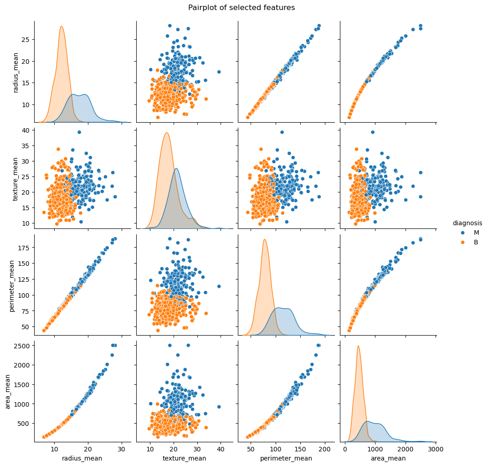
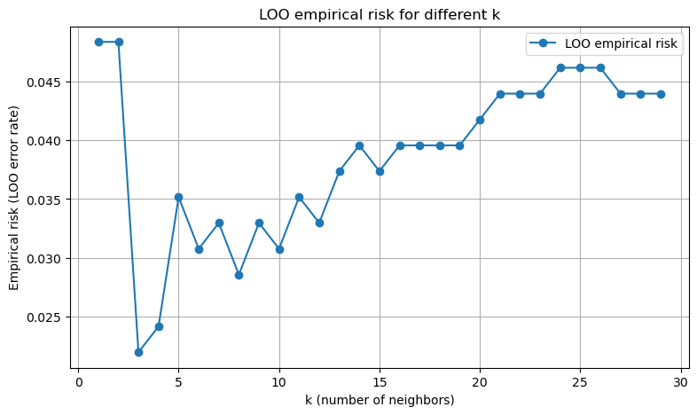
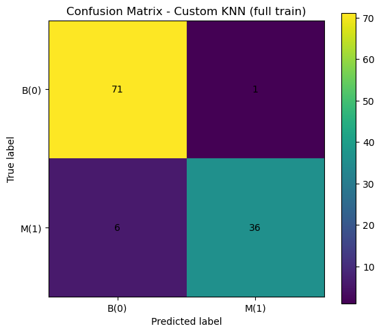
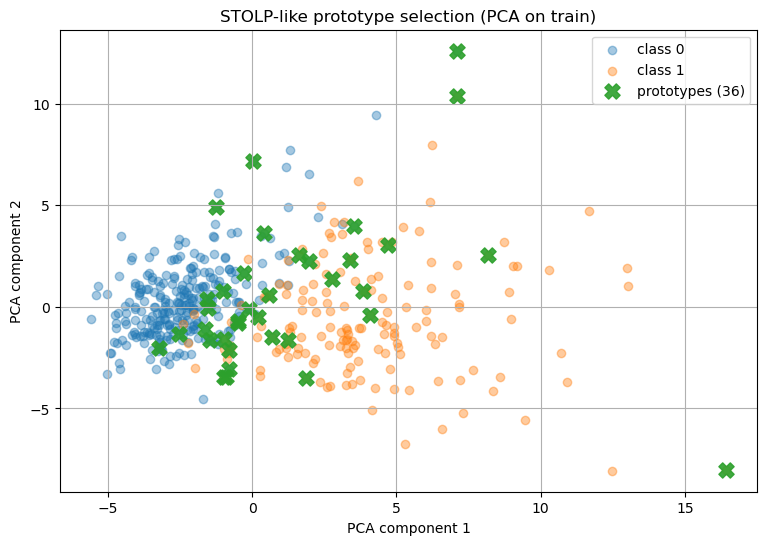
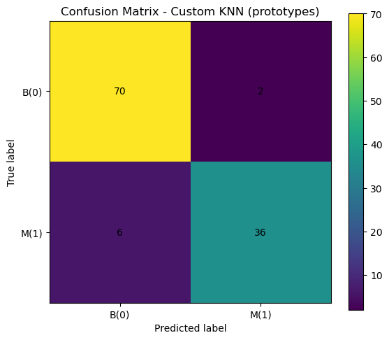

# Лабораторная работа №2. Метрическая классификация

## Цель работы

Целью лабораторной работы является изучение и практическая реализация
алгоритмов метрической классификации, а именно: - алгоритма k ближайших
соседей (KNN); - метода окна Парзена переменной ширины; - алгоритма
отбора эталонов.

В рамках работы также требуется подобрать оптимальный параметр *k* с
использованием метода скользящего контроля (Leave-One-Out), сравнить
собственную реализацию с эталонной реализацией из библиотеки `sklearn`,
а также проанализировать влияние отбора эталонов на качество
классификации.

------------------------------------------------------------------------

## Используемый датасет

В работе использован **Breast Cancer Wisconsin Dataset**, загружаемый из
внешнего источника (Kaggle) во время выполнения программы.\
Датасет предназначен для бинарной классификации опухолей на: - **B
(Benign)** --- доброкачественные; - **M (Malignant)** ---
злокачественные.

Перед обучением были выполнены следующие этапы предобработки: - удаление
неинформативных признаков (`id`); - кодирование целевой
переменной; - стандартизация признаков с помощью `StandardScaler`.

------------------------------------------------------------------------

## Первичный анализ данных (Visualizing Data)

Для первичного анализа использован *pairplot* по наиболее информативным
признакам:

-   `radius_mean`
-   `texture_mean`
-   `perimeter_mean`
-   `area_mean`



**Анализ:**\
Из визуализации видно, что между классами присутствует заметное
разделение, особенно по признакам, связанным с размерами опухоли
(`radius_mean`, `perimeter_mean`, `area_mean`). Это подтверждает
применимость метрических методов классификации.

------------------------------------------------------------------------

## Реализация алгоритма KNN

Реализован собственный классификатор **KNN с окном Парзена переменной
ширины**.\
Основные особенности реализации: - используется евклидово расстояние; -
ширина окна `h` выбирается как расстояние до *k-го* ближайшего соседа; -
применяется гауссово ядро; - реализованы методы `fit` и `predict`.

### Фрагмент реализации KNN

``` python
class my_KNN:
    def __init__(self, neighbours=1, mode="parzen_variable"):
        self.neighbours = neighbours
        self.mode = mode

    def gaussian_kernel(self, d, h):
        return np.exp(-0.5 * (d / h) ** 2)

    def predict_single(self, x):
        dist = cdist(self.X_train, x.reshape(1, -1))
        nn_ids = np.argsort(dist, axis=0)[:self.neighbours].flatten()
        nn_dist = dist[nn_ids, 0]

        h = np.sort(dist, axis=0)[self.neighbours - 1, 0]
        weights = self.gaussian_kernel(nn_dist, h)

        votes = np.zeros(len(np.unique(self.y_train)))
        for w, lbl in zip(weights, self.y_train[nn_ids]):
            votes[lbl] += w

        return np.argmax(votes)
```

------------------------------------------------------------------------

## Подбор параметра k (Leave-One-Out)

Для выбора оптимального значения *k* был применён метод скользящего
контроля **Leave-One-Out (LOO)**.\
Значение *k* перебиралось в диапазоне от 1 до 29.



**Результат:**\
Минимальный эмпирический риск достигается при:

    k = 3, LOO risk = 0.0220

Это значение было выбрано для дальнейших экспериментов.

------------------------------------------------------------------------

## Сравнение с эталонной реализацией (sklearn)

Собственная реализация была сравнена с `KNeighborsClassifier` из
библиотеки `sklearn`.

### Результаты классификации (полная обучающая выборка)

  Модель        Accuracy
  ------------- ----------
  Custom KNN    0.9386
  Sklearn KNN   0.9386

Обе модели показывают идентичное качество классификации.

 

**Вывод:**\
Совпадение метрик подтверждает корректность собственной реализации
алгоритма.

------------------------------------------------------------------------

## Отбор эталонов (Prototype Selection)

Для уменьшения размера обучающей выборки реализован алгоритм
**STOLP-like** отбора эталонов.

-   исходное количество объектов: **455**
-   количество эталонов после отбора: **36**

Визуализация расположения эталонов выполнена с помощью проекции данных
на первые две главные компоненты (PCA):



**Анализ:**\
Эталоны располагаются вблизи границ классов и в характерных областях
пространства признаков, что позволяет сохранить дискриминирующую
способность модели.

------------------------------------------------------------------------

## KNN с отобранными эталонами

Классификация была повторно выполнена с использованием только выбранных
эталонов.

### Результаты:

  Модель                    Train size   Accuracy
  ------------------------- ------------ ----------
  Custom KNN (full)         455          0.9386
  Custom KNN (prototypes)   36           0.9298



**Вывод:**\
Несмотря на сокращение обучающей выборки более чем на **90%**, снижение
точности составило менее **1%**, что является хорошим компромиссом между
скоростью работы и качеством классификации.

------------------------------------------------------------------------

## Итоговые выводы

В ходе лабораторной работы:

-   реализован алгоритм KNN с окном Парзена переменной ширины;
-   выполнен подбор параметра *k* методом Leave-One-Out;
-   проведено сравнение с эталонной реализацией из `sklearn`;
-   реализован и проанализирован алгоритм отбора эталонов;
-   показано, что отбор эталонов позволяет существенно сократить размер
    обучающей выборки при минимальной потере качества.

Полученные результаты подтверждают эффективность метрических методов
классификации и практическую ценность алгоритмов отбора эталонов.
