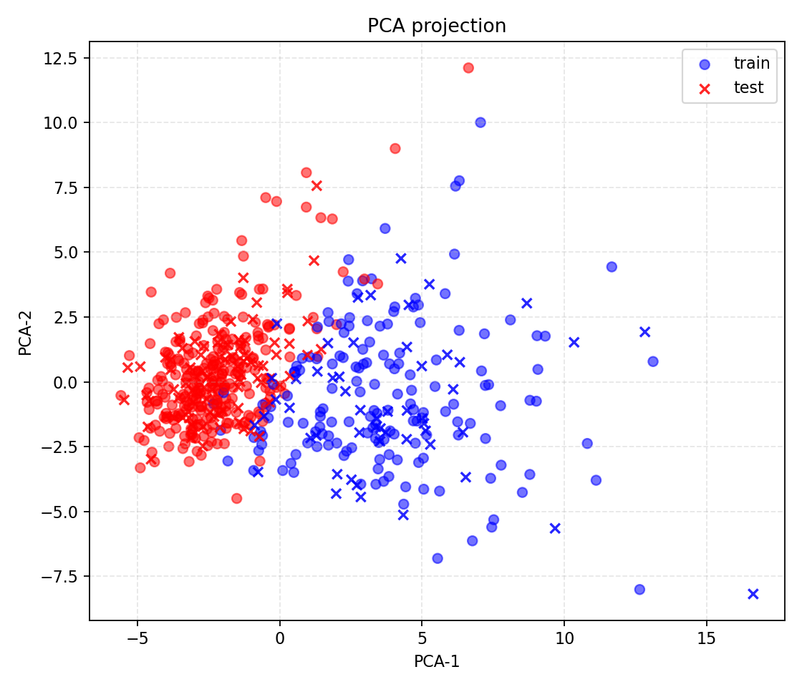
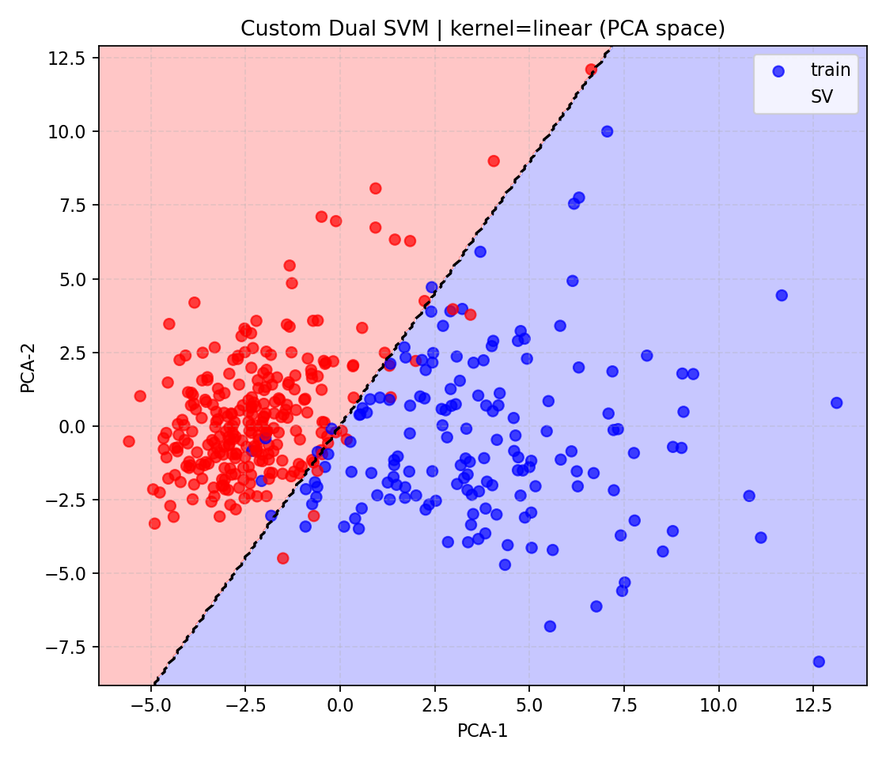
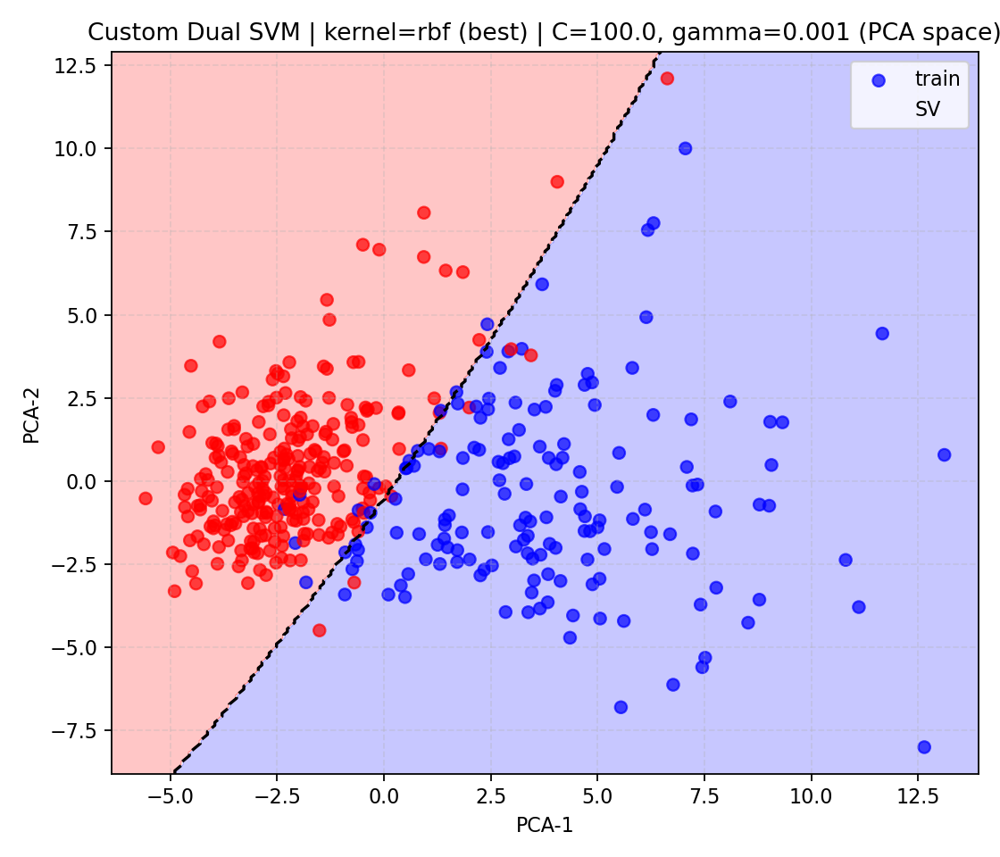
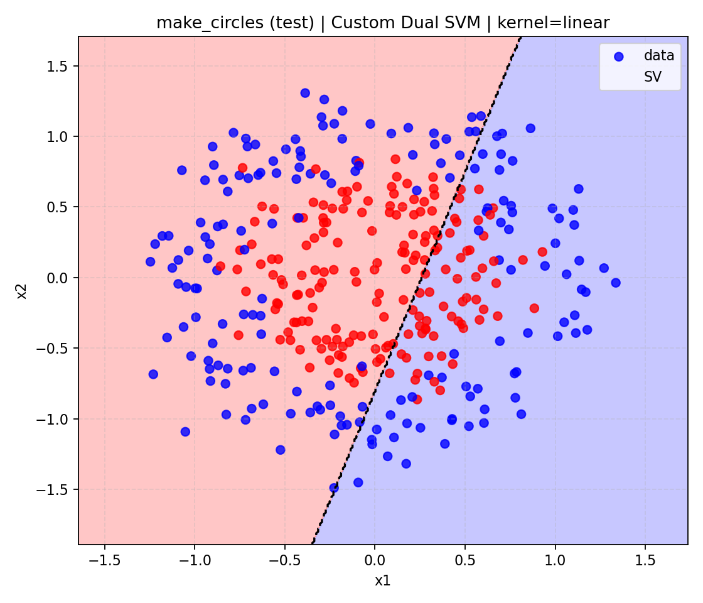
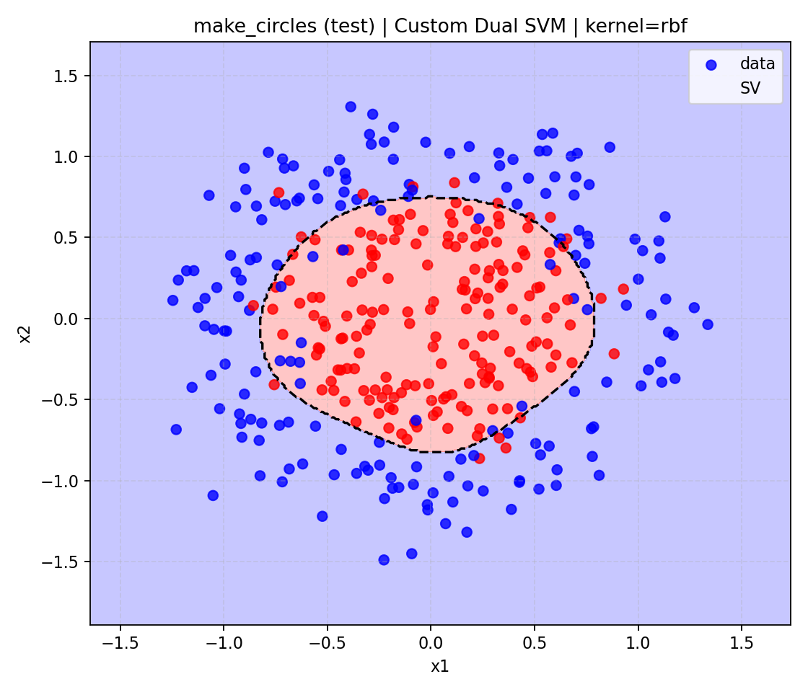
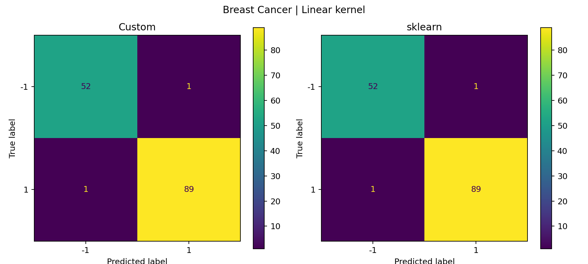
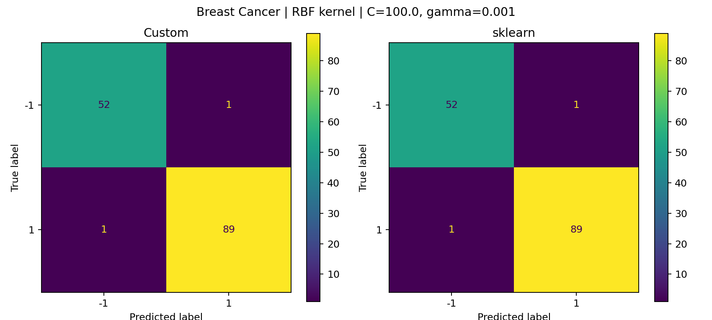
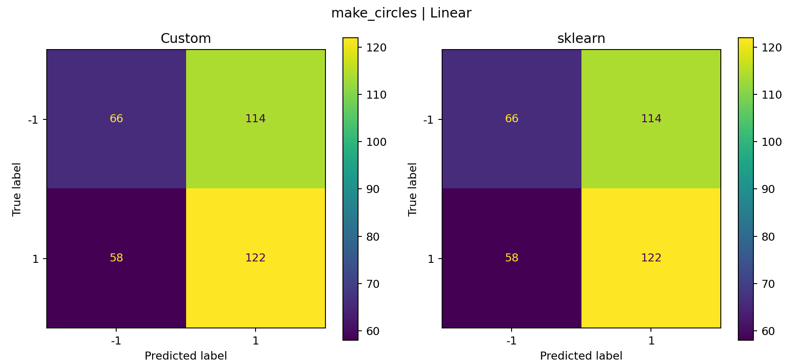
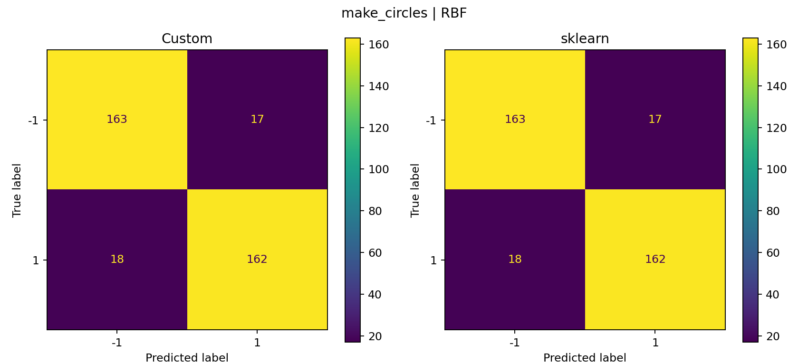

# Laboratory Work №3 — Support Vector Machine (SVM)

## Цель работы
Целью лабораторной работы является реализация алгоритма Support Vector Machine (SVM) через решение двойственной задачи по λ, применение kernel trick для построения нелинейных классификаторов, визуализация решений и сравнение с эталонной реализацией из библиотеки sklearn.

## Теоретическая основа
В работе используется геометрическая постановка задачи SVM, приводящая к задаче квадратичного программирования. Решается двойственная задача по коэффициентам λ с ограничениями:
- 0 ≤ λᵢ ≤ C  
- Σ λᵢ yᵢ = 0  

Для построения нелинейных классификаторов применяется kernel trick.

## Используемые датасеты

### Breast Cancer Wisconsin Dataset
- 569 объектов, 30 признаков
- Бинарная классификация
- Метки: 0 → -1, 1 → +1
- Масштабирование: StandardScaler
- Разделение: 80% train / 20% test
- PCA используется только для визуализации

### make_circles
Синтетический датасет для демонстрации нелинейной разделимости данных.

## Реализация SVM
Реализован кастомный Dual SVM:
- Решение двойственной задачи через scipy.optimize.minimize (SLSQP)
- Поддержка линейного и RBF ядер
- Автоматическое определение опорных векторов
- Корректный расчёт смещения b

## Визуализация

### PCA проекция

### Decision Boundary — Breast Cancer
**Linear kernel**

**RBF kernel (best)**

### make_circles
**Linear kernel**

**RBF kernel**

## Confusion Matrix

### Breast Cancer

### make_circles

## Результаты

### Breast Cancer
- Accuracy ≈ 0.986
- Precision / Recall / F1 ≈ 0.985
- Результаты полностью совпадают с sklearn

### make_circles
- Linear kernel: Accuracy ≈ 0.52 (не подходит для нелинейных данных)
- RBF kernel: Accuracy ≈ 0.90 (корректное разделение классов)

## Сравнение с sklearn
Качество классификации кастомной реализации полностью совпадает с sklearn, однако время обучения значительно больше из-за отсутствия C++ оптимизаций.

## Выводы
- SVM реализован корректно через двойственную задачу
- Kernel trick успешно применён
- RBF ядро эффективно для нелинейных данных
- Визуализация подтверждает теоретические выводы
- Эксперимент полностью демонстрирует принципы работы SVM
