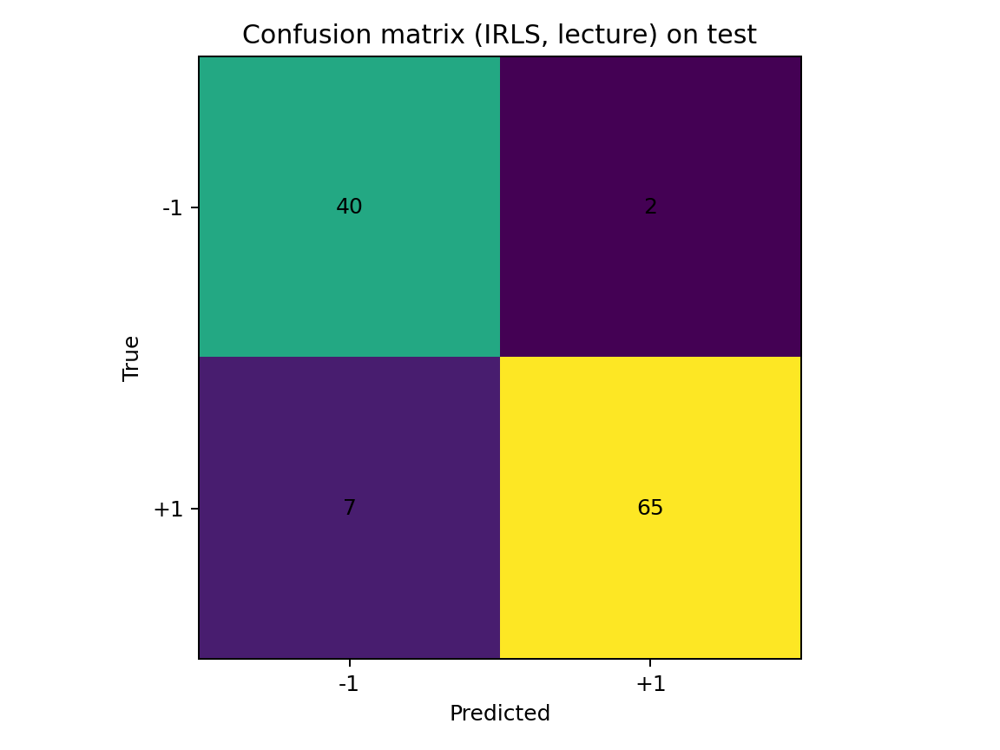
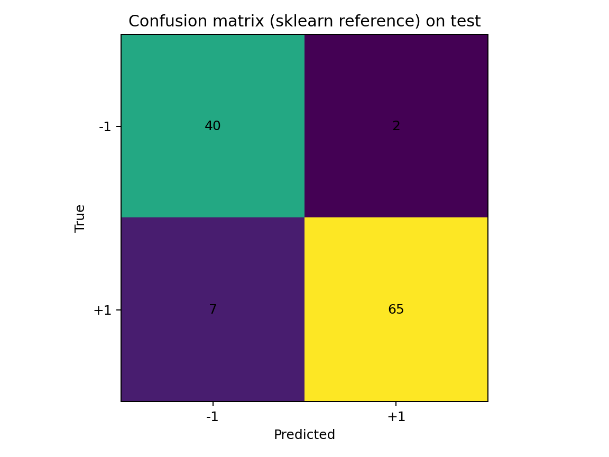
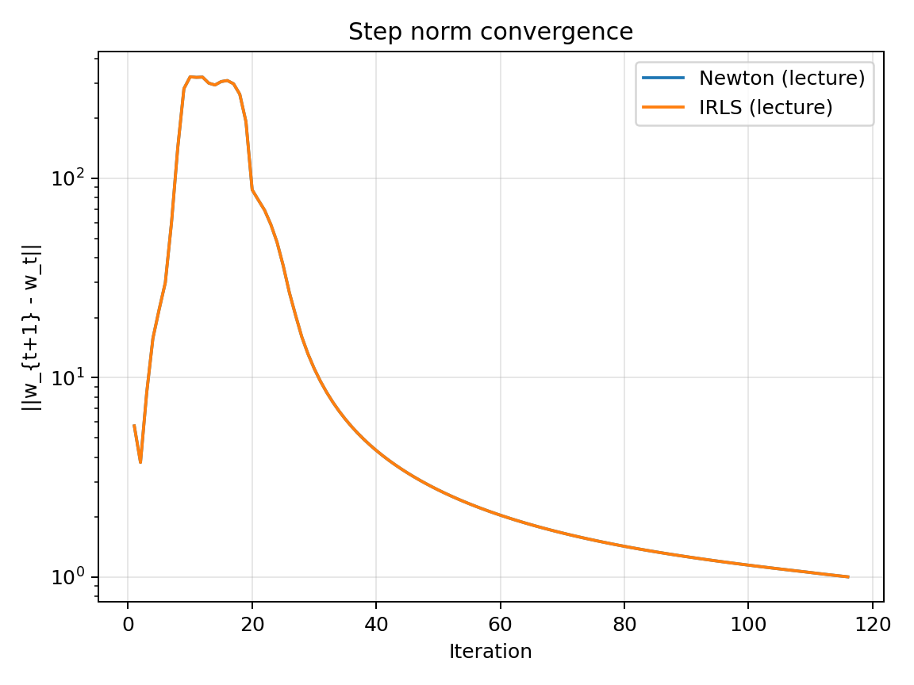
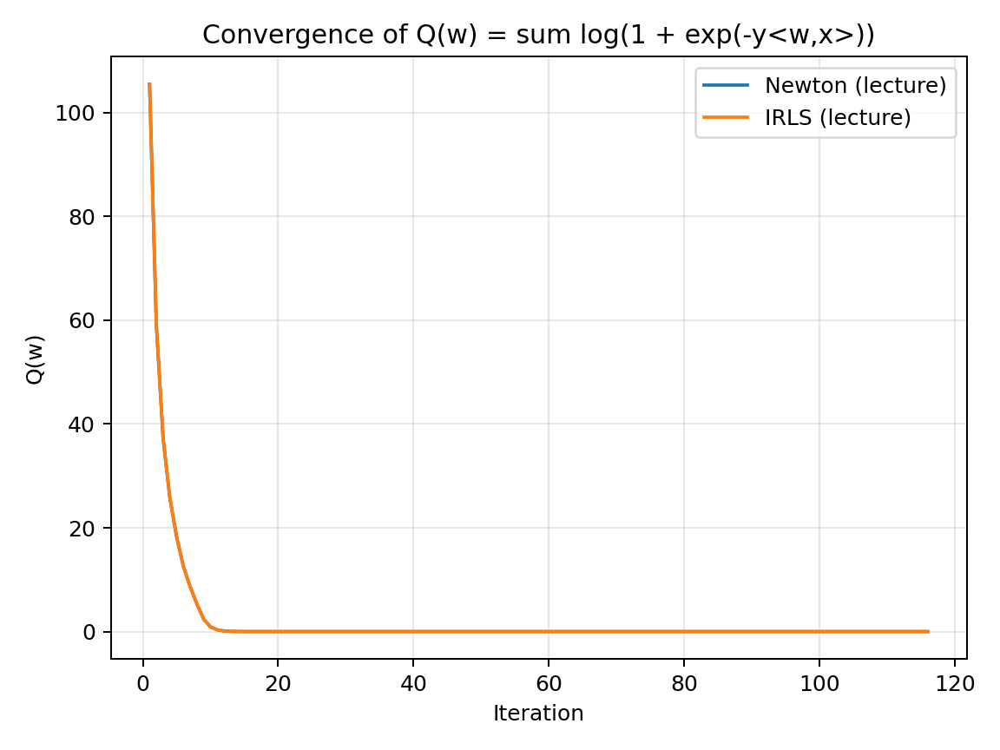
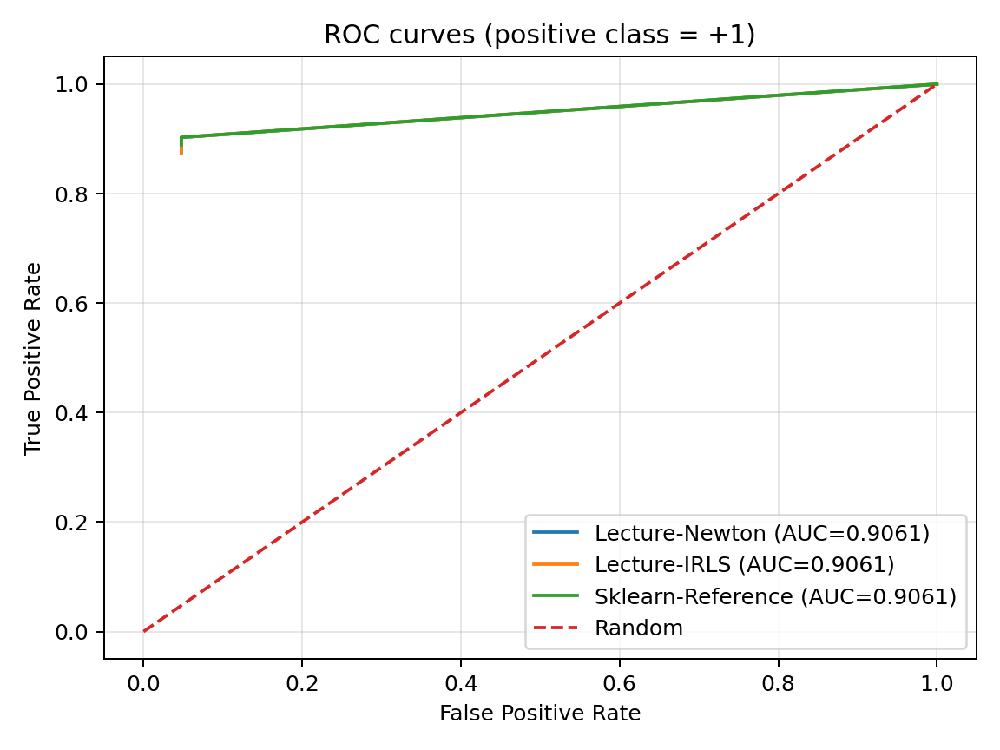

# Лабораторная работа №5  
## Логистическая регрессия: метод Ньютона–Рафсона и IRLS

---

## 📌 Цель работы

Целью данной лабораторной работы является:

- реализация логистической регрессии **с нуля**;
- минимизация эмпирического риска с логистической функцией потерь;
- реализация и сравнение методов:
  - Ньютона–Рафсона;
  - IRLS (Iteratively Reweighted Least Squares);
- экспериментальное подтверждение их эквивалентности;
- сравнение с эталонной реализацией `sklearn`.

---

## 📊 Датасет

Используется датасет **Breast Cancer Wisconsin** (`sklearn.datasets`).

- 569 объектов
- 30 признаков
- Бинарная классификация
- Метки классов: \( y \in \{-1, +1\} \)
- Стандартизация признаков
- Разбиение: 70% / 30%, `random_state=42`

---

## 📐 Теоретическая постановка

Минимизируется функционал (согласно лекции *Нелинейная регрессия*):

Q(w) = Σ_i log(1 + exp(− y_i * (w^T x_i)))

где:
- x_i — вектор признаков,
- y_i ∈ {−1, +1},
- w — вектор параметров модели.

---

## 🧮 Градиент и гессиан

### Градиент

∇Q(w) = − Σ_i y_i x_i * σ(− y_i * (w^T x_i))

### Гессиан

H(w) = Σ_i x_i x_i^T * σ(m_i) * (1 − σ(m_i)),
где m_i = y_i * (w^T x_i)
---

## 🔁 Метод Ньютона–Рафсона

### Итерация Ньютона

w_{t+1} = w_t − H(w_t)^{-1} * ∇Q(w_t)

Используется демпфирование гессиана для устойчивости.

---

## 🔁 Метод IRLS

Эквивалентная форма Ньютона:

(X^T W X) w = X^T W z

Метод решает последовательность задач взвешенных МНК.

---

## 📈 Результаты

### Матрицы ошибок

#### IRLS

**Анализ:** модель корректно классифицирует большинство объектов, ошибки симметричны и совпадают с другими методами.

---

#### Newton

**Анализ:** матрица полностью идентична IRLS, что подтверждает эквивалентность методов.

---

#### Sklearn

**Анализ:** эталонная реализация даёт те же предсказания.

---

## 📉 Сходимость

### Норма шага

**Анализ:** Newton и IRLS демонстрируют идентичную динамику сходимости.

---

### Значение функционала

**Анализ:** функционал монотонно убывает и совпадает для обоих методов.

---

## 📊 ROC-кривые

**AUC = 0.9061** для всех моделей — подтверждение идентичности решений.

---

## 📋 Итоговые метрики

| Модель | Accuracy |
|------|---------|
| Lecture-Newton | 0.9211 |
| Lecture-IRLS | 0.9211 |
| Sklearn | 0.9211 |

---

## ✅ Выводы

- Методы Ньютона и IRLS эквивалентны теоретически и экспериментально;
- Реализация полностью соответствует материалам лекции;
- Результаты совпадают с `sklearn`;
- Цель лабораторной работы достигнута.

---

## 📂 Файлы результатов

- `metrics.txt`
- `equivalence.txt`
- `history/*.csv`
- `out/*.png`

---

## 🏁 Заключение

Лабораторная работа успешно демонстрирует практическую реализацию и эквивалентность методов оптимизации для логистической регрессии.
