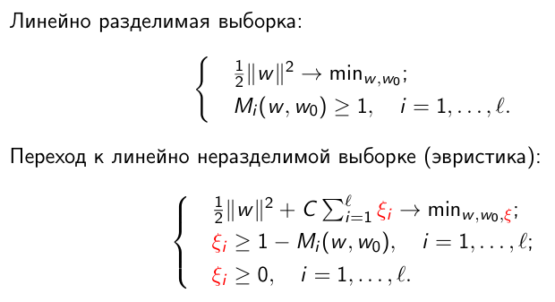
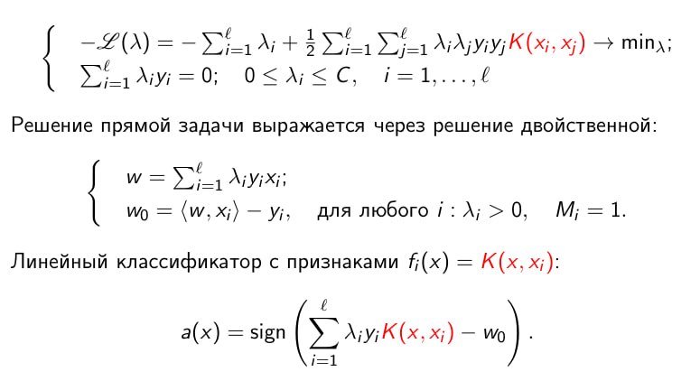

# Support Vector Machine (SVM) — реализация с нуля

Реализация метода опорных векторов (SVM) на Python с решением двойственной задачи оптимизации.

## Реализованные ядра

| Ядро | Формула |
|------|---------|
| Линейное | K(x, y) = x · y |
| Полиномиальное | K(x, y) = (γ · x · y + coef0)^d |
| RBF (Гауссово) | K(x, y) = exp(-γ \|\|x - y\|\|²) |

## Теоретические основы

### Исходная задача (Primal)



### Двойственная задача (Dual)



Решение двойственной задачи:
- Минимизируем: −L(α) = −Σαᵢ + ½ΣΣαᵢαⱼyᵢyⱼK(xᵢ, xⱼ)
- При ограничениях: 0 ≤ αᵢ ≤ C, Σαᵢyᵢ = 0

## Особенности реализации

### Алгоритм оптимизации
Используется `scipy.optimize.minimize` с методом **SLSQP** (Sequential Least Squares Programming) — градиентный метод последовательного квадратичного программирования для решения задачи с ограничениями.

### Целевая функция
```
minimize: −L(α) = −Σαᵢ + 0.5 · αᵀQα
где Q[i,j] = yᵢyⱼK(xᵢ, xⱼ)
```

### Предсказание
Для нового объекта x решающая функция:
```
f(x) = Σᵢ αᵢyᵢK(xᵢ, x) + w₀
predict(x) = sign(f(x))
```

## Параметры SVM

| Параметр | Описание | По умолчанию |
|----------|----------|--------------|
| `C` | Параметр регуляризации. Контролирует баланс между максимизацией margin'а и минимизацией ошибок классификации. Большие значения C → меньше ошибок на обучении, но риск переобучения | 1.0 |
| `kernel` | Объект ядра для вычисления скалярных произведений в пространстве признаков. Доступны: `LinearKernel`, `PolynomialKernel`, `RBFKernel` | LinearKernel() |
| `threshold` | Порог для определения опорных векторов. Точки с αᵢ > threshold считаются опорными | 1e-5 |

## Демонстрация

Запустите `main.ipynb` для:
- Загрузки и визуализации данных (Breast Cancer dataset)
- Обучения SVM с разными ядрами
- Сравнения с sklearn SVC
- Визуализации опорных векторов через PCA
