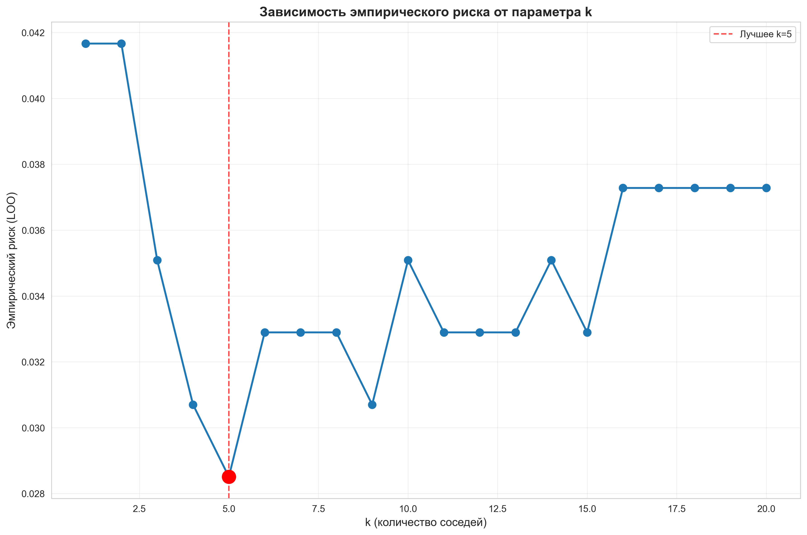
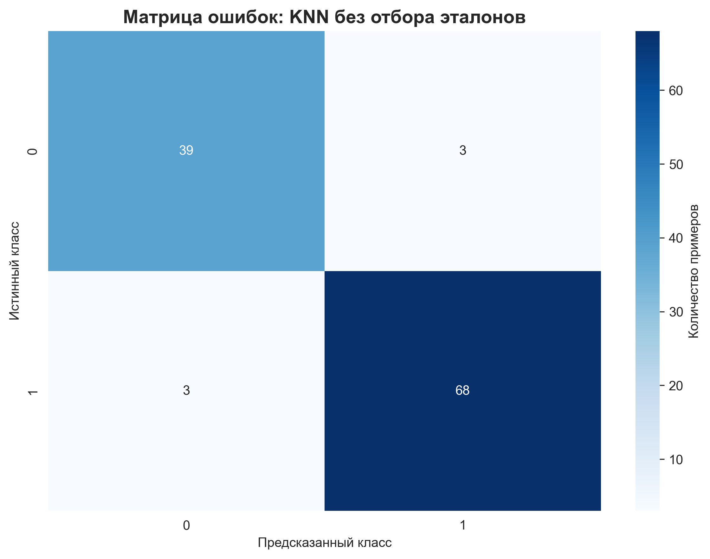
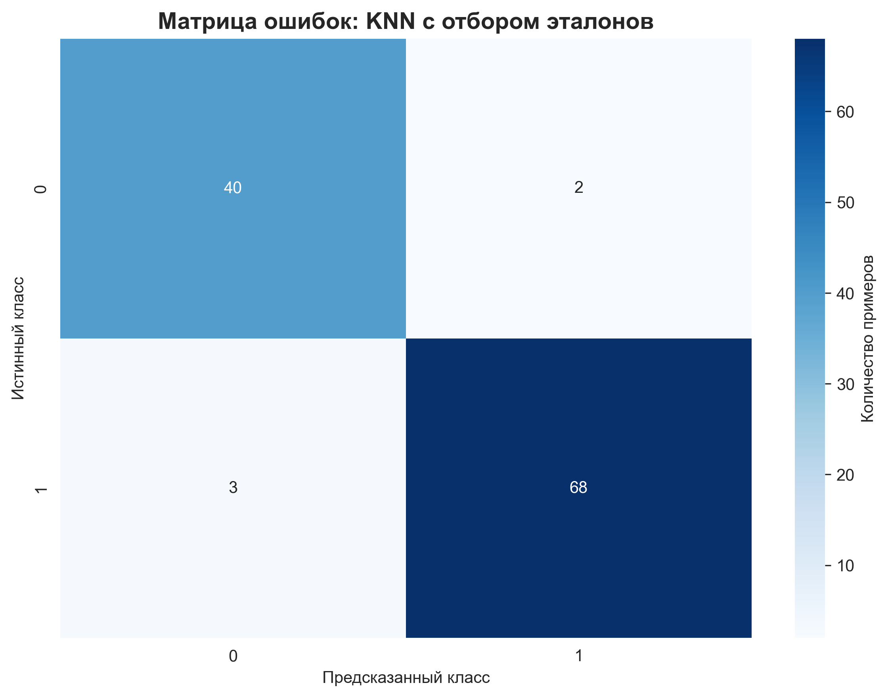
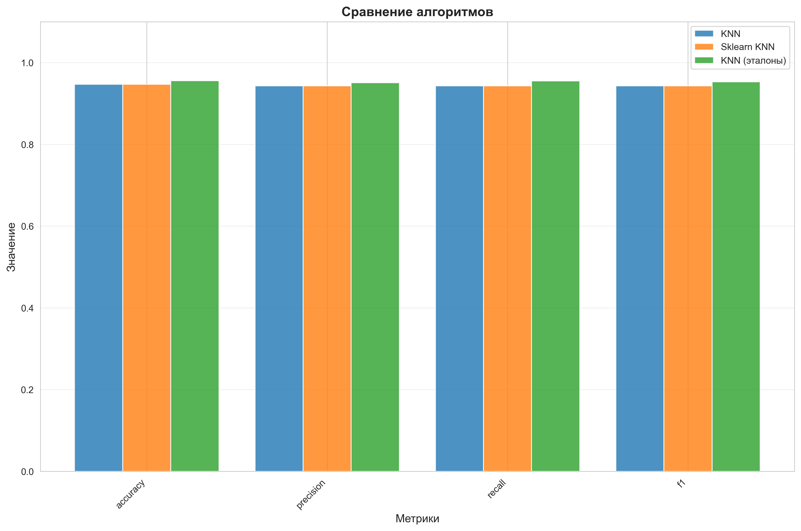

# Лабораторная работа №2. Метрическая классификация
## Задание

1. выбрать датасет для классификации, например на [kaggle](https://www.kaggle.com/datasets?tags=13302-Classification);
2. реализовать алгоритм KNN с методом окна Парзена переменной ширины;
   1. в качестве ядра можно использовать гауссово ядро;
3. подобрать параметр k методом скользящего контроля (LOO);
4. обосновать выбор параметров алгоритма, построить графики эмпирического риска для различных k;
5. сравнить с [эталонной](https://scikit-learn.org/stable/) реализацией KNN;
   1. сравнить качество работы алгоритмов;
6. реализовать алгоритм отбора эталонов;
7. подготовить визуализацию результатов работы алгоритма отбора эталонов;
8. сравнить качество работы KNN с и без отбора эталонов; 
9. подготовить небольшой отчет о проделанной работе.

## Ход работы

### 1. Выбор датасета
Выбранный датасет: breast_cancer
```text
Размер обучающей выборки: 456
Размер тестовой выборки: 113
Количество признаков: 30
Количество классов: 2
```

### 2. LOO. Подбор оптимального k
Был реализован алгоритм LOO , обучающий KNN на всех k указанных в файле конфигурации:
```text
Подбор параметра k методом скользящего контроля (LOO)...

Лучшее значение k: 5
Эмпирический риск при k=5: 0.0285
```


### 3. Отбор эталонов
Для сжатия выборки отбором эталонов был реализован PrototypeSelection (Condensed Nearest Neighbor)
```text
Эксперимент с отбором эталонов...
Исходный размер выборки: 456
Размер после отбора эталонов: 352
Коэффициент сокращения: 0.7719
```


### 4. Сравнение всех моделей
```text
Наша реализация KNN:
  Accuracy: 0.9469
  Precision: 0.9432
  Recall: 0.9432
  F1-score: 0.9432

Sklearn KNeighborsClassifier:
  Accuracy: 0.9469
  Precision: 0.9432
  Recall: 0.9432
  F1-score: 0.9432

KNN с отбором эталонов::
  Accuracy: 0.9558
  Precision: 0.9508
  Recall: 0.9551
  F1-score: 0.9529
```



