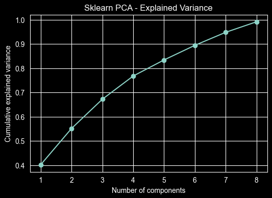
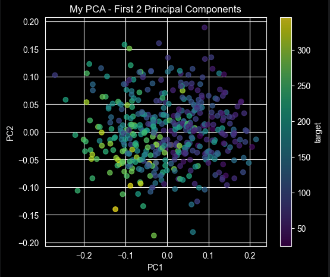
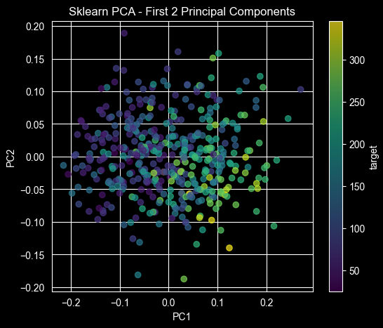

# Лабораторная работа №4. PCA

В рамках лабораторной работы предстоит реализовать PCA и сравнить с эталонной реализацией алгоритма.

## Задание

1. выбрать датасет для линейной регрессии;
2. реализовать PCA через сингулярное разложение;
3. определить эффективную размерность выборки;
4. показать эквивалентность с эталонной реализацией;
5. подготовить отчет.


## Датасет

Выбран `sklearn.datasets.load_diabetes`

## Реализация PCA

```python
@dataclass(frozen=True)
class LinearProjector:
    components: np.ndarray
    mean: np.ndarray

    def transform(self, X: np.ndarray) -> np.ndarray: return (X - self.mean) @ self.components.T


class PCA:
    ...

    def fit(self, X: np.ndarray) -> "PCA":
        self.mean_ = X.mean(axis=0)
        Xc = X - self.mean_
        U, S, Vt = self.decomposer.compute(Xc)
        ratio = self._compute_explained_variance(S, X.shape[0])
        k = self.selector.select(ratio)
        self.components_ = Vt[:k]
        self.explained_variance_ratio_ = ratio[:k]
        assert self.components_ is not None
        assert self.mean_ is not None
        self.projector_ = LinearProjector(self.components_, self.mean_)
        return self

    ...
```

## Определение эффективной размерности

Выбирается искомая дисперсия
```python
self.selector = selector or VarianceThresholdSelector(0.95)
```

Выбирается `n` компонент, объясняющие не менее чем заданную долю дисперсии.

```python
class VarianceThresholdSelector(ComponentSelector):
    def __init__(self, threshold: float = 0.95): self.threshold = threshold

    def select(self, explained_variance_ratio: np.ndarray) -> int: return int(np.searchsorted(np.cumsum(explained_variance_ratio), self.threshold) + 1)
```

По итогу и собственная и `scikit-learn` реализации выдали по 8 компонент.




## Эквивалентность

```
Для первого объекта
Совпадение проекций по абсолютным значениям:  True
Оригинал:
  0.04   0.05   0.06   0.02  -0.04  -0.03  -0.04  -0.00   0.02  -0.02
Самописная PCA:
 -0.03  -0.09   0.03  -0.00  -0.01   0.05  -0.01  -0.04
Sklearn PCA:
  0.03  -0.09   0.03   0.00   0.01  -0.05  -0.01  -0.04
```

Знаки отличаются, однако по абсолютным значениям с погрешностью в $10^{-6}$ значения совпадают.




