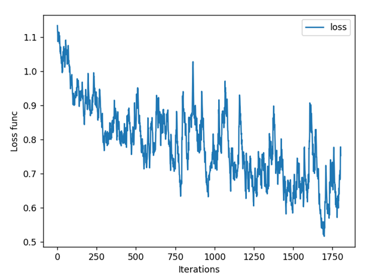
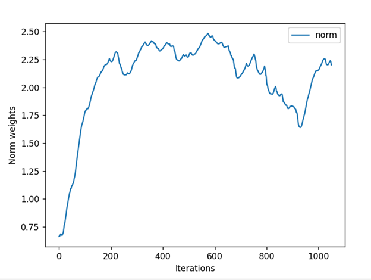

# Линейный классификатор с методом градиентного спуска

## Описание проекта

В данном проекте реализован алгоритм линейной классификации с использованием метода градиентного спуска и его модификаций. В ходе работы были реализованы и протестированы различные методы оптимизации и регуляризации.

## Гиперпараметры

- **Максимальное количество итераций**: 100 000  
- **Оценка точности метода**: \(10^{-5}\)  
- **Параметр L2 регуляризации**: \(10^{-3}\)  
- **Параметр рекуррентной оценки функционала качества**: 0.05  
- **Параметр метода инерций**: 0.9  
- **Максимальная длина шага градиента**: 0.01  

## Реализованные методы

### 1. Рекуррентная оценка функции спуска

График зависимости значения функционала ошибки от номера итерации показывает корректность рекуррентной оценки: значение ошибки уменьшается и стабилизируется вблизи минимума.

---

### 2. Стохастический градиентный спуск с инерцией

Использование инерции (метод моментов Нестерова) позволяет снизить значение функционала ошибки и сгладить колебания.

#### Без метода моментов Нестерова:

#### С методом моментов Нестерова:

---

### 3. L2 регуляризация

L2 регуляризация ограничивает веса модели, предотвращая переобучение.

#### С L2 регуляризацией:

#### Без L2 регуляризации:

---

### 4. Метод наискорейшего градиентного спуска

Этот метод позволяет достичь сходимости за меньшее число итераций по сравнению с обычным градиентным спуском.

#### Обычный градиентный спуск:

#### Наискорейший градиентный спуск:

---

### 5. Сравнение методов инициализации и предъявления объектов

Сравнение проводилось с использованием кросс-валидации. Ниже приведены метрики для различных комбинаций методов инициализации весов и предъявления объектов.

| Метод инициализации          | Предъявление объектов     | Accuracy | Precision | Recall | F1-score |
|------------------------------|---------------------------|----------|-----------|--------|-----------|
| Случайная                    | Случайное                 | 0.7735   | 0.7765    | 0.7735 | 0.7730    |
| Случайная                    | По модулю отступа         | 0.7013   | 0.7080    | 0.7013 | 0.6970    |
| Через корреляцию             | Случайное                 | 0.7811   | 0.7845    | 0.7811 | 0.7798    |
| Через корреляцию             | По модулю отступа         | 0.7847   | 0.7883    | 0.7847 | 0.7826    |
| Мультистарт                  | Случайное                 | 0.7806   | 0.7854    | 0.7806 | 0.7791    |
| Мультистарт                  | По модулю отступа         | 0.7897   | 0.7927    | 0.7897 | 0.7882    |
| **Эталонный метод**          | —                         | **0.7964** | **0.7996** | **0.7964** | **0.7952** |

---

### 6. Отступ классификатора

Для лучшей реализации построен график отступа классификатора.

## Итоги

В ходе работы были успешно реализованы и протестированы различные модификации градиентного спуска. Наилучшие результаты показали методы с инициализацией весов через мультистарт и предъявлением объектов по модулю отступа.