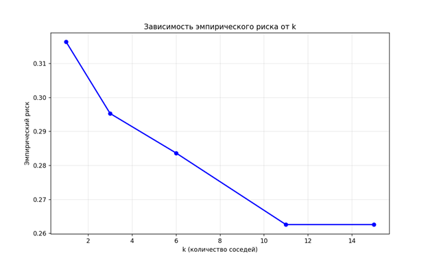
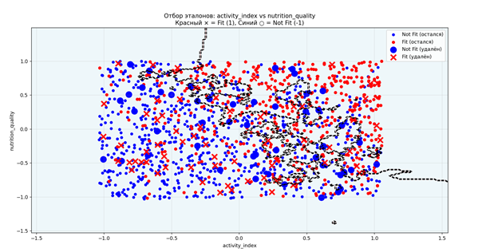

# Лабораторная работа: Реализация метрического алгоритма классификации (KNN)

## Постановка задачи
Необходимо реализовать метрический алгоритм классификации **KNN** с гиперпараметрами:
- **k** — количество соседей  
- **p** — показатель степени при расчёте расстояния между объектами

## Выполненные этапы

### 1. Реализация KNN с переменным окном Парзена и гауссовским ядром  
Реализован модифицированный алгоритм KNN с использованием метода окна Парзена переменной ширины и гауссовского ядра.

### 2. Метод скользящего контроля (LOO)  
Применён метод **Leave-One-Out (LOO)** для оценки качества модели.  
Результаты визуализированы на графике зависимости **эмпирического риска от количества соседей `k`**.  
> **График 1.** График зависимости эмпирического риска от `k`.

### 3. Сравнение с эталонной реализацией  
Разработанный алгоритм сравнён с эталонной реализацией при идентичных гиперпараметрах. Результаты приведены в **Таблице 1**.

**Таблица 1.** Сравнение метрик качества классификации

| Модель                      | Accuracy | Precision | F1     |
|----------------------------|----------|-----------|--------|
| Разработанный алгоритм     | 0.7576   | 0.7551    | 0.7559 |
| Эталонная реализация       | 0.7559   | 0.7535    | 0.7543 |

### 4. Алгоритм отбора эталонов  
Реализован алгоритм отбора опорных (эталонных) объектов.  
Результаты проиллюстрированы графиком распределения объектов по классам (**Скрин 2**).  
- Крестиками (`×`) обозначены удалённые объекты класса **1**  
- Ноликами (`○`) — удалённые объекты класса **–1**

> **График 2.** Распределение объектов по классам с выделением удалённых эталонов.

### 5. Сравнение алгоритма отбора эталонов и базового KNN  
Сравнение качества представлено в **Таблице 2**.

**Таблица 2.** Сравнение обычного KNN и KNN с отбором эталонов (tol=1e-3)

| Модель                                | Accuracy | Precision | F1     |
|--------------------------------------|----------|-----------|--------|
| Обычный алгоритм                     | 0.7576   | 0.7551    | 0.7559 |
| Разработанный алгоритм отбора эталонов | 0.7627   | 0.7600    | 0.7606 |

## Интерпретация результатов
Полученное незначительное улучшение метрик качества при использовании отбора эталонов может объясняться следующими факторами:
- **Сильный дисбаланс классов** в пользу класса *Not Fit*  
- **Отсутствие чёткого разделения** объектов на непересекающиеся группы в признаковом пространстве