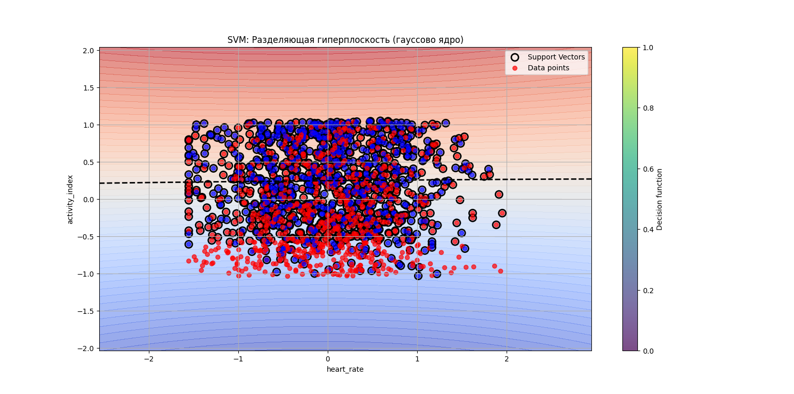

# Лабораторная работа: Реализация метода опорных векторов (SVM)

## Постановка задачи
Необходимо реализовать алгоритм опорных векторов **SVM** с гиперпараметрами:
- **С** — константа, влияющая на ширину полосы
- **gamma** — если используется rbf-ядро, коэффициент при ядре

## Выполненные этапы

### 1. Реализация решения двойственной задачи
Реализовано решение двойственной задачи по лямбда; для решения задачи использован scipy.optimize.minimize

### 2. Реализовать ядерный трюк
В качестве ядерной функции было выбрано **RBF-ядро**. В реализации так же предусмотрен выбор простого скалярного произведения в качестве ядерной функции.

### 3. Реализация линейного классификатора
Был так же разработан линейный классификатор. Качество работы линейного классификатора при использовании **RBF-ядра** проиллюстрировано на **Графике 1**.

### 4. Сравнение с эталонной реализацией  
Разработанный алгоритм сравнивался с эталонной реализацией (SVC из sklearn) при идентичных гиперпараметрах. Результаты приведены в **Таблице 1**.

**Таблица 1.** Сравнение метрик качества классификации

| Модель                      | Accuracy | Precision | F1     |
|----------------------------|----------|-----------|--------|
| Разработанный алгоритм     | 0.8034   | 0.8042    | 0.7973 |
| Эталонная реализация       | 0.7932   | 0.7919    | 0.7881 |

## Интерпретация результатов
Разработанная реализация превосходит эталонную в части метрик при идентичных параметрах. Однако из-за решения задачи квадратичного программирования она уступает по времени обучения эталонной. Это может объясняться использованием более оптимизированных численных методов для решения задачи КП.