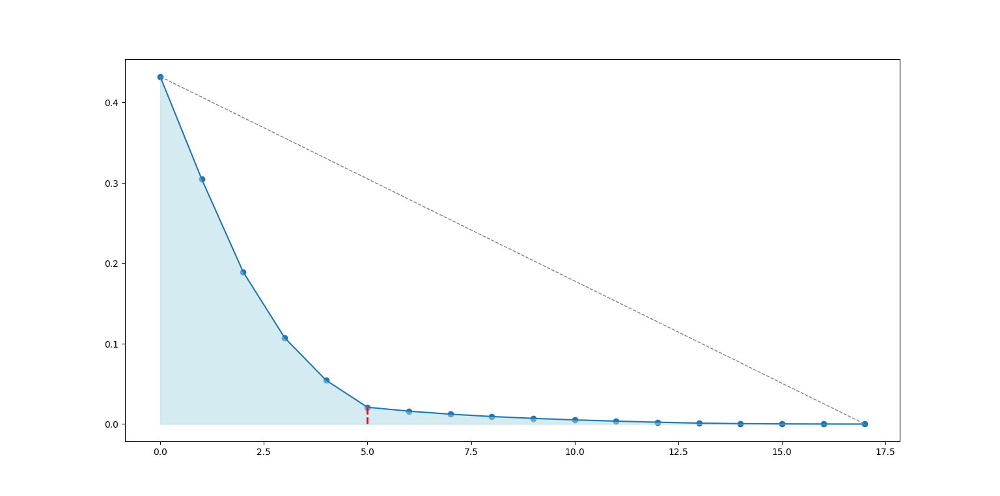

# Лабораторная работа: Реализация метода главных компонент (PCA)

## Постановка задачи
Необходимо реализовать метод главных компонент **PCA** через сингулярное разложение матриц **SVD** с гиперпараметрами:
- **n_components** — количество главных компонент

## Выполненные этапы

### 1. Реализация PCA через сингулярное разложение матриц
Реализован метод главных компонент с использованием сингуярного разложения метриц.
Алгоритм производит преобразование входного датасета в датасет меньшей размерности (n_components)

### 2. Алгоритм отбора эффективной размерности выборки
На основании геометрических соображений автоматический выбирается локтевая точка на графике.
Локтевая точка - та точка, у которой ее расстояние до прямой, соединяющей начало и конец графика, максимально.
Результат автоматического поиска эффективной размерности выборки проиллюстрирован на графике зависимости ошибки "восстановления" **E(m)** от номера от числа используемых главных компонент m.
> **График 1.** График ошибки "восстановления" от m.

### 3. Сравнение с эталонной реализацией  
Разработанный алгоритм сравнивался с эталонным алгоритмом PCA из sklearn через близость модуля результирующей матрицы признаков, а также через разность вектора процента объясненных дисперсий.

Результаты сравнения

- Норма разности модулей новых матриц признаков: 0
- Разность вектора процентов объясненных дисперсий: [ 0.00000000e+00  0.00000000e+00  1.38777878e-17  0.00000000e+00
 -6.93889390e-18]

## Интерпретация результатов
Полученные результаты доказывают эквивалентность реализованной версии метода PCA эталонной.