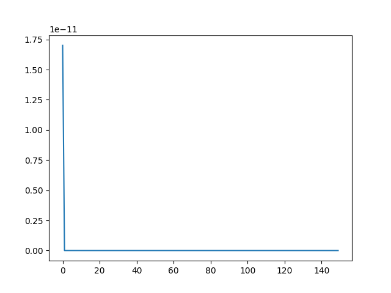
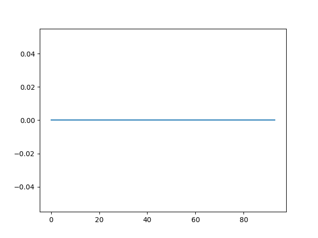

# Лабораторная работа: Реализация логистической регрессии 

## Постановка задачи
Необходимо реализовать логистическую регрессию**SVD** с гиперпараметрами:
- **max_iters** — количество итераций обучения
- **tol** — порядок точности сходимости
- **lr** — шаг метода

## Выполненные этапы

### 1. Реализация логистической регрессии с помощью метода Ньютона-Рафсона и IRLS
Были реализованы оба метода логистической регрессии, а так же были построены графики зависимости велечины функции ошибки от номера итерации. По графикам видно, что если метод Ньютона-Рафсона сходится со временем к оптимуму, то метод IRLS уже начинает с окло (оптимума) из-за своей постановки.

### 2. Сравнение с эталонной реализацией  
Разработанный алгоритм сравнивался с эталонным алгоритмом логистической регрессии из sklearn. Результаты сравнения представлены в **Таблице 1**.

**Таблица 1.** Сравнение метрик качества классификации

| Модель                      | Accuracy | Precision | F1     |
|----------------------------|----------|-----------|--------|
| Разработанный Ньютон-Рафсон    | 0.8102   | 0.8085   | 0.8087 |
| Разработанный IRLS    | 0.8034   | 0.8119    | 0.8105 |
| Эталонная реализация       | 0.8153   | 0.8135   | 0.8135 | 

## Интерпретация результатов
Все три реализации показывают хорошие результаты. Собственная реализация IRLS справляется лучше Ньютона-РАфсона, возможно по причине старта из точки рядом с решением, а так же из-за особенности архитектуры. Эталонная реализация же сработала лучше разработанных методов. 