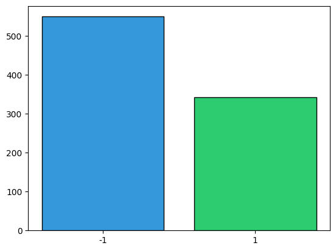
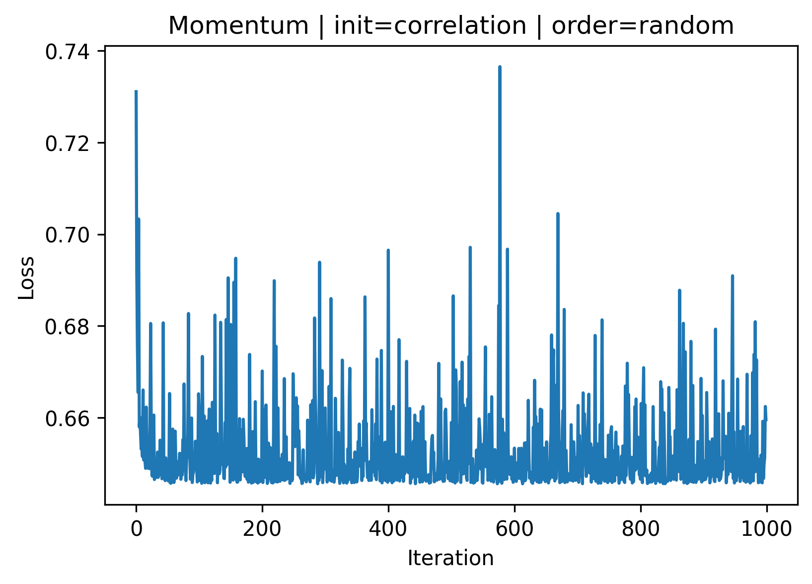
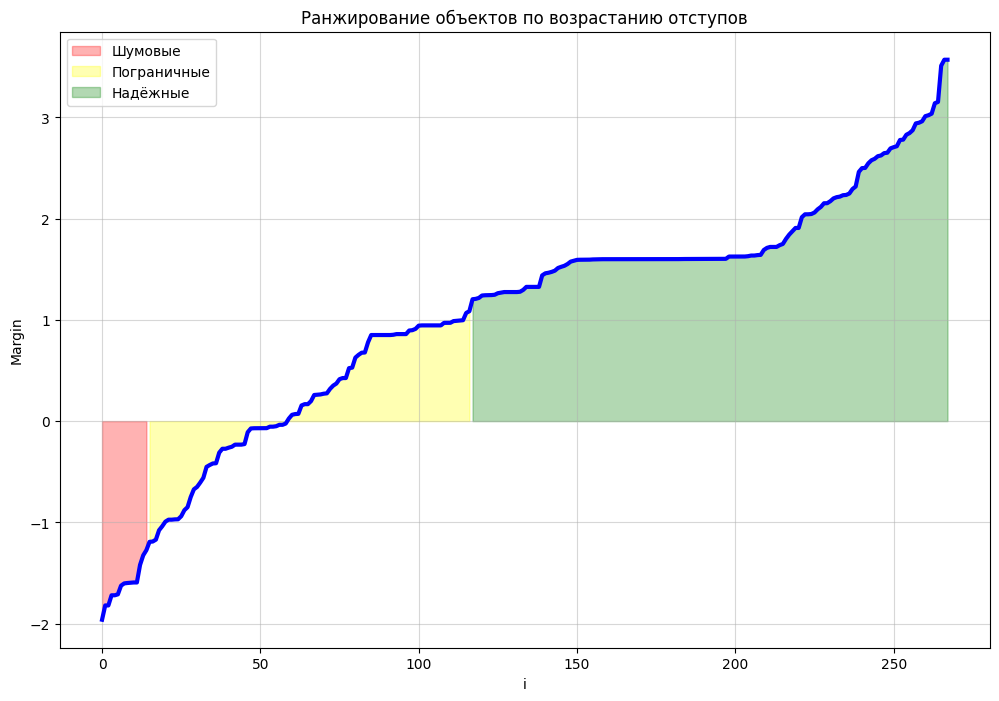

# Лабораторная работа №1

## Задание

1. выбрать датасет для классификации, например на [kaggle](https://www.kaggle.com/datasets?&tags=13304-Clustering);
2. реализовать вычисление отступа объекта (визуализировать, проанализировать);
3. реализовать вычисление градиента функции потерь;
4. реализовать рекуррентную оценку функционала качества;
5. реализовать метод стохастического градиентного спуска с инерцией;
6. реализовать L2 регуляризацию;
7. реализовать скорейший градиентный спуск;
8. реализовать предъявление объектов по модулю отступа;
9. обучить линейный классификатор на выбранном датасете;
   1. обучить с инициализацией весов через корреляцию;
   2. обучить со случайной инициализацией весов через мультистарт;
   3. обучить со случайным предъявлением и с п.8;
10. оценить качество классификации;
11. сравнить лучшую реализацию с эталонной;
12. подготовить отчет.

## Отчёт

### 1. Датасет

В качестве датасета выбран [Titanic Survival Prediction Dataset](https://www.kaggle.com/datasets/yasserh/titanic-dataset)

Данный набор данных содержит информацию о пассажирах Титаника, включая их возраст, пол, класс билета, количество родственников на борту и другие признаки.
Целевая переменная — **Survived** (1 — пассажир выжил, 0 — не выжил).

Основная цель — построить **линейный классификатор**, который будет предсказывать вероятность выживания пассажира на основе признаков.

#### Подготовка данных:

- Загружен CSV-файл `titanic.csv`;
- Проведена предобработка:
  - удалены пропуски в признаках `Age`, `Embarked`;
  - категориальные признаки (`Sex`, `Embarked`) переведены в числовой формат;
  - Возраст преобразован в категории (0,1,2,3)
  - признаки нормализованы к диапазону [0, 1];
- Датасет разделён на обучающую и тестовую выборки в соотношении **80/20**.

```python
import pandas as pd
from sklearn.preprocessing import StandardScaler

url = "https://raw.githubusercontent.com/datasciencedojo/datasets/master/titanic.csv"
df = pd.read_csv(url)

# Выбор признаков и целевой переменной
features = ['Pclass', 'Sex', 'Age', 'SibSp', 'Parch', 'Fare', 'Embarked']
X = df[features].copy()
y = df['Survived']

# Обработка пропусков и категориальных признаков
X['Age'] = X['Age'].fillna(X['Age'].median())
X['Age'] = pd.cut(
    X['Age'],
    bins=[0, 12, 18, 60, 120],
    labels=[0, 1, 2, 3]
).astype(int)
X['Embarked'] = X['Embarked'].fillna('S')

# Кодирование категориальных признаков
X['Sex'] = X['Sex'].map({'male': 0, 'female': 1})
X['Embarked'] = X['Embarked'].map({'S': 0, 'C': 1, 'Q': 2})

# Масштабирование числовых признаков
scaler = StandardScaler()
X[['SibSp', 'Parch', 'Fare']] = scaler.fit_transform(X[['SibSp', 'Parch', 'Fare']])
```

### Доля классов выживших меньше


## 2. Программная реализация
Структура проекта
```
lab1/
├── source/
│ ├── classifier/
│ │ └── sgd_classifier.py # Основная реализация классификатора
│ └── loss/
│ │ └── log_loss.py 
│ └── optimizer/
│ │ └── momentum.py 
│ │ └── nesterov.py 
│ │ └── sgd.py 
└── lab1.ipynb # Анализ результатов классификации, построениt смещения и сравнение с эталоном

└── README.md 
``` 
В программе реализовано согласно заданию:
* **Метод стохастического градиентного спуска с инерцией** — [исходный код](source/optimizer/momentum.py)
* **L2 регуляризация** — [исходный код](source/classifier/sgd_classifier.py)
```python
case 'l2':
    def grad_fun(w):
        reg = self.alpha * w
        return self.loss.derivative(_y * (_x @ w)) * _y * _x + reg

    updated_weights = self.optimizer.update(self.weights, grad_fun, self.learning_rate)
    self.weights = updated_weights
```

* **Скорейший градиентный спуск (Nesterov Accelerated Gradient)** — [исходный код](source/optimizer/nesterov.py)
* **Предъявление объектов по модулю отступа** — [исходный код](source/classifier/sgd_classifier.py)
```python
case 'margin-first':
    margin=np.abs(y * (X @ self.weights))
    shuffle_indices = (margin).argsort()
    print()
```
* **Инициализация весов через корелляцию**
```python
            case 'correlation':
            
                w = np.array([np.dot(X[:, i], y) / np.dot(X[:, i], X[:, i]) for i in range(n_features - (1 if self.use_bias else 0))])
                if self.use_bias:
                    w = np.append(w, 0.0)
                self.weights = w
```

* **Инициализация весов через мультистарт**
```python
case 'multi':
    a = [SGDClassifier(learning_rate=self.learning_rate, alpha=self.alpha,
                        n_iterations=5, optimizer=self.optimizer, loss=self.loss,
                        weight_init='random', penalty=self.penalty, use_bias=self.use_bias) for _ in range(10)]
    X_ = X[:, :-1]
    _ = [i.fit(X_, y) for i in a]
    best = min(a, key=lambda model: model.Q)
    self.weights = best.weights
    print(self.weights.shape)
```
## 3. Анализ и сравнение
Для оценки эффективности различных стратегий обучения были построены графики изменения функции потерь на каждой итерации обучения.

В рамках эксперимента варьировались:
- **метод оптимизации:** `SGD`, `Momentum`, `Nesterov`;
- **инициализация весов:** `random`, `multi`, `correlation`;
- **порядок предъявления объектов:** `random`, `margin-first`.

Графики автоматически сохранялись во время обучения в виде файлов:
```loss_<optimizer><init><ordering>.png```

Наиболее явное различие при изменении предъявления объектов





На примере данных графиков видно, что при рандомном предъявлении объектов график лоса скачет, при предъявлении margin-first, предъявляя сначала объекты с наименьшим по модулю отступом получаем более стабильный график лоса

### Сравнение с эталоном 
При сравнении своей реализации:
```python
SGDClassifier(learning_rate=0.01, n_iterations= 1000, optimizer=Momentum(gamma=0.9), loss=LogLoss(), weight_init='multi', penalty=None, ordering ="margin-first", lambd=0.5, use_bias=True)
```
С реализацеий sklearn:
```python
SGDClassifier(
    loss='log_loss',      
    learning_rate='constant',
    eta0=0.01,
    penalty='l2',
    random_state=42,
    warm_start=True  
)
```
Получил следующие результаты
Моя модель:
```
Accuracy: 0.7910447761194029
Confusion Matrix:
 [[ 89  34]
 [ 22 123]]
```
Sklearn:
```
Accuracy: 0.7910447761194029
Confusion Matrix:
 [[ 79  24]
 [ 32 133]]|
 ```

Видно что общий accuracy получилось доститчь тот же, но видно что моей модели сложнее определять класс -1, нежели +1. В sklearn наоборот.

### Построение графиков смещения [исходный код](source/lab1.ipynb)
```python
X_test_2 = np.hstack([X_test, np.ones((X_test.shape[0], 1))])
margins = y_test * (X_test_2 @ a.weights)
sorted_margins = margins[np.argsort(margins)]

plt.figure(figsize=(12, 8))
plt.plot(range(len(sorted_margins)), sorted_margins, 'b-', linewidth=3)

n_points = len(sorted_margins)
x_range = np.arange(n_points)

threshold = 1.2
noisy = sorted_margins < -threshold  
borderline = (sorted_margins >= -threshold) & (sorted_margins <= threshold)
reliable = sorted_margins > threshold
plt.fill_between(x_range[noisy], sorted_margins[noisy], 0, 
                     color='red', alpha=0.3, label='Шумовые')
plt.fill_between(x_range[borderline], sorted_margins[borderline], 0, 
                     color='yellow', alpha=0.3, label='Пограничные')
plt.fill_between(x_range[reliable], sorted_margins[reliable], 0, 
                     color='green', alpha=0.3, label='Надёжные') 


plt.xlabel('i')
plt.ylabel('Margin')
plt.title('Ранжирование объектов по возрастанию отступов')
plt.legend()
plt.grid(True, alpha=0.5)
plt.show()
```

Видно что большая часть объектов надежные - (смещение>1.2)\
Значение смещения было выбрано исходя из графика.
## Вывод
В ходе лабораторной работы были реализованы и исследованы основные методы обучения линейного классификатора на примере задачи предсказания выживания пассажиров «Титаника».\
Получилось сравнить различные оптимизаторы и методы предъявления новых объектов.