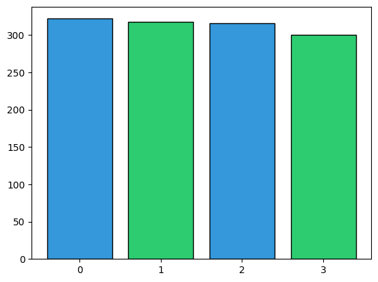
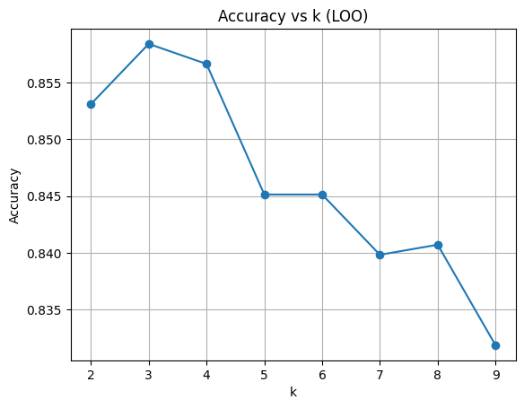
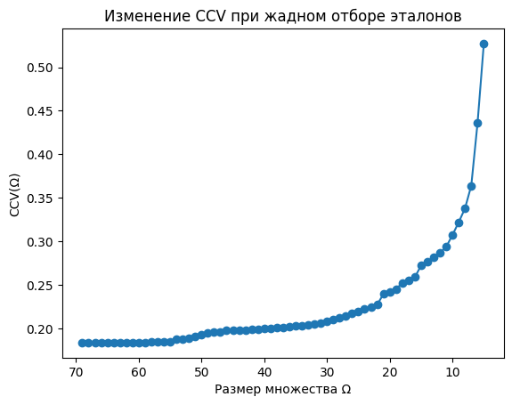

# Лабораторная работа №2

## Задание

1. выбрать датасет для классификации, например на kaggle;
2. реализовать алгоритм KNN с методом окна Парзена переменной ширины;
3. в качестве ядра можно использовать гауссово ядро;
4. подобрать параметр k методом скользящего контроля (LOO);
5. обосновать выбор параметров алгоритма, построить графики эмпирического риска для различных k;
6. сравнить с эталонной реализацией KNN;
7. сравнить качество работы алгоритмов;
8. реализовать алгоритм отбора эталонов;
9. подготовить визуализацию результатов работы алгоритма отбора эталонов;
10. сравнить качество работы KNN с и без отбора эталонов;
11. подготовить небольшой отчет о проделанной работе.

## Отчёт

### 1. Датасет

В качестве датасета выбран [Earthquake Alert Dataset](https://www.kaggle.com/datasets/...)

Данный набор данных содержит информацию о ... .
Целевая переменная — **...** (...).

Основная цель — построить **метрический классификатор KNN**, который будет предсказывать ... .

#### Подготовка данных:

- Загружен CSV-файл `earthquake_alert_balanced_dataset.csv`;
- Проведена предобработка:
  - удалены пропуски;
  - категориальные признаки переведены в числовой формат;
  - признаки нормализованы;
- Датасет разделён на обучающую и тестовую выборки в соотношении **80/20**.

### Распределение классов



## 2. Программная реализация

Структура проекта:

```
lab2/
├── source/
│   ├── classifier/
│   │   └── KnnClassifier.py      # Реализация KNN классификатора
│   └── selector/
│       ├── compactness.py        # Вычисление CCV
│       └── selector.py           # Алгоритм отбора эталонов
└── lab2.ipynb                    # Анализ результатов классификации
└── README.md 
```

В программе реализовано согласно заданию:

* **Алгоритм KNN с методом окна Парзена** — [исходный код](source/classifier/KnnClassifier.py)

```python
def _kernel(self, distance, h):
    if self.kernel == "gaussian":
        return np.exp(-2 * (distance / h) ** 2)
    elif self.kernel == "epanechnikov":
        u = distance / h
        return 0.75 * (1 - u ** 2) if abs(u) <= 1 else 0.0
```

* **Подбор параметра k методом LOO** — [исходный код](source/classifier/KnnClassifier.py)

```python
for k in range(2, min(n, 10)):
    y_pred = []
    for i in range(n):
        neighbor_idx = sorted_indices[i][1:k+1]  
    accuracy = np.sum(y_pred == y) / n
    if accuracy > self.best_accuracy:
        self.best_accuracy = accuracy
        self.k = k
```

* **Алгоритм отбора эталонов (жадное удаление/добавление)** — [исходный код](source/selector/selector.py)
* **Вычисление критерия компактности CCV** — [исходный код](source/selector/compactness.py)

## 3. Анализ и сравнение

### Подбор параметра k

График эмпирического риска для различных значений k:



Оптимальное значение k = 3, при котором достигается LOO = 0.8584070796460177

### Сравнение с эталоном

При сравнении своей реализации:

```python
knn2 = KnnClassifier(ord = 2, weights ="uniform")
```

Uniform был выбран как наилучший вариант после экспериментов с разными ядрами и весами.

С реализацией sklearn:

```python
from sklearn.neighbors import KNeighborsClassifier
knn = KNeighborsClassifier(n_neighbors=3, metric='minkowski', p=2, )
```

Получены следующие результаты:

**Моя модель:**

```
Accuracy: 0.8968253968253969
```

**Sklearn:**

```
Accuracy: 0.8968
```

### Алгоритм отбора эталонов

Визуализация изменения CCV при отборе эталонов:



Сравнение качества KNN до и после отбора эталонов:

С отбором эталонов:

```
Accuracy: 0.8015873015873016
```

Без отбора эталонов:

```
Accuracy: 0.8968253968253969
```

C точки зрения Accuracy, отбор эталонов ухудшил качество классификации, что свидетельствует о том датасет не избыточен и все объекты важны для классификации.

## Вывод

В ходе лабораторной работы были реализованы и исследованы:

- Алгоритм метрической классификации KNN с методом окна Парзена;
- Метод скользящего контроля (LOO) для подбора параметра k;
- Алгоритм отбора эталонов с критерием компактности CCV.

Получилось сравнить различные ядра и методы отбора эталонов. Отбор эталонов в данном случае ухудшил качество классификации, что говорит о важности всех объектов в выбранном датасете.
