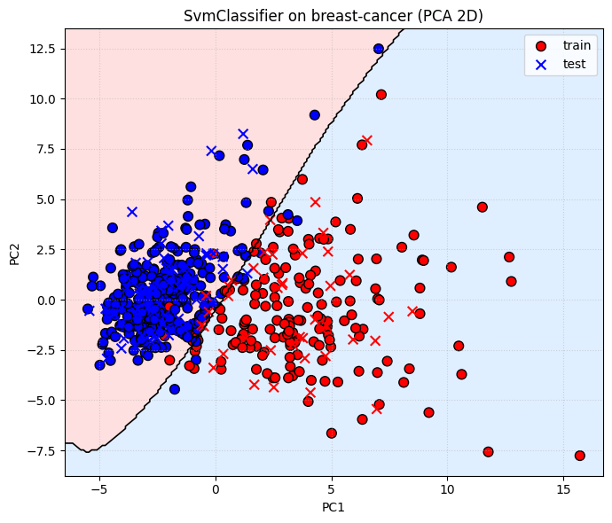

# Лабораторная работа №3

## Задание

1. выбрать датасет для бинарной классификации;
2. реализовать решение двойственной задачи по лямбда; для решения задачи использовать [scipy.optimize.minimize](https://docs.scipy.org/doc/scipy/reference/generated/scipy.optimize.minimize.html#scipy.optimize.minimize) или любую другую библиотеку;
3. провернуть трюк с ядром;
4. построить линейный классификатор;
5. визуализировать решение;
6. сравнить с эталонным решением;

## Отчёт

### 1. Датасет

В качестве датасета выбран breast-cancer dataset.


### 2. Программная реализация

Структура проекта:
```
lab3/
├── source/
│   ├── svm_classifier.py   # Основная реализация SVM
└── lab3.ipynb              # Анализ, визуализация, сравнение с эталоном
└── README.md
```

В программе реализовано:
* **Решение двойственной задачи SVM** — [исходный код](source/svm_classifier.py)
* **Трюк с ядром (kernel trick)** — [исходный код](source/svm_classifier.py)
* **Визуализация разделяющей поверхности** — [исходный код](lab3.ipynb)
* **Сравнение с эталонной реализацией (sklearn SVC)** - [исходный код](lab3.ipynb)

#### Реализация SVM с решением двойственной задачи:
```python
 def _objective_function(self, alpha, kernel_matrix):
        alpha = np.array(alpha)
        y = np.array(self.y)
        kernel_matrix = np.array(kernel_matrix)
        bigsum = np.dot(alpha * y, np.dot(kernel_matrix, alpha * y))
        return -np.sum(alpha) + 0.5 * bigsum
    def _objective_gradient(self, alpha, kernel_matrix):
        alpha = np.array(alpha)
        y = np.array(self.y)
        kernel_matrix = np.array(kernel_matrix)
        grad = -np.ones_like(alpha) + np.dot(kernel_matrix, alpha * y) * y
        return grad
    
    def fit(self):
        n_samples = len(self.X)
        initial_alpha = [0.0] * n_samples
        bounds = [(0, self.C) for _ in range(n_samples)]
        kernel_matrix = self._compute_kernel_matrix()
        constraints = {'type': 'eq', 'fun': lambda alpha: sum(alpha[i] * self.y[i] for i in range(n_samples))}
        result = minimize(fun=self._objective_function,
                          x0=initial_alpha,
                          args=(kernel_matrix,),
                          bounds=bounds,
                          constraints=constraints,
                            method='SLSQP',
                            jac=self._objective_gradient

                        )
        self.alpha = result.x
        support_indices = [i for i in range(n_samples) if self.alpha[i] > 1e-5]
        if not support_indices:
            self.b = 0
        else:
            b_sum = 0
            for i in support_indices:
                decision = sum(self.alpha[j] * self.y[j] * self._kernel_function(self.X[j], self.X[i]) for j in range(n_samples))
                b_sum += self.y[i] - decision
            self.b = b_sum / len(support_indices)
```

#### Реализация ядер:
```python
    def _kernel_function(self, x1, x2):
        if self.kernel == 'linear':
            return sum(a*b for a, b in zip(x1, x2))
        elif self.kernel == 'constant':
            return 1
        elif self.kernel == 'polynomial':
            return (sum(a*b for a, b in zip(x1, x2)) + 1) ** self.d
        elif self.kernel == 'rbf':
            diff = np.array(x1) - np.array(x2)
            return np.exp(-np.dot(diff, diff))
        elif self.kernel == 'custom':
            a = sum(a*b for a, b in zip(x1, x2))
            return a**3 + 2*a**2 + 3*a + 1
```

### 3. Анализ и сравнение




**Результаты:**
```
Моя модель:
Train Accuracy: 0.967032967032967
Test Accuracy: 0.9210526315789473

Sklearn SVC:
Accuracy: 0.945054945054945
Test Accuracy:  0.9385964912280702

```

### Вывод

В ходе лабораторной работы были реализованы и исследованы методы построения линейного классификатора SVM, решена двойственная задача, применён трюк с ядром, проведена визуализация и сравнение с эталонной реализацией. Полученные результаты подтверждают корректность реализации и позволяют анализировать влияние различных параметров на качество классификации.