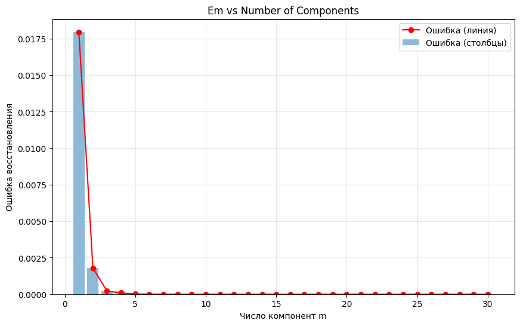
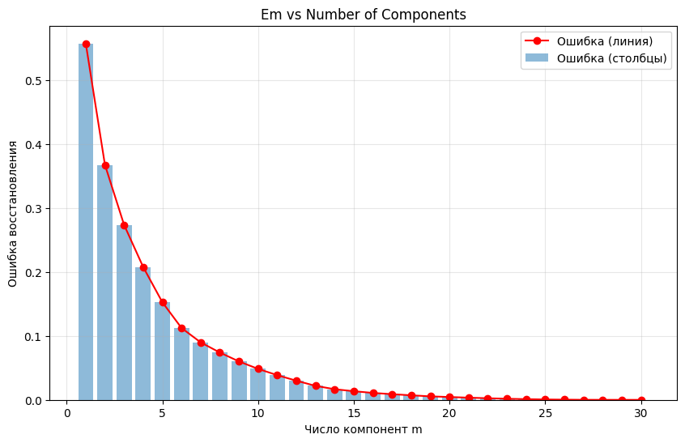

## Задание

1. выбрать датасет для линейной регрессии;
2. реализовать PCA через сингулярное разложение;
3. определить эффективную размерность выборки;
4. показать эквивалентность с эталонной реализацией;
5. подготовить отчет.

## Датасет для линейной регрессии
В качестве датасета выбран [Breast Cancer Wisconsin (Diagnostic) Dataset](https://www.kaggle.com/datasets/uciml/breast-cancer-wisconsin-data).

## Программная реализация
Структура проекта:
```
lab4/
├── source/
│   ├── PCA.py                # Основная реализация PCA
└── lab4.ipynb                # Анализ, визуализация, сравнение с эталоном
└── README.md
```
В программе реализовано согласно заданию:
* **PCA через сингулярное разложение** — [исходный код](source/PCA.py)
```python
    def fit(self, X):
        # центрирование
        self.mean_ = X.mean(axis=0)
        Xc = X - self.mean_

        # SVD
        V, S, U_T = np.linalg.svd(Xc, full_matrices=False)

        # собственные значения
        self.singular_values_ = S
        self.explained_variance_ = S**2
        self.explained_variance_ratio_ = (
            self.explained_variance_ / self.explained_variance_.sum()
        )

        # выбор числа компонент
        if self.n_components is None:
            if self.eps is None:
                self.n_components_ = X.shape[1]
            else:
                total = self.explained_variance_.sum()
                residual = np.array([
                    self.explained_variance_[m+1:].sum() / total
                    for m in range(len(self.explained_variance_))
                ])

                self.n_components_ = np.argmax(residual <= self.eps)
                if self.n_components_ == 0:
                    self.n_components_ = 1
        else:
            self.n_components_ = self.n_components

        # главные направления
        self.components_ = U_T[:self.n_components_]

        return self
```

## Эффективная размерность выборки



После выполнения PCA без стандартизации с сохраненной долей дисперсии 0.9820446715106614 была определена эффективная размерность m: 1 (окак). График крутого склона показывает, что большая часть дисперсии объясняется первой главной компонентой.



После выполнения PCA со стандартизацией с сохраненной долей дисперсии 0.9398790324425351 была определена эффективная размерность m: 9.
График крутого склона показывает, что первые девять главных компонент объясняют значительную часть дисперсии.

## Сравнение с эталонной реализацией

В качестве эталонной реализации используется PCA из библиотеки sklearn. Проверяется совпадение подпространств.
```python
print(
    np.allclose(
        np.abs(pca.components_ @ sk_pca.components_.T),
        np.eye(pca.n_components_),
        atol=1e-6
    )
)
```

## Вывод 
В работе была реализована процедура главных компонент (PCA) через сингулярное разложение. Проведено сравнение с эталонной реализацией из библиотеки sklearn, показавшее полное совпадение подпространств. Были определены эффективная размерность выборки для заданного уровня сохраненной дисперсии.