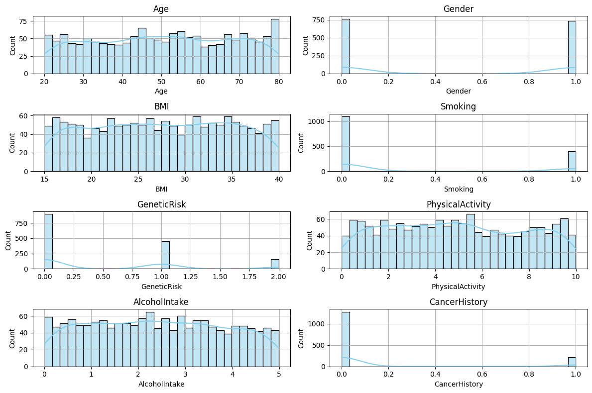
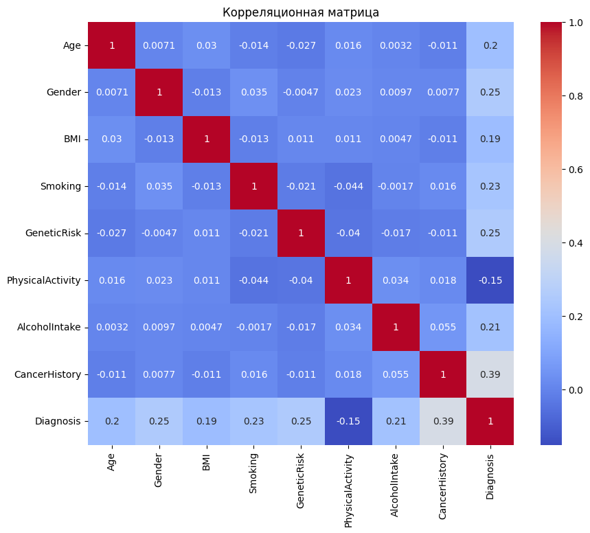
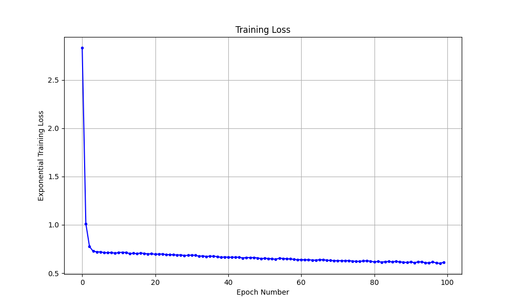
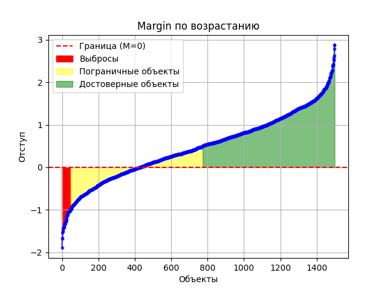
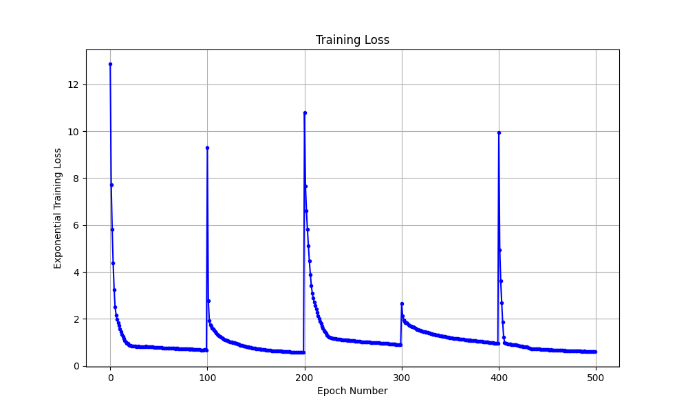
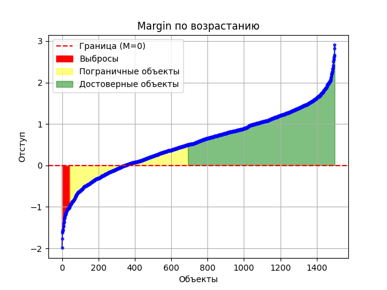
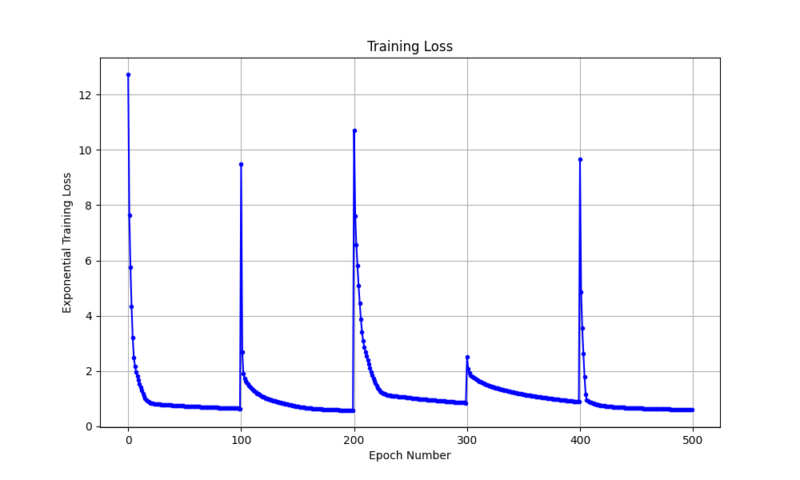
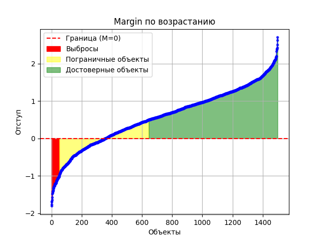
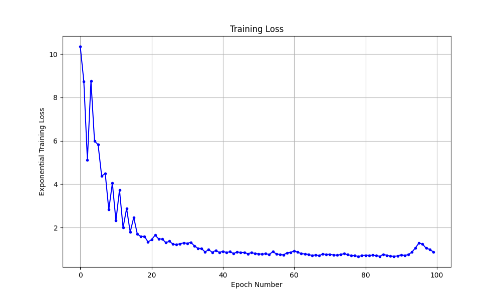
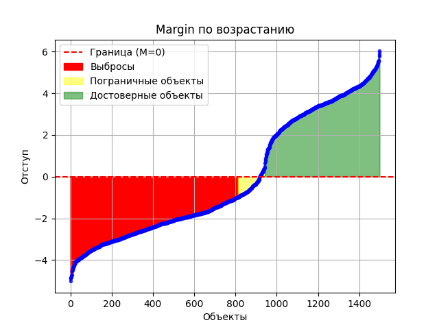

# Лабораторная работа №1. Линейная классификация

В рамках лабораторной работы предстоит реализовать линейный классификатор. И обучить его методом стохастического градиентного спуска с инерцией с L2 регуляризацией и квадратичной функцией потерь.

## Задание

1. выбрать датасет для классификации, например на [kaggle](https://www.kaggle.com/datasets?&tags=13304-Clustering);
2. реализовать вычисление отступа объекта (визуализировать, проанализировать);
3. реализовать вычисление градиента функции потерь;
4. реализовать рекуррентную оценку функционала качества;
5. реализовать метод стохастического градиентного спуска с инерцией;
6. реализовать L2 регуляризацию;
7. реализовать скорейший градиентный спуск;
8. реализовать предъявление объектов мо модулю отступа;
9. обучить линейный классификатор на выбранном датасете;
   1. обучить с инициализацией весов через корреляцию;
   2. обучить со случайной инициализацией весов через мультистарт;
   3. обучить со случайным предъявлением и с п.8;
10. оценить качество классификации;
11. сравнить лучшую реализацию с эталонной;
12. подготовить отчет.


# Отчет

1. В качестве датасеты был выбран https://www.kaggle.com/datasets/rabieelkharoua/cancer-prediction-dataset с задачей бинарной классификации наличия рака у человека

В данных нет пропусков.

Распределение признаков:



Отсюда видно, что Gender, Smoking, GeneticRisk и CancerHistpry - бинарные категориальные признаки. Остальные - численные (возможно категориальные по типу возраста)

Корреляционная матрица:



2. [Код для вычисления margin](./src/module/margin.py)

3. [Код для вычисления loss](./src/module/loss.py)

4. [Код для вычисления Q](./src/module/evaluator.py)

5. [Код для SGD и NAG](./src/module/optimizer.py)

6. [Код с регуляризацией](./src/module/regularization.py)

7. П.5

8. [Код для предъявления по отступу или случайным образом](./src/batch/batch_generator.py)

9. По результатам обучения получилась таблица со сравнением резуьтатов модели:

| Модель | Accuracy | Q | Margin |
|--------|----------|---|--------|
|Инициализация весов через корреляцию + SGD | 0.723 |  |  |
|Инициализация весов мультистарт + SGD | 0.776 |  |  |
|Инициализация весов мультистарт + NAG | 0.77 |  |  |
|Обучение с предъявлением по margin + SGD | 0.393 |  |  |
|Обучение со случайным предъявлением + SGD | 0.693 |  |  |

Лучшей оказалась модель с иницализацией через мультистарт + SGD

10. Сравним с sklearn реализацией

```python
baseline_model = SGDClassifier(
        loss='hinge',
        max_iter=100,
        learning_rate='constant',
        eta0=0.002,
        random_state=42,
        tol=1e-3,
        shuffle=True
    )
```

Accuracy: 0.75

Реализованная модель справилась даже немного лучше.


