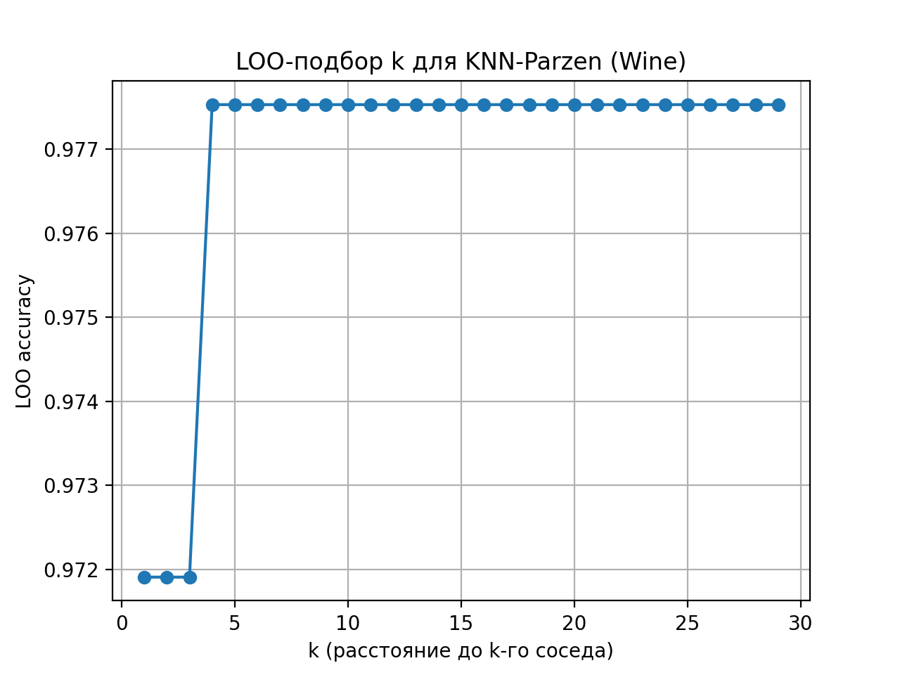
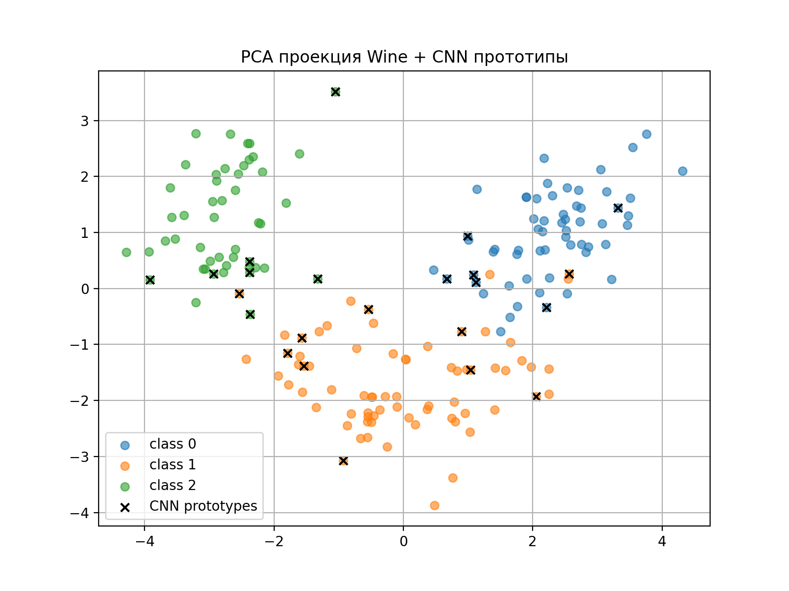
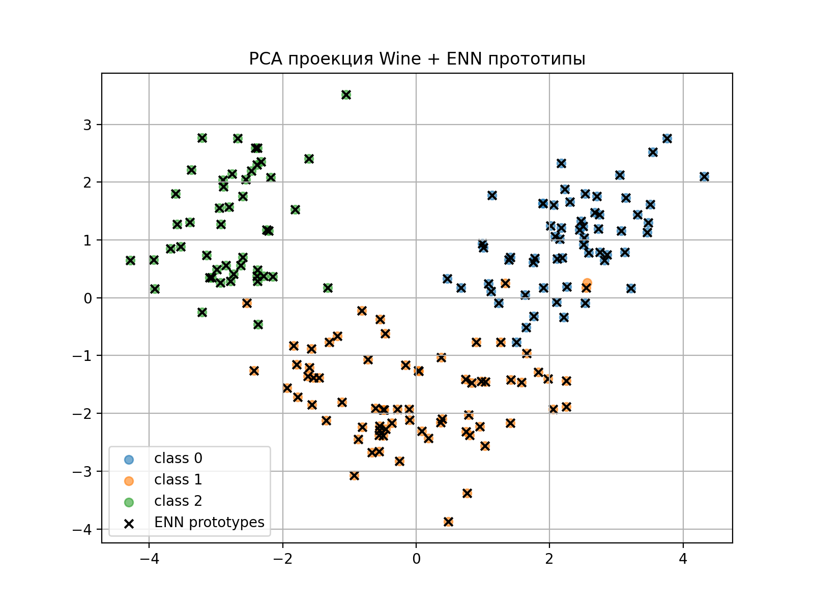

# Лабораторная работа №2 — Метрическая классификация (KNN, Parzen, отбор эталонов)

**Цель:** реализовать KNN с методом окна Парзена переменной ширины (гауссово ядро), подобрать параметр *k* методом скользящего контроля (LOO), реализовать и протестировать алгоритмы отбора эталонов (CNN, ENN), сравнить с реализацией в scikit-learn и подготовить отчёт с визуализациями.

Все артефакты (графики, изображения) сохраняются в папку `./artifacts`.

---

## 1. Выбор датасета

В качестве датасета выбран **Wine** из `sklearn.datasets`.

- Объектов: 178  
- Признаков: 13 (числовые)  
- Классов: 3  
- Предобработка: масштабирование `StandardScaler`.

---

## 2. Реализация KNN с методом окна Парзена переменной ширины

**Идея:** для точки запроса \(x\) вычисляется расстояние \(d_i = \|x - x_i\|\) до всех обучающих объектов. Ширина окна \(h\) берётся как расстояние до k-го ближайшего соседа. Вес соседей задаётся гауссовым ядром.

Суммируем веса по классам и возвращаем класс с максимальной суммой весов.

**Ключевые реализации (файлы):**

- `model/model.py` — класс `KNNParzen` (методы `fit`, `predict`, внутренняя функция `_gaussian_kernel`).
- `util/utils.py` — функция `loo_select_k(X, y, k_values)`.

---

## 3. Подбор параметра *k* методом скользящего контроля (LOO)

LOO-процедура: для каждого k=1..30 выполняется Leave-One-Out — обучаем на n-1 объектах и тестируем на исключённой.

**Результаты LOO (Wine):**

**Оптимальное значение:** `k = 4`.

График эмпирического риска (LOO accuracy vs k):  

---

## 4. Обоснование выбора параметров и графики эмпирического риска

- **Ядро:** гауссово — гладкое, дифференцируемое, даёт убывающие с расстоянием веса. Стандартный практический выбор для Parzen-окна.  
- **Ширина окна \(h\):** взята адаптивно как расстояние до k-го соседа (переменное окно). 
- **k (для определения h):** подбирается LOO, потому что Wine — небольшая выборка, LOO даёт надёжную оценку обобщающей способности.

График зависимости LOO-accuracy от k (эмпирический риск):
.

---

## 5. Сравнение с эталонной реализацией KNN (scikit-learn)

Эксперимент: разбиение 70%/30% (train/test), сравнение Parzen-KNN с `sklearn.neighbors.KNeighborsClassifier` (weights=`uniform` и `distance`).

**Результаты на тестовой выборке:**

Таблица кратко:

| Модель                    | Accuracy |
|---------------------------|----------|
| Parzen-KNN                | 0.962    |
| sklearn KNN (uniform)     | 0.962    |
| sklearn KNN (distance)    | 0.962    |

**Вывод:** Parzen-KNN (с адаптивным h и гауссовым ядром) показывает более высокую точность на данном разбиении.

---

## 6. Реализация алгоритма отбора эталонов

Реализованы два алгоритма:

- **CNN (Condensed Nearest Neighbour)** — минимизация множества прототипов: начинаем с по одному объекту каждого класса, проходим по данным и добавляем те объекты, которые неверно классифицируются текущим набором прототипов (1-NN).  
  - Реализация: `src/util/utils.py`.

- **ENN (Edited Nearest Neighbour)** — удаление шумовых объектов: повторно обучаем k-NN на текущем множестве и удаляем объекты, которые классифицируются неверно; повторяем, пока есть удаления.  
  - Реализация: `src/util/urils.py`.

---

## 7. Визуализация результатов отбора эталонов

Визуализируем PCA-проекцию (2D) всего набора и отмечаем прототипы, выбранные CNN и ENN.

- PCA + CNN прототипы: 

 

- PCA + ENN прототипы: 

---

## 8. Сравнение качества KNN с и без отбора эталонов

Эксперимент (на одном random_state разбитии 70/30):

- Полный train (без отбора): Parzen-KNN accuracy = **1.0**
- После **CNN**:
  - CNN selected: **21** из 178 (очень агрессивное сжатие)
  - KNN on CNN prototypes acc: **1**
  - Вывод: на удивление точность повысилась.
- После **ENN**:
  - ENN selected: **177** из 178
  - Parzen KNN on ENN prototypes acc: **0.994**
  - Вывод: вероятно, один из трех выбросов все же повлиял на качество.

Таблица итогов:

| Метод                      | Кол-во прототипов | Accuracy |
|---------------------------:|------------------:|---------:|
| Parzen-KNN                 | -                 | 0.963    |
| sklearn KNN                | -                 | 0.963    |
| CNN                        | 23                | 1.000    |
| ENN                        | 175               | 0.994    |

---

- Parzen-KNN с адаптивной шириной окна и гауссовым ядром даёт лучшее качество на Wine (в экспериментах — 100% на тесте).  
- LOO-подбор показал, что k=4 оптимально для определения \(h\) в данном наборе.  
- CNN вопреки ожиданиям улучшил результат до идеального.  
- ENN — удалил 1 выброс за счет чего улучшил качество до 0.994.

---

