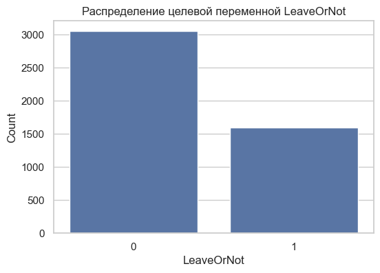
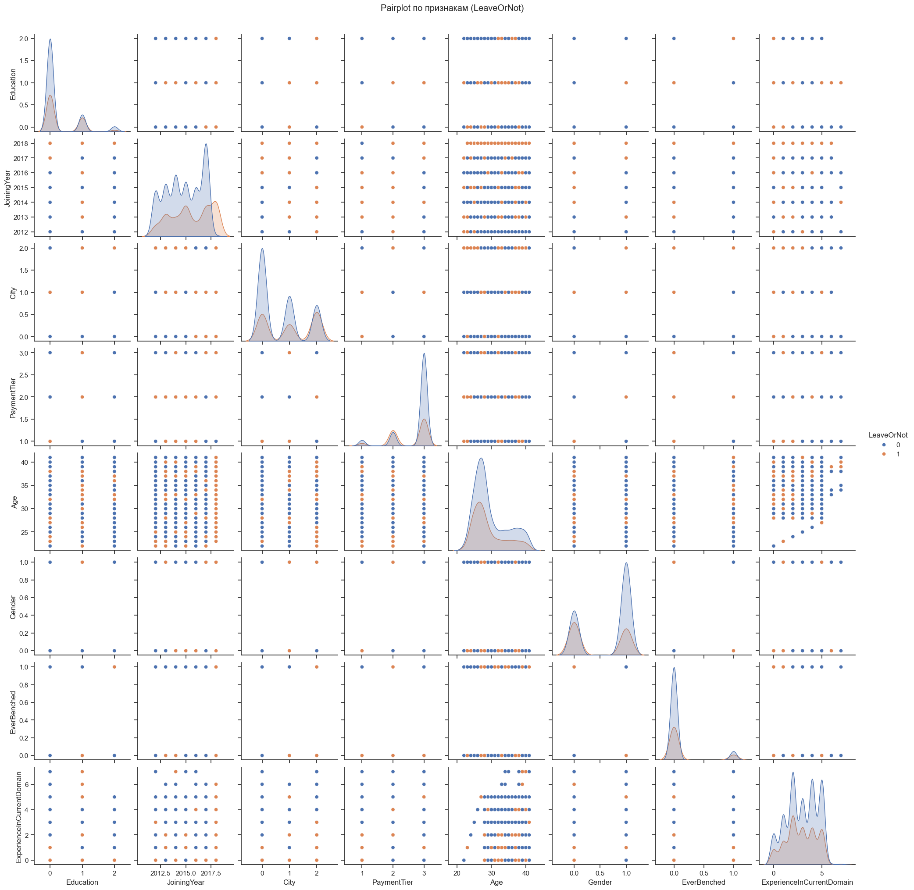
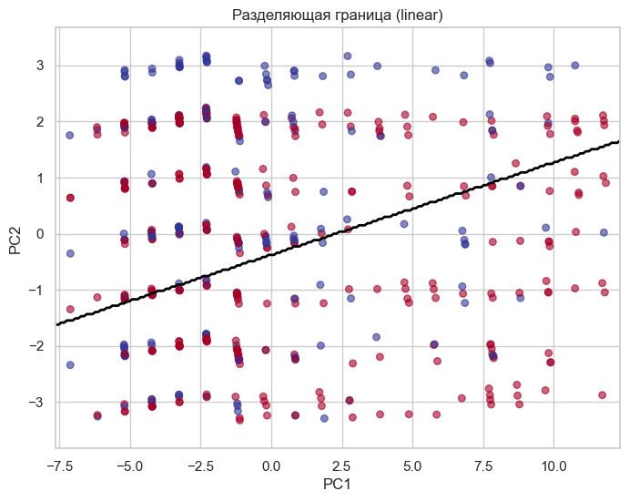
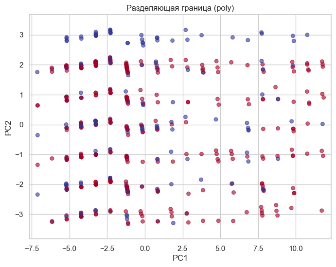
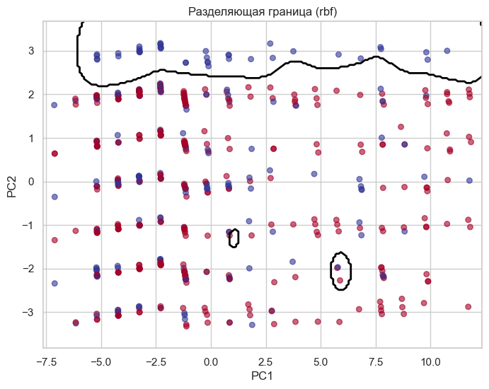
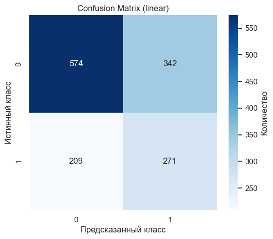
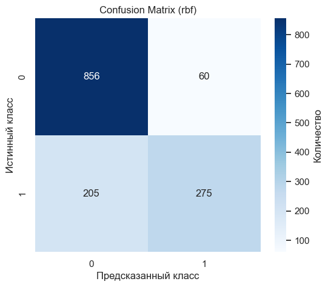
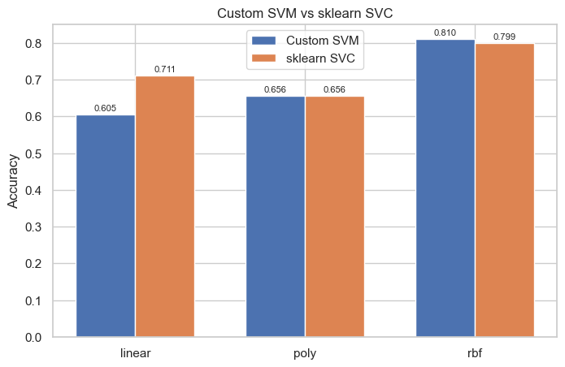

# Лабораторная работа №3. SVM

В рамках лабораторной работы предстоит реализовать SVM и сравнить с эталонной реализацией алгоритма.

## Задание

1. выбрать датасет для бинарной классификации;
2. реализовать решение двойственной задачи по лямбда; для решения задачи использовать [scipy.optimize.minimize](https://docs.scipy.org/doc/scipy/reference/generated/scipy.optimize.minimize.html#scipy.optimize.minimize) или любую другую библиотеку;
3. провернуть трюк с ядром;
4. построить линейный классификатор;
5. визуализировать решение;
6. сравнить с эталонным решением;

# Отчет

1. В качестве датасета был выбран [`Employee Future Prediction`](https://www.kaggle.com/datasets/tejashvi14/employee-future-prediction) с задачей бинарной классификации ухода сотрудника из компании (`LeaveOrNot`).

   Датасет содержит информацию о сотрудниках компании и необходимо предсказать, уйдет ли сотрудник из компании.

   Распределение целевой переменной:

   

   Попарные распределения признаков:

   

2. [Код для решения двойственной задачи по лямбда](./src/model/svm.py)

   Реализован класс `SVM`, который решает двойственную задачу оптимизации через `scipy.optimize.minimize` с методом SLSQP. Целевая функция минимизируется:
   ```
   L(λ) = 0.5 * λ^T * (yy^T ⊙ K) * λ - sum(λ)
   ```
   с ограничениями:
   - `0 ≤ λ_i ≤ C` для всех i
   - `sum(λ_i * y_i) = 0`

   После решения находятся опорные векторы (где `λ_i > ε`) и вычисляется смещение `b`.

3. [Код для трюка с ядром](./src/model/kernels.py)

   Реализованы три типа ядер:
   - `LinearKernel`: линейное ядро `K(x, y) = x^T * y`
   - `PolynomialKernel`: полиномиальное ядро `K(x, y) = (x^T * y + 1)^d` с параметром `degree`
   - `RBFKernel`: гауссовское ядро `K(x, y) = exp(-γ * ||x - y||^2)` с параметром `gamma`

   Ядра используются для вычисления матрицы Грама, что позволяет строить нелинейные разделяющие поверхности в исходном пространстве признаков.

4. Построен линейный классификатор через решение двойственной задачи. Функция принятия решения имеет вид:
   ```
   f(x) = sum(λ_i * y_i * K(x, x_i)) + b
   ```
   где суммирование идет только по опорным векторам. Классификация выполняется по знаку функции: `predict(x) = sign(f(x))`.

5. Визуализация решения:

   Разделяющие границы для каждого типа ядра (проекция на первые две главные компоненты через PCA):

   **Линейное ядро:**
   

   **Полиномиальное ядро:**
   

   **RBF ядро:**
   

   Confusion matrix для каждого типа ядра:

   **Линейное ядро:**
   

   **Полиномиальное ядро:**
   

   **RBF ядро:**
   

6. Сравнение с эталонным решением `sklearn.svm.SVC`:

   

   Результаты сравнения:

   | Ядро   | Custom SVM accuracy | sklearn SVC accuracy |
   |--------|---------------------|---------------------|
   | linear | 0.605               | 0.71                |
   | poly   | 0.656               | 0.656               |
   | rbf    | 0.81                | 0.799               |

   RBF‑ядро показывает наилучшее качество на выбранном датасете. Для полиномиального ядра результаты полностью совпадают с эталонной реализацией. Для линейного и RBF ядер наблюдается небольшое расхождение, что может быть связано с различиями в оптимизации и обработке граничных случаев.

## Запуск

Из директории `lab3`:

```bash
python src/main.py
```
