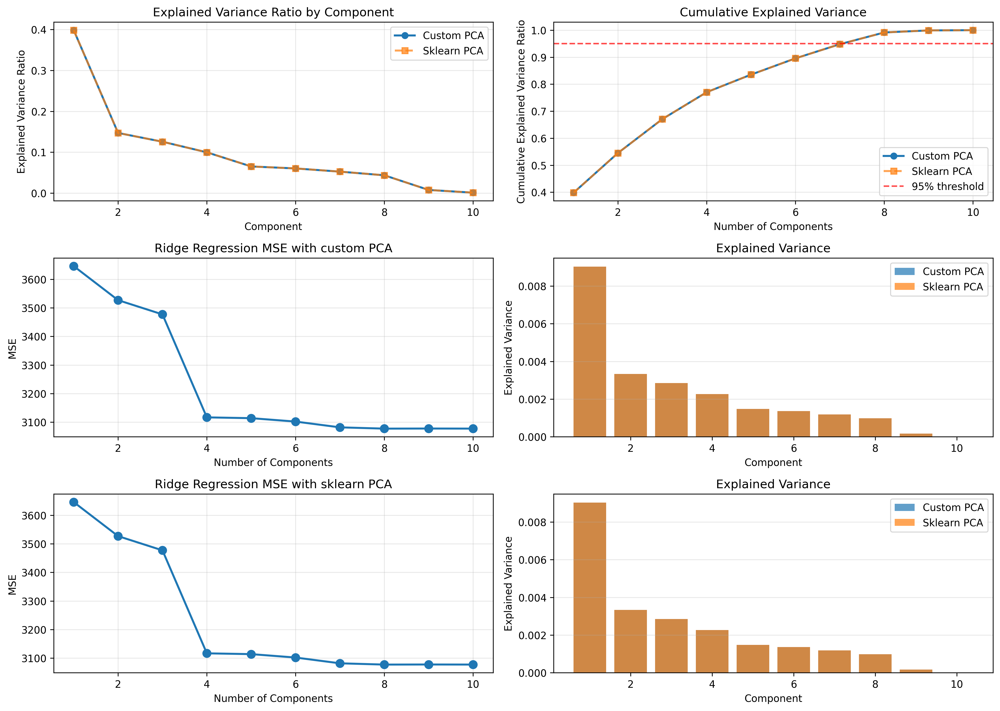

# Лабораторная работа №4. PCA

## 1. Выбор датасета для линейной регрессии

Выбран датасет Diabetes из библиотеки scikit-learn. Датасет содержит 442 образца с 10 признаками (возраст, пол, индекс массы тела, артериальное давление и другие медицинские показатели). Целевая переменная представляет количественную меру прогрессирования диабета через год после базовой линии.

## 2. Реализация PCA через сингулярное разложение

Реализован класс PCA в файле `src/model/pca.py`. Алгоритм работает следующим образом:

1. Центрирование данных: вычитание среднего значения по каждому признаку
2. Сингулярное разложение: применение SVD к центрированной матрице данных
3. Определение главных компонент: выбор первых n_components компонент из правых сингулярных векторов

## 3. Определение эффективной размерности выборки

Эффективная размерность определяется как минимальное количество главных компонент, необходимое для объяснения заданной доли дисперсии (по умолчанию 95%).

## 4. Эквивалентность с эталонной реализацией

Проведено сравнение реализованного PCA с эталонной реализацией из scikit-learn. 


По дисперсии видно, что компоненты совпадают, а среднее отличие между представление незначительно. 

## 5. Результат



### Структура проекта

```
lab4/
├── README.md
├── requirements.txt
└── src/
    ├── main.py
    ├── model/
    │   └── pca.py
    └── data_load/
        └── data_load.py
```

### Запуск

```bash
pip install -r requirements.txt
cd src
python main.py
```