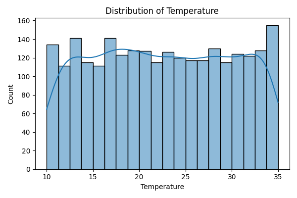
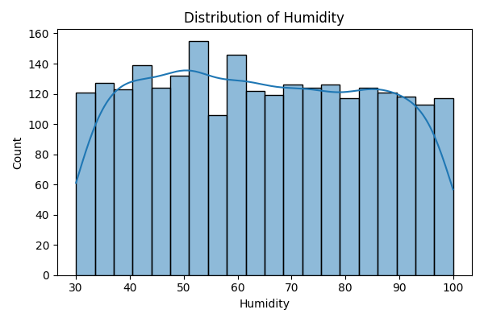
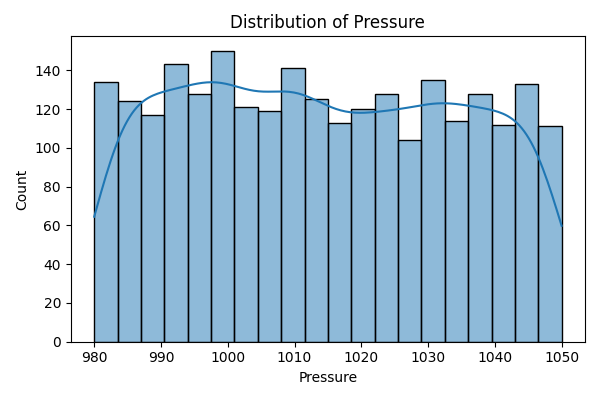
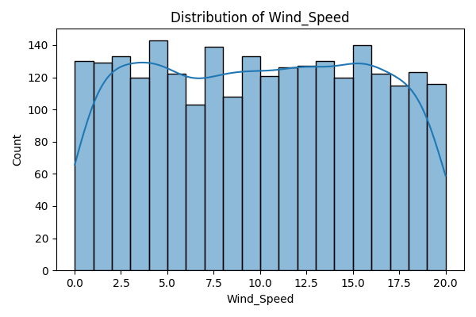
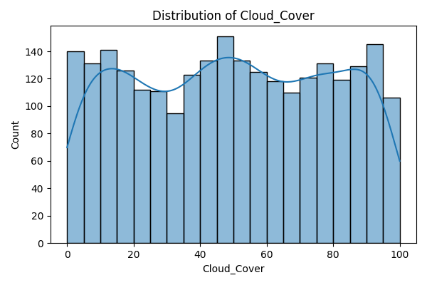
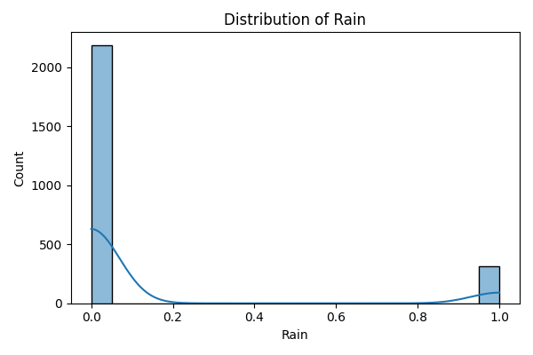
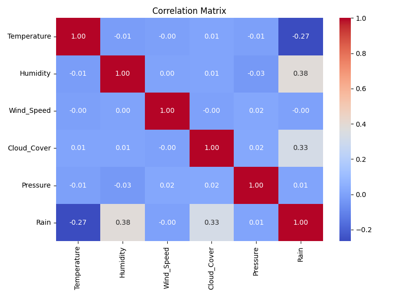
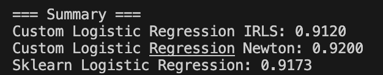

# Лабораторная работа №5. Логистическая регрессия

## 1. Выбор датасета для логистической регрессии

Выбран датасет Weather Forecast Dataset из Kaggle (zeeshier/weather-forecast-dataset). Датасет содержит метеорологические данные с признаками: температура, влажность, давление, скорость ветра, облачность. Целевая переменная представляет бинарную классификацию: наличие дождя (rain) или его отсутствие (no rain).

### Описательная статистика

Описательная статистика сохранена в файле `artifacts/descriptive_stats.csv`.

### Распределения признаков













### Матрица корреляций



## 2. Реализация логистической регрессии

Реализованы два класса логистической регрессии в файле `src/model/logistic_regression.py`:

### 2.1. Метод IRLS (Iteratively Reweighted Least Squares)

Класс `LogisticRegressionIRLS` реализует алгоритм IRLS:

1. Инициализация весов через решение системы линейных уравнений
2. Итеративное обновление весов:
   - Вычисление сигмоидальной функции для текущих весов
   - Вычисление весовых коэффициентов γ = √(σ(1-σ))
   - Построение взвешенной системы линейных уравнений
   - Решение системы и обновление весов с шагом обучения

### 2.2. Метод Ньютона-Рафсона

Класс `NewtonRaphsonLogisticRegression` реализует метод Ньютона-Рафсона:

1. Инициализация весов нулевым вектором
2. Итеративное обновление весов:
   - Вычисление градиента функции потерь
   - Вычисление гессиана (матрицы вторых производных)
   - Решение системы линейных уравнений для нахождения направления обновления
   - Обновление весов с шагом обучения

## 3. Эквивалентность с эталонной реализацией

Проведено сравнение реализованных методов с эталонной реализацией из scikit-learn (LogisticRegression с solver="lbfgs").



Оба реализованных метода (IRLS и Ньютона-Рафсона) показывают сопоставимую точность с эталонной реализацией, что подтверждает корректность реализации алгоритмов.

## 4. Результат

Реализованы два метода оптимизации для логистической регрессии:
- **IRLS**: итеративный метод взвешенных наименьших квадратов
- **Ньютона-Рафсона**: метод оптимизации второго порядка с использованием гессиана

Оба метода успешно применяются для бинарной классификации и показывают результаты, эквивалентные эталонной реализации из scikit-learn.

## Запуск

```bash
pip install -r requirements.txt
cd src
python main.py
```
