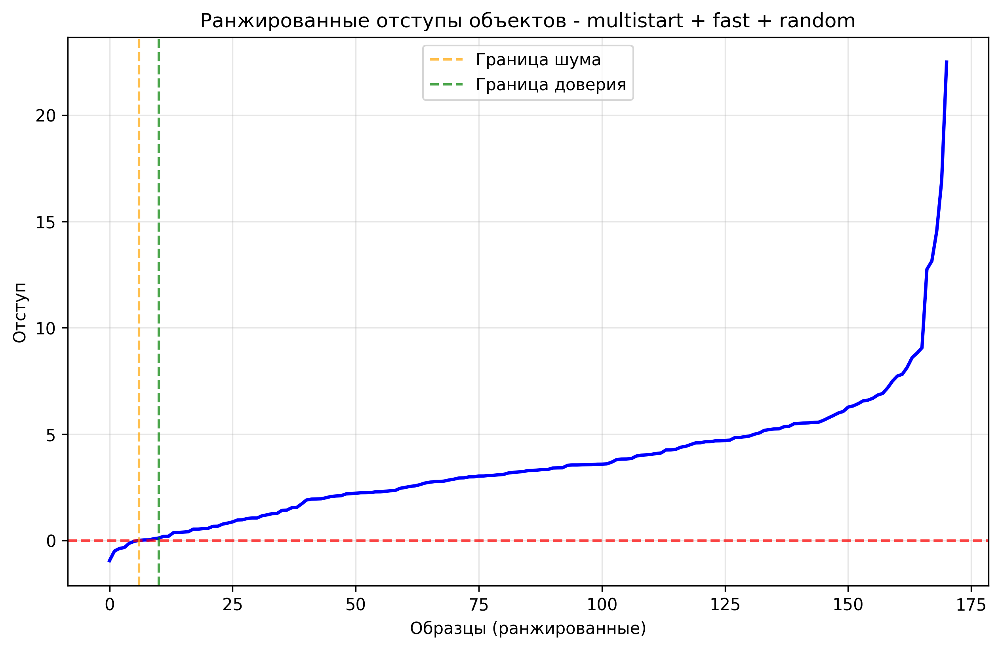
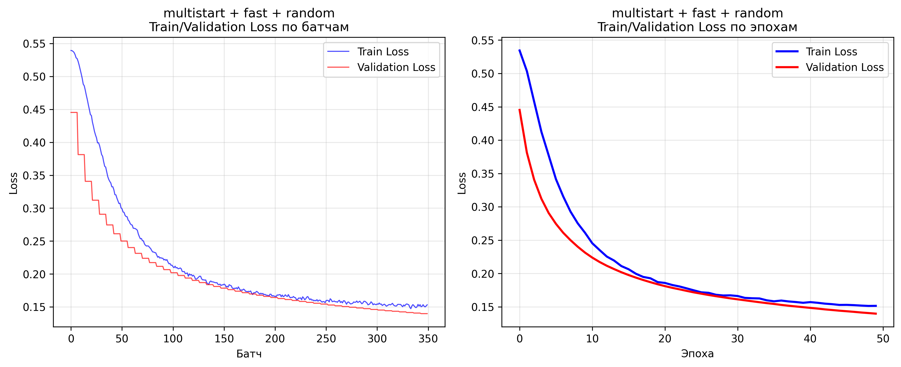

# Лабораторная работа №1. Линейная классификация — Отчет

В работе реализован линейный классификатор, обучаемый стохастическим градиентным спуском с инерцией, L2‑регуляризацией и рекуррентной оценкой функционала качества. Проведены эксперименты с разными стратегиями инициализации весов, вариантами оптимизации шага обучения и методами формирования батчей на основе отступов. Результаты сопоставлены с эталонными моделями библиотеки scikit‑learn.

## Датасет
Использован Breast Cancer Wisconsin (Diagnostic) из scikit‑learn с предобработкой (стандартизация признаков, стратифицированное разбиение):
- Реализация: `source/dataset_loader.py`, класс `DataManager.load_data()`

## Где реализован каждый пункт задания
- Выбор датасета для классификации: `source/dataset_loader.py::DataManager`
- Вычисление отступа объекта и визуализация:  
  - Отступ: `source/margin_analyzer.py::Margin.compute_margins` 
  - Визуализация: `source/margin_analyzer.py::Margin.plot_margins`
- Вычисление градиента функции потерь:  
  - Логистическая функция потерь: `source/losses.py::RecurrentLogisticLoss.gradient`  
  - Градиент L2‑регуляризатора: `source/losses.py::L2Regularizer.gradient`
- Рекуррентная оценка функционала качества:  
  - Loss `source/losses.py::RecurrentLogisticLoss.compute_loss`
- Стохастический градиентный спуск с инерцией:  
  - Оптимизатор с «momentum»: `source/sgd.py::Optimizer(mode="momentum")`  
  - Использование в шаге обучения: `source/classifier.py::LinearClassifier.sgd_step`
- L2‑регуляризация:  
  - Реализация: `source/losses.py::L2Regularizer`
- «Скорейший» градиентный спуск:  
  - Режим `fast` : `source/sgd.py::Optimizer(mode="fast")`
- Предъявление объектов по модулю отступа:  
  - Сэмплинг батчей: `source/classifier.py::DataSampler`  
  - Стратегии: `margin`, `random`
- Обучение линейного классификатора на выбранном датасете:  
  - Тренировка/валидация, логирование лосса: `source/classifier.py::LinearClassifier.fit`
- Инициализация весов через корреляцию:  
  - Реализация: `source/classifier.py::LinearClassifier.initialize_weights(init_method='correlation')`
- Случайная инициализация весов через мультистарт:  
  - Мультистарт и выббор лучшего запуска: `source/main.py::run_experiment` при `weights_init='multistart'`
- Обучение со случайным предъявлением и с предъявлением по модулю отступа:  
  - Перебор режимов `random`, `margin`: `source/main.py` (см. `batch_methods` и сборку конфигураций)
- Оценка качества классификации:  
  - Метрики Accuracy/Precision/Recall/F1: `source/benchmark_suite.py::calculate_metrics`
- Сравнение лучшей реализации с эталонной:  
  - Эталонные модели sklearn (SGD Logistic и Linear SVM): `source/benchmark_suite.py::Benchmark.run_sklearn`
- Отчет: данный файл `lab1/README.md`

## Конфигурации экспериментов
Перебирались комбинации:  
- Инициализация: `multistart` (случайная с N перезапусками), `correlation`  
- Оптимизатор: `momentum`, `fast` (линейный поиск шага по сетке на батче)  
- Формирование батчей: `margin`, `random`

Гиперпараметры (см. `source/main.py`): LR=2e-4, momentum=0.7, L2=1e-3, smoothing=1e-3, epochs=50, batch_size=64, restarts=5.

## Лучший кастомный результат и сравнение с библиотекой
По итогам `source/experiment_results.csv` лучшая кастомная конфигурация:
- Метод: multistart + fast + random 
- Метрики (test):  
  - Accuracy:   0.9649
  - Precision:  0.981
  - Recall:   0.9626
  - F1:  0.9717

Сравнение с эталоном (sklearn, те же данные):
- Sklearn Logistic (SGD): F1 = 0.9677, Accuracy = 0.9591

## Визуализации (отступы и динамика loss)
Ниже приведены иллюстрации для лучшей кастомной конфигурации (multistart + fast + random). Все изображения сохраняются в `source/images` автоматически при запуске экспериментов.

- Ранжированные отступы на тесте:

- Динамика функции потерь (батчи и эпохи):

## Файлы с результатами
- Таблица с метриками по всем экспериментам: `source/experiment_results.csv`
- Изображения графиков: `source/images/*.png`

## Как воспроизвести
- Запуск всех экспериментов и генерация таблицы/графиков: `python source/main.py`
