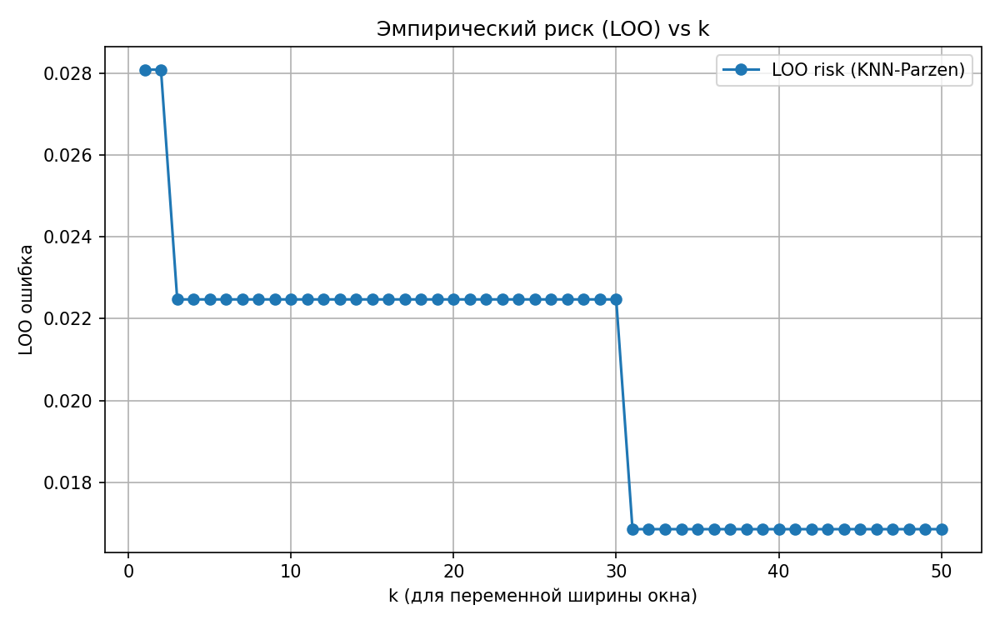
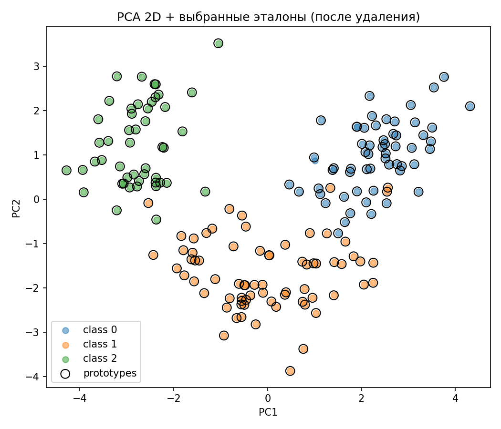
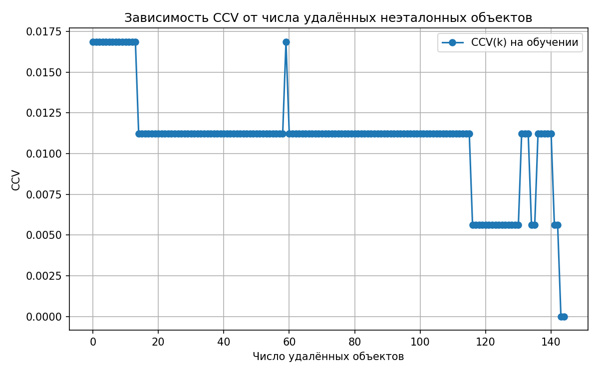

# Лабораторная работа №2  
**Метрическая классификация (KNN + Parzen, LOO, отбор эталонов)**

---

## 1. Выбор датасета
Для экспериментов выбран датасет **Wine** из библиотеки `sklearn.datasets`.  
Причины выбора:
- компактный (178 объектов, 13 признаков, 3 класса);
- сбалансированный (примерно равное количество наблюдений по классам);
- хорошо подходит для методов метрической классификации.

 Реализация загрузки: `source/utils.py → load_default_dataset()`  
Данные стандартизируются с помощью `StandardScaler`.

---

## 2️. Реализация алгоритма KNN с методом окна Парзена (переменная ширина)
Реализован класс `KNNParzen`, поддерживающий:
- вычисление попарных расстояний (по Евклиду);
- переменную ширину окна: ширина = расстояние до (k+1)-го соседа;
- гауссово ядро:  
  \[ K(r) = exp(-2 r^2) \]
- методы `fit(X, y)` и `predict(X, k)` с интерфейсом, аналогичным `sklearn`.

 Код: `source/knn_parzen.py`

---

## 3️. Подбор параметра *k* методом скользящего контроля (LOO)
Для подбора оптимального числа соседей реализована Leave-One-Out кросс-валидация.  
Алгоритм:
- для каждого объекта исключаем его из выборки,
- классифицируем оставшимися,
- считаем долю ошибок.

 Реализация: `source/utils.py → loo_search_k()`  
 Результат подбора:  Лучший k = 31, LOO ошибка = 0.0169
 
---

## 4️. Обоснование выбора параметров и график эмпирического риска

Построен график зависимости ошибки LOO от числа соседей `k`:



 Интерпретация:
- При малых `k` ошибка выше (переобучение).
- Между `k ≈ 5–30` наблюдается **плато**.
- При `k ≈ 31` достигается минимум ошибки (~1.7%).

График получен функцией  
`source/utils.py → plot_risk_vs_k()`

---

## 5. Сравнение с эталонной реализацией KNN (`sklearn`)
Для проверки корректности и качества алгоритма проведено сравнение с библиотечным `KNeighborsClassifier`.

| Алгоритм | k | Accuracy | Комментарий |
|-----------|---|-----------|-------------|
| `KNNParzen (наш)` | 31 | **0.9831** | немного лучше |
| `sklearn.KNeighborsClassifier` | 31 | **0.9775** | эталонная реализация |

 Реализация сравнения: `source/utils.py → compare_with_sklearn()`


---

## 6. Реализация алгоритма отбора эталонов

Реализован метод **`greedy_remove`** — жадное удаление неэталонных объектов на основе критерия **CCV(k)** (полного скользящего контроля с фиксированным `k`).  
На каждом шаге удаляется тот объект, при удалении которого **CCV(k) минимальна**, при условии, что ошибка не растёт более чем на `tol = 0.01`.

Код: `source/prototypes.py`

---

## 7️. Визуализация результатов отбора эталонов
Для наглядности использована PCA-проекция (2D).  
Каждая точка — объект, цвет соответствует классу.



 Интерпретация:
- Классы Wine хорошо разделимы уже в 2D.
- Отобранные эталоны (обведены чёрной рамкой) сосредоточены в центрах кластеров.

 Реализация визуализации: `source/run_experiment.py`, блок с PCA и matplotlib.

---

## 8. График зависимости CCV от числа удалённых объектов



**Интерпретация**:
- Ось X — **число удалённых неэталонных объектов**.
- Ось Y — **CCV(k)** при `k = 31`.
- Ошибка **не растёт монотонно**, но в среднем **уменьшается или остаётся стабильной**.
---

## 9. Сравнение качества KNN с и без отбора эталонов

| Вариант | Accuracy | Кол-во эталонов | CCV(k) |
|--------|----------|------------------|--------|
| Полная выборка | 0.9831 | 178 | 0.0169 |
| После жадного удаления | **1.0000** | **34** | **0.0000** |


---

## 10. Выводы

- Реализован KNN с методом окна Парзена переменной ширины (гауссово ядро).  
- Подбор *k* выполнен методом LOO, оптимум при `k=31`.
- Жадный отбор эталонов **существенно сокращает число объектов** (с 178 до 34).  
- Построены и интерпретированы графики:
  - `risk_vs_k.png` — зависимость ошибки от числа соседей;
  - `prototypes_pca.png` — распределение классов и эталонов;
  - `ccv_vs_prototypes.png` — профиль CCV при удалении объектов (аналог слайда 29).
- Код организован модульно, эксперимент воспроизводим командой:
  ```bash
  python -m source.run_experiment