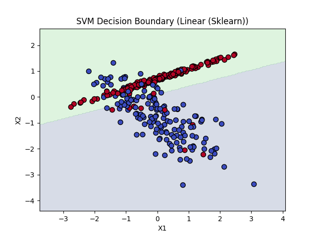
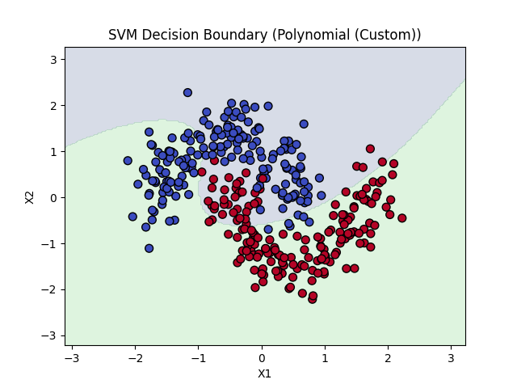
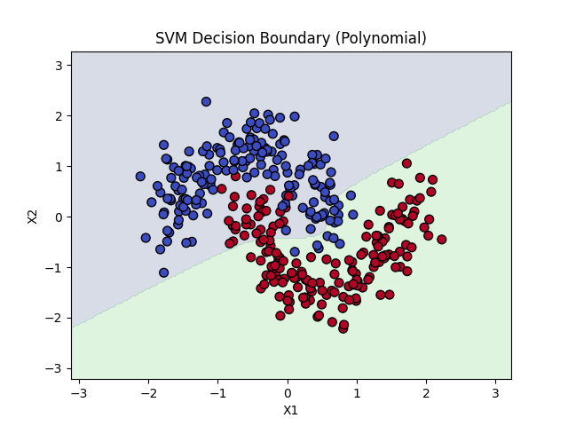
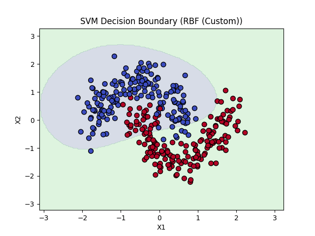
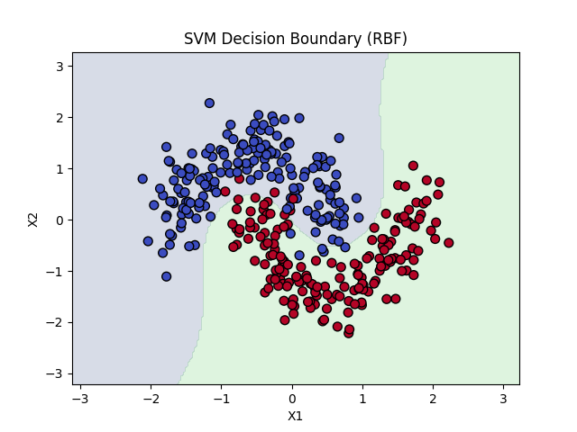

# Лабораторная работа №3: SVM

**Цель работы:** Реализация SVM через двойственную задачу и сравнение с эталонной реализацией.

**Ход работы:**
1. Выбран датасет для бинарной классификации (генерируется через `make_classification`).
2. Реализована SVM через двойственную задачу λ с помощью `scipy.optimize.minimize`.
3. Добавлена возможность использования ядровых функций (линейное).
4. Построены линейные классификаторы и визуализированы границы решений.
5. Проведено сравнение с эталонной реализацией `sklearn.SVC`.

**Результаты:**  
Точность кастомной реализации одинакова с `sklearn.SVC`.

Custom SVM Accuracy: 0.8266666666666667
Sklearn SVM Accuracy: 0.8266666666666667

Границы решений визуализированы на графиках.

Custom SVM Accuracy: 0.7066666666666667
Sklearn SVM Accuracy: 0.8866666666666667

Custom SVM Accuracy: 0.88
Sklearn SVM Accuracy: 0.9733333333333334

