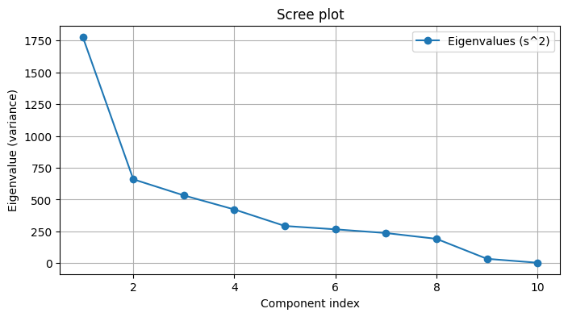
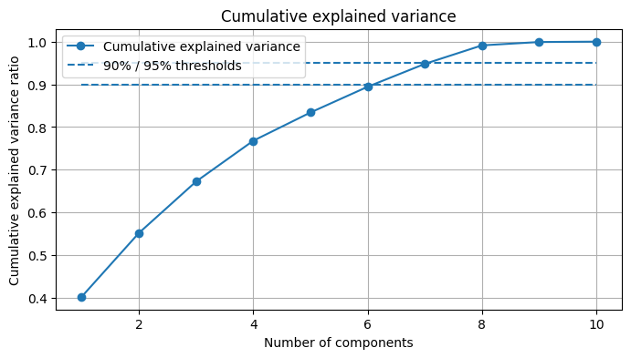
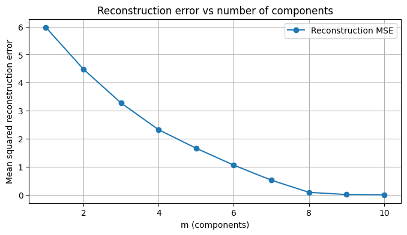

---

## Отчёт по лабораторной работе №4 — PCA через SVD

### Цель
Реализовать метод главных компонент (PCA) через сингулярное разложение (SVD), определить эффективную размерность выборки и показать эквивалентность с эталонной реализацией `sklearn.decomposition.PCA`.

---

### 1️. Выбор датасета

Для эксперимента выбран встроенный датасет **`Diabetes`** из библиотеки `sklearn.datasets`.  
Этот набор данных содержит числовые признаки, используется для задач **регрессии** и хорошо подходит для анализа методом PCA.

> Реализация загрузки — `source/utils.py`, функция `load_regression_dataset()`.  
> Датасет автоматически стандартизируется (нормализация по каждому признаку).

---

### 2️. Реализация PCA через сингулярное разложение

PCA реализован вручную без использования `sklearn.decomposition.PCA`.  
Используется `numpy.linalg.svd` — вычисляются сингулярные значения `s_i`, из которых получаются собственные значения ковариационной матрицы:
\[ lambda_i = \frac{s_i^2}{n-1} \]

> Код: `source/pca_svd.py`, класс **`PCA_SVD`**  
> Реализованные методы:
> - `fit(X)` — подгонка модели, центрирование и вычисление SVD  
> - `transform(X, n_components)` — проекция данных на первые `m` компонент  
> - `inverse_transform(Z)` — восстановление исходных данных  
> - `effective_dim(eps)` — определение минимального числа компонент  
> - `reconstruction_error(X, m)` — ошибка восстановления при `m` компонентах

---

### 3️. Определение эффективной размерности выборки

Эффективная размерность определяется по критерию:
\[
E_m = \frac{\sum_{j=m+1}^{n} \lambda_j}{\sum_{j=1}^{n} \lambda_j} \le \varepsilon
\]

> Код: метод `effective_dim()` в `source/pca_svd.py`  
> Запуск: `python source/main.py`

**Результаты запуска:**
Effective dimension for eps=0.05: m=8
Effective dimension for eps=0.01: m=8

То есть, начиная с **8 главных компонент**, объясняется более 95–99% всей дисперсии данных.  
Более мелкие компоненты вносят незначительный вклад.

---

### 4️. Проверка эквивалентности с эталонной реализацией

Для проверки корректности реализован скрипт `source/compare_sklearn.py`,  
который сравнивает результаты собственной реализации с `sklearn.decomposition.PCA`.

Проверяются:
- собственные значения (explained variance);  
- доли объяснённой дисперсии (explained variance ratio);  
- матрицы компонент (с учётом возможной разницы в знаке);  
- ошибка восстановления данных после обратного преобразования.

**Результаты:**
Explained variance (ours) : [4.033336 1.495704 1.208701 0.957643 0.663683 0.604084 0.537782 0.434665 0.078498 0.00858 ]

Explained variance (sklearn) : [4.033336 1.495704 1.208701 0.957643 0.663683 0.604084 0.537782 0.434665 0.078498 0.00858 ]

Explained variance ratio difference (L1): 0.0

Components equal up to sign & order?: True

m=2: MSE ours=4.483470e-01, sklearn=4.483470e-01

m=5: MSE ours=1.659846e-01, sklearn=1.659846e-01

m=10: MSE ours=5.206149e-31, sklearn=5.206149e-31

**Вывод:**  
Различия между реализациями отсутствуют даже на уровне машинной точности →  
Реализация **эквивалентна** `sklearn.PCA`.

---

### 5️. Визуализация результатов

Графики автоматически сохраняются в папку `results/` при запуске `main.py`.

| Тип графика | Название файла | Смысл |
|--------------|----------------|--------|
| Scree plot | `results/scree.png` | Собственные значения λᵢ (визуализация убывания дисперсии) |
| Cumulative explained variance | `results/cumulative_variance.png` | Накопленная доля объяснённой дисперсии |
| Reconstruction error vs m | `results/reconstruction_vs_m.png` | Ошибка восстановления при разных m |

**Пример визуализаций:**

  
*На графике видно, что после 8 компонент дисперсия стабилизируется.*

  
*90–95% дисперсии объясняется уже первыми 8 компонентами.*

  
*Ошибка восстановления стремится к нулю при m ≥ 8.*

---

### Заключение

-  **Эффективная размерность** выборки при ε = 0.05 и 0.01 — `m = 8`.
-  **Визуализации и результаты сохранены** в `results/`.  

