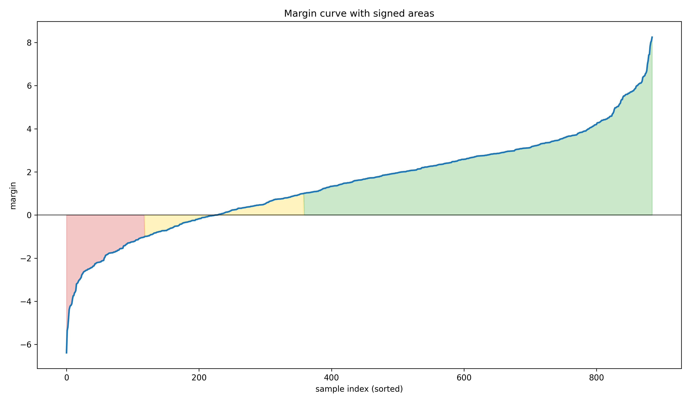
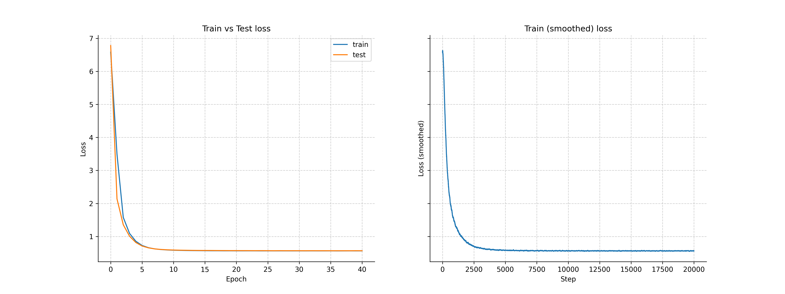
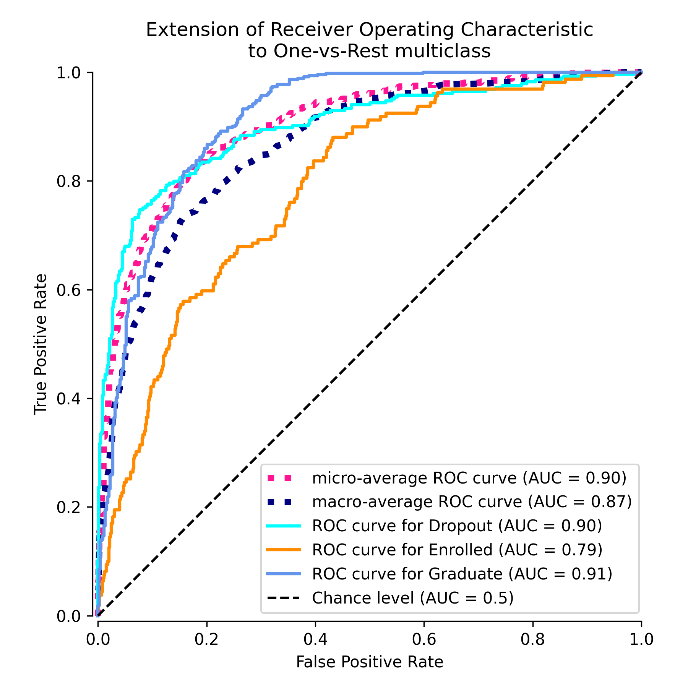
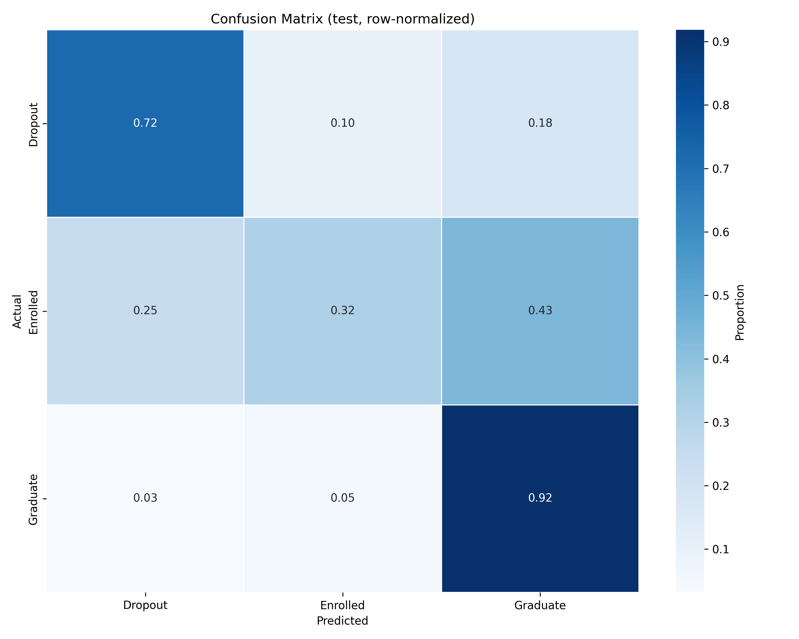

# Отчет по лабораторной работе: линейный классификатор и SGD

Кратко: реализована многоклассовая логистическая регрессия (softmax + cross-entropy) на NumPy, обучаемая GD/SGD/minibatch с momentum, L2-регуляризацией, адаптивным шагом (line search), выборкой по отстуту (margin) и ранней остановкой. Проведен бенчмарк и сравнение с эталонными моделями scikit-learn.

## Воспроизводимость результатов кода

Для воспроизведения среды, в которой запускались тесты, рекомендуется установить все зависимости, указанные в `requirements.txt`.

Для запуска и репликации экспериментов код стоит запускать из директории `students/tonka-pa/lab1`. Для запуска тестов рекомендуется вызвать следующую команду:

```bash
python source/main.py datasets/ source/utils \
model_params.json -d ";" -l -s results/
```

Подробнее о доступных аргументах можно узнать, вызвав `python source/main.py --help`.

Рекомендуется запустить тесты хотя бы раз, чтобы получить все доступные артефакты экспериментов. В репозитории содержатся только те артефакты, что были использованы в отчете, чтобы не засорять репозиторий. Ознакомиться со всеми выходными файлами можно отдельно, скачав их с [google drive](https://drive.google.com/drive/folders/1s294GRZsdPbw-mD31VEbEggPBI4o4GRK?usp=sharing).

## Структура проекта

```
.
├── README.md
├── requirements.txt
├── datasets
│   └── data.csv
├── results
│   ├── LogRegNumpy
│   ├── LogisticRegressionSK
│   └── SGDClassifierSK
└── source
    ├── logistic_regression.py
    ├── main.py
    └── utils
        ├── __init__.py
        ├── benchmark.py
        ├── data_prep.py
        ├── model_params.json
        ├── model_params.yaml
        └── visualization.py
```

## Датасет и подготовка данных

Датасет: [Predict Students' Dropout and Academic Success](https://archive.ics.uci.edu/dataset/697/predict+students+dropout+and+academic+success), (CSV с разделителем `;`). Классы: `Dropout`, `Enrolled`, `Graduate`. Скачиывается в начале запуска тестов, если не был скачен ранее. 

Ключевой препроцессинг датасета реализован в `source/utils/data_prep.py`. Т.к. все столбцы за исключением таргета уже являются числовым, ко всем была применена *z-нормализация*.

## Реализация модели LogRegNumpy (ядро)

Функция потерь (cross-entropy с `logsumexp`) и вычисление логитов:

```python
def forward(self, X):
    logits = np.matmul(X, self.weights) + self.bias
    return logits

def _loss_fn_opt(self, y_true, logits, reduction=None):
    lse = logsumexp(logits, axis=1, keepdims=True)
    nll = lse - logits
    loss = nll[np.arange(nll.shape[0]), y_true]
    if reduction == 'mean':
        loss = loss.mean()
    return loss
```

## Выполнение требований (1-12)

### 1. Выбор датасета для классификации
Использован датасет UCI с тремя классами (`Dropout`, `Enrolled`, `Graduate`), файл `datasets/data.csv`. Загрузка и сохранение реализованы в `data_prep.py`:

```python
def download_dataset(download_path: str) -> str:
    url = "https://archive.ics.uci.edu/static/public/697/predict+students+dropout+and+academic+success.zip"
    response = requests.get(url)
    response.raise_for_status()
    ...
    with zipfile.ZipFile(io.BytesIO(response.content)) as z:
        for file in z.namelist():
            ...
            z.extract(file, saveto_path)
    return target_path.as_posix()
```

### 2. Расчет отступа объекта (margin) + визуализация
Отступ объекта - один из способов оценки качества классификации. Измеряется по формуле:
$$
M(\bold{x}, y) = g_y(\bold{x}) - max_{c\ne y}{g_c(\bold{x})},
$$
где $g_y(\bold{x})$ - рейтинг (оценка уровня уверенности) верного класса, а $max_{c\ne y}{g_c(\bold{x})}$ - максимальный рейтинг среди всех неверных.

Отступ по смыслу измеряет, насколько модель уверенно назначала верный класс по сравнению со всеми неверными. Чем отступ выше, тем модель была более уверена в правильном прогнозе. Если $M(\bold{x})>0$, то модель делает верный прогноз, а если $M(\bold{x})<0$, то неверный.

Реализация расчета отсутпа для многоклассовой классификации:
```python
def calc_margins(self, X, y_true):
    logits = self.forward(X)
    true_logits = logits[np.arange(X.shape[0]), y_true]
    logits[np.arange(logits.shape[0]), y_true] = -np.inf
    false_logits = logits.max(axis=1)
    margins = true_logits - false_logits
    return margins
```

Если применить модель ко всем объектам обучающей выборки, посчитать на них отступ и отсортировать по нему, то получим примерно такой график:



### 3. Градиент функции потерь
Градиент cross-entropy по весам и смещениям:

```python
def _gradient(self, X, y_true, logits):
    y_prob = self._softmax(logits)
    y_prob[np.arange(y_prob.shape[0]), y_true] -= 1
    y_prob /= y_prob.shape[0]
    w_grad = np.matmul(X.T, y_prob)
    b_grad = y_prob.sum(axis=0, keepdims=True)
    return w_grad, b_grad
```

### 4. Рекуррентная оценка качества функционала
Поддерживаются скользящее среднее и EMA для сглаживания истории лосса:

```python
def _rec_update(self, xi):
    if self.rec_mode == "mean":
        self.rec_count += 1
        m = self.rec_count
        self.rec_value = (1.0 / m) * xi + (1.0 - 1.0 / m) * self.rec_value
        return self.rec_value

    if self.rec_mode == "ema":
        self.rec_value = self.ema_lambda * xi + (1.0 - self.ema_lambda) * self.rec_value
        return self.rec_value
```

### 5. SGD с momentum
В `fit` используется экспоненциальное сглаживание градиента:

```python
Vdw = self.momentum * Vdw - (1.0 - self.momentum) * w_grad
Vdb = self.momentum * Vdb - (1.0 - self.momentum) * b_grad

self.weights += learning_rate * Vdw
self.bias    += learning_rate * Vdb
```

### 6. L2-регуляризация
Добавление L2 в градиент и в расчет loss при line search:

```python
# в LogRegNumpy.fit()
if self.l2 > 0.0:
    w_grad += self.l2 * self.weights
```

```python
# в LogRegNumpy._line_search_backtracking()
if self.l2 > 0.0:
    loss_t += self.l2 * np.sum(np.pow(Wt, 2)) * 0.5
```

### 7. Наискорейший градиентный спуск (адаптивный шаг)
Опциональный backtracking line search включается через `optim_step=True`:

```python
if self.optim_step:
    learning_rate = self._line_search_backtracking(
        xi, yi, w_grad, b_grad, Vdw, Vdb
    )
```

```python
def _line_search_backtracking(...):
    ...
    while t > tol:
        Wt = W0 + t * dir_w
        bt = b0 + t * dir_b
        logits_t = np.matmul(X, Wt) + bt
        loss_t = self._loss_fn_opt(y, logits_t, reduction='mean')
        if self.l2 > 0.0:
            loss_t += self.l2 * np.sum(np.pow(Wt, 2)) * 0.5
        if loss_t <= loss_0 + alpha * t * dd:
            return t
        t *= beta
    return default_lr
```

### 8. Отбор объектов по модулю отступа
Вероятности сэмплинга строятся по модулю отступа, затем используется сэмплирование из распределения:

```python
def _margin_sampling_probs(self, X, y, use_abs=True, tau=0.2, min_prob=0.01):
    margins = self.calc_margins(X, y)
    diff = -np.abs(margins) if use_abs else -margins
    scores = diff / max(tau, 1e-8)
    probs = self._softmax(scores.reshape(1, -1)).squeeze()
    floor = min_prob / X.shape[0]
    probs = (1.0 - min_prob) * probs + floor
    return probs
```

```python
# ...
margin_probs = lambda: self._margin_sampling_probs(
    X, y, use_abs=True, tau=self.sampling_tau, min_prob=self.sampling_min_prob
)
# ...
if self.sampling_mode == 'by_margin':
    if step % self.refresh_rate == 0:
        probs = margin_probs()
    batch_idx = rng.choice(N, size=self.batch_size, replace=True, p=probs)
```

### 9. Обучение на датасете с разными стратегиями
Запуск экспериментов и описание параметров тестируемых моделей - в `source/main.py` и `source/utils/model_params.json` соответственно:

```python
for model_class in (LogRegNumpy, LogisticRegressionSK, SGDClassifierSK):
    for test_suffix, model_params in model_test_params[model_class.__name__].items():
        ...
        benchmark.benchmark_classifier(
            model_class,
            X_train_scaled, y_train_enc,
            X_test_scaled, y_test_enc,
            model_args=model_params,
            ...
        )
```

Инициализации и стратегии сэмплинга (средние по 5-fold CV):

| config                    |   accuracy |   f1_macro |   f1_weighted |   fit_time_sec |
|:--------------------------|-----------:|-----------:|--------------:|---------------:|
| SGD_default (uniform)     |       0.76 |       0.66 |          0.74 |           1.37 |
| SGD_correlation_init      |       0.76 |       0.67 |          0.74 |           0.85 |
| SGD_multistart_init       |       0.75 |       0.66 |          0.73 |           1.39 |
| SGD_margin_based_sampling |       0.75 |       0.65 |          0.73 |           1.86 |

Фрагменты кода инициализаций `corr` и `multistart`:

```python
if self.init_strategy == 'corr':
    denom = np.float64(N)
    W = np.zeros((d, K), dtype=np.float64)
    b = np.zeros((1, K), dtype=np.float64)
    for k in range(K):
        t = (y == k).astype(np.float64)
        numer = X.T @ t
        W[:, k] = numer / denom
        b[0, k] = t.mean()
```

```python
if self.init_strategy == 'multistart':
    best_loss = np.inf
    for _ in range(n_starts):
        W = self.rng_.standard_normal((d, K), dtype=np.float32)
        b = self.rng_.standard_normal((1, K), dtype=np.float32)
        w, b, loss = self._warmup(X, y, W, b, steps=search_steps, lr=lr)
        if loss < best_loss:
            best_loss = loss
            best_W, best_b = w, b
    self.weights = best_W
    self.bias    = best_b
```

### 10. Оценка качества классификации
Оценка проводится в `source/utils/benchmark.py` (CV + финальная оценка на тесте):

```python
acc  = accuracy_score(yva, yhat)
p_micro, r_micro, f_micro, _ = precision_recall_fscore_support(yva, yhat, average="micro")
p_macro, r_macro, f_macro, _ = precision_recall_fscore_support(yva, yhat, average="macro")
p_w, r_w, f_w, _             = precision_recall_fscore_support(yva, yhat, average="weighted")
```

Пример результатов для лучшей конфигурации `LogRegNumpy` (MiniBatch + L2 + momentum, тестовый набор):

| class        | precision | recall | f1-score | support |
|:-------------|----------:|-------:|---------:|--------:|
| Dropout      |      0.79 |   0.72 |     0.76 |  284.00 |
| Enrolled     |      0.50 |   0.32 |     0.39 |  159.00 |
| Graduate     |      0.77 |   0.92 |     0.84 |  442.00 |
| accuracy     |         - |      - |     0.75 |  885.00 |
| macro avg    |      0.69 |   0.65 |     0.66 |  885.00 |
| weighted avg |      0.73 |   0.75 |     0.73 |  885.00 |

Примеры графиков качества:





### 11. Сравнение с эталонными моделями (scikit-learn)
Сводные метрики (средние по 5-fold CV):

| model                | config                    |   accuracy |   f1_macro |   f1_weighted |   fit_time_sec |
|:---------------------|:--------------------------|-----------:|-----------:|--------------:|---------------:|
| LogRegNumpy          | MiniBatch_SGD_l2_momentum |       0.77 |       0.67 |          0.75 |           1.90 |
| LogisticRegressionSK | Default                   |       0.77 |       0.69 |          0.76 |           0.03 |
| SGDClassifierSK      | L2_0-01_opt-lr            |       0.77 |       0.65 |          0.74 |           0.12 |

Качество на тесте (для тех же конфигураций):

**LogRegNumpy (MiniBatch_SGD_l2_momentum)**
| class        | precision | recall | f1-score | support |
|:-------------|----------:|-------:|---------:|--------:|
| Dropout      |      0.79 |   0.72 |     0.76 |  284.00 |
| Enrolled     |      0.50 |   0.32 |     0.39 |  159.00 |
| Graduate     |      0.77 |   0.92 |     0.84 |  442.00 |
| accuracy     |         - |      - |     0.75 |  885.00 |
| macro avg    |      0.69 |   0.65 |     0.66 |  885.00 |
| weighted avg |      0.73 |   0.75 |     0.73 |  885.00 |

**LogisticRegressionSK (Default)**
| class        | precision | recall | f1-score | support |
|:-------------|----------:|-------:|---------:|--------:|
| Dropout      |      0.79 |   0.74 |     0.76 |  284.00 |
| Enrolled     |      0.50 |   0.35 |     0.41 |  159.00 |
| Graduate     |      0.78 |   0.90 |     0.83 |  442.00 |
| accuracy     |         - |      - |     0.75 |  885.00 |
| macro avg    |      0.69 |   0.66 |     0.67 |  885.00 |
| weighted avg |      0.73 |   0.75 |     0.73 |  885.00 |

**SGDClassifierSK (L2_0-01_opt-lr)**
| class        | precision | recall | f1-score | support |
|:-------------|----------:|-------:|---------:|--------:|
| Dropout      |      0.79 |   0.73 |     0.76 |  284.00 |
| Enrolled     |      0.53 |   0.25 |     0.34 |  159.00 |
| Graduate     |      0.76 |   0.94 |     0.84 |  442.00 |
| accuracy     |         - |      - |     0.75 |  885.00 |
| macro avg    |      0.69 |   0.64 |     0.65 |  885.00 |
| weighted avg |      0.73 |   0.75 |     0.72 |  885.00 |

### 12. Отчет
Итоговый отчет оформлен в `README.md`; все дополнительные артефакты лежат в `results/` (графики, таблицы).
