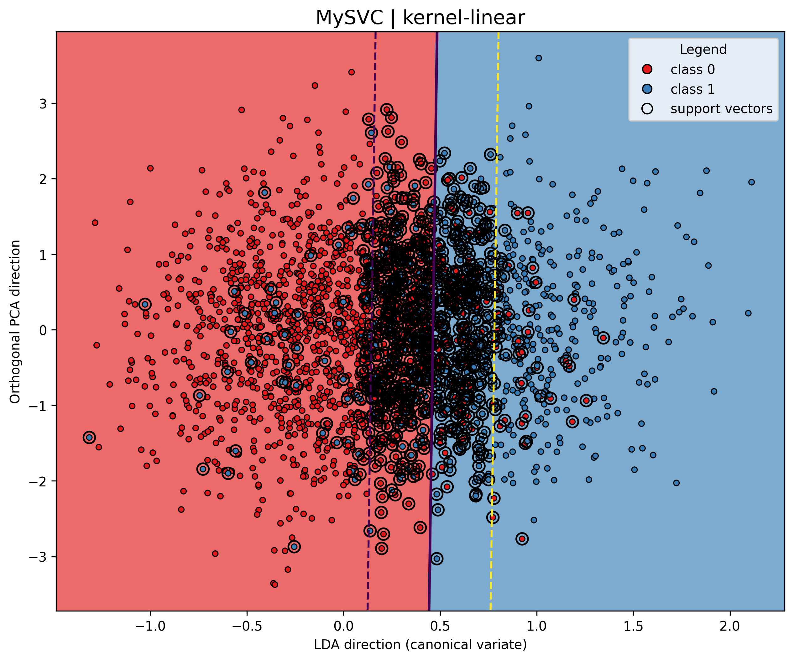
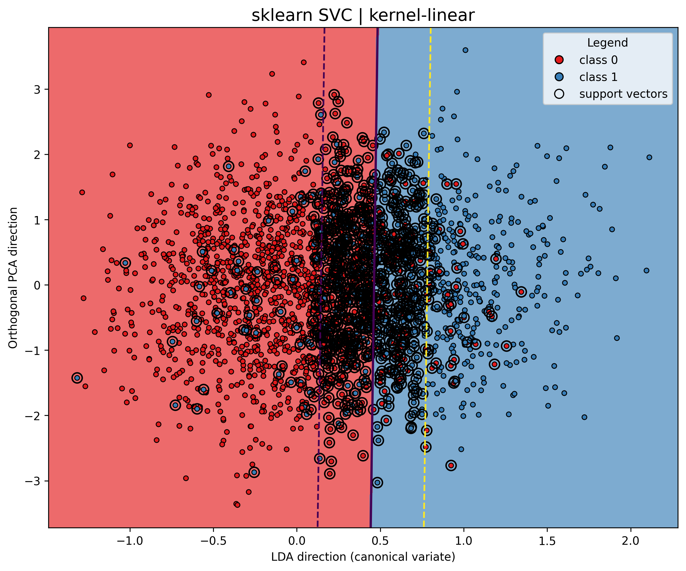
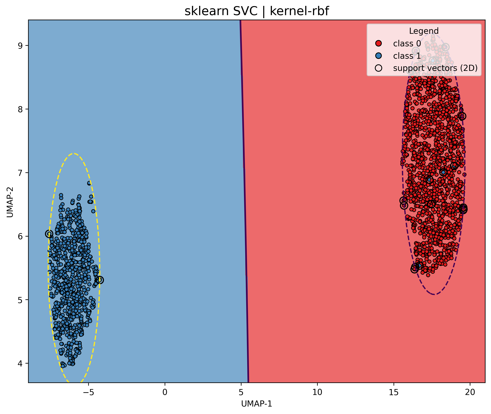

# Отчет по лабораторной работе: кастомная реализация SVM

Цель работы — реализовать собственный SVM‑классификатор для бинарной классификации, решить двойственную задачу, реализовать ядра, построить линейный классификатор, визуализировать решение и сравнить с эталонной реализацией `sklearn.svm.SVC`.  
Важно: в этой реализации обучение выполняется через решение квадратичной задачи (cvxpy + OSQP), а не через градиентный спуск.

## Постановка задач

- выбрать датасет для бинарной классификации;
- реализовать решение двойственной задачи по лямбда;
- провернуть трюк с ядром;
- построить линейный классификатор;
- визуализировать решение;
- сравнить с эталонным решением (sklearn).

## Структура проекта

```
.
├── datasets
│   └── alzheimers_disease_data.csv
├── experiments
│   ├── __init__.py
│   ├── experiments.py
│   ├── helpers.py
│   └── main.py
├── notebooks
│   └── svm.ipynb
└── src
    ├── __init__.py
    ├── svc.py
    └── utils
        ├── __init__.py
        ├── preprocess.py
        └── viz.py
```

Ключевой файл с реализацией — `src/svc.py`. Экспериментальный пайплайн — `experiments/experiments.py`.

## Датасет и предобработка

Датасет — табличные данные о пациентах с бинарным признаком наличия болезни Альцгеймера.  
Скачивание и чтение реализованы в `src/utils/preprocess.py`:

```python
url = (
    "https://www.kaggle.com/api/v1/datasets/download/"
    "rabieelkharoua/alzheimers-disease-dataset"
)
...
df = pd.read_csv(input_dir, header=0)
df = df.drop(columns=["PatientID", "DoctorInCharge"])
```

Предобработка строится через `ColumnTransformer`: масштабирование числовых признаков, one‑hot для категориальных и passthrough для бинарных:

```python
preprocessing = ColumnTransformer(
    transformers=[
        ("float_cols", StandardScaler(), float_cols + int_cols + [cat_cols[1]]),
        ("cat_cols", OneHotEncoder(drop="first", sparse_output=False, handle_unknown="ignore"), [cat_cols[0]]),
        ("bin_cols", "passthrough", bin_cols),
    ],
    remainder="passthrough"
)
```

## Реализация MySVC (`src/svc.py`)

### 1) Решение двойственной задачи

Двойственная задача SVM решается как квадратичная оптимизация с ограничениями на лямбда‑множители (Лагранжа):

```python
lambda_ = cp.Variable(G.shape[0])
constraints = [
    lambda_ >= 0,
    lambda_ <= self.C,
    lambda_ @ y == 0
]
obj = cp.Minimize((1/2)*cp.quad_form(lambda_, cp.psd_wrap(G)) - cp.sum(lambda_))
problem = cp.Problem(obj, constraints)
problem.solve(cp.OSQP, eps_abs=self.tol, eps_rel=self.tol, max_iter=self.max_iter)
```

Перед оптимизацией строится матрица Грама и матрица `G = (y y^T) ∘ K`:

```python
gram = self.kernel_fn(X, X)
G = np.outer(y_pm1, y_pm1) * gram
G = 0.5 * (G + G.T)
lambda_ = self._solve_dual(G, y_pm1)
```

### 2) Ядерный трюк

Ядра реализованы отдельным классом `Kernel`:

```python
def linear(self, A, B):
    return A @ B.T

def poly(self, A, B):
    return np.power(self.gamma * (A @ B.T) + self.coef0, self.degree)

def rbf(self, A, B):
    cdists = self._cdist(A, B)
    return np.exp(-self.gamma * cdists)
```

Для `rbf` используется быстрая реализация парных расстояний без `sqrt`, что ускоряет расчеты.

### 3) Линейный классификатор и решающее правило

Для линейного ядра строится явный вектор весов:

```python
if self.kernel == 'linear':
    self.coef_ = sv_coef @ X[sv_idx]
self.intercept_ = np.mean(y_pm1[sv_edge_idx] - decision_on_edge)
```

Решающее правило:

```python
if self.kernel == 'linear':
    return X @ self.coef_ + self.intercept_
gram = self.kernel_fn(self.support_vectors_, X)
decision_values = self.dual_coef_ @ gram + self.intercept_
```

Это покрывает как линейный случай, так и использование ядерного трюка.

## Визуализация (`src/utils/viz.py`)

Два типа визуализаций:

- `plot_svc_solution_lda_pca2`: обученная модель визуализируется на 2D‑проекции (LDA + ортогональная PCA‑ось).
- `plot_svc_solution_umap2_fit`: строится UMAP‑проекция в 2D, и на ней заново обучается копия модели для наглядной границы.

Примеры (результаты из `results/`):

Линейное ядро, LDA+PCA:



RBF‑ядро, UMAP‑2D (переобучение на проекции):



## Эксперименты и сравнение с sklearn

Экспериментальный пайплайн (`experiments/experiments.py`) строит `Pipeline` с предобработкой и моделью, считает метрики на 5‑fold CV и сохраняет отчеты:

```python
my_pipe = Pipeline([("preprocess", preprocessor), ("model", my_svc)])
sk_pipe = Pipeline([("preprocess", preprocessor), ("model", sk_svc)])

my_metrics = score_model_cv(my_pipe, X, y, cv=cv, include_timing=True)
sk_metrics = score_model_cv(sk_pipe, X, y, cv=cv, include_timing=True)
```

Результаты каждого варианта сохраняются в `results/<variant>/`:
- таблица метрик `model_comparison_*.md`;
- изображения с границами решений.

В текущем наборе результатов присутствуют эксперименты для `linear` и `rbf`. Полиномиальное ядро поддержано реализацией и описано в `build_kernel_variants`, но не было запущено в этих результатах.

## Сводные таблицы метрик (из `results/`)

### Linear, C=1 (по умолчанию)

| Model       |       F1 |   Accuracy |   Precision |   Recall |   Fit Time (s) |   Number of Support Vectors |
|:------------|---------:|-----------:|------------:|---------:|---------------:|----------------------------:|
| MySVC       | 0.759988 |   0.838071 |    0.797461 | 0.726316 |       9.3127   |                         856 |
| sklearn SVC | 0.759988 |   0.838071 |    0.797461 | 0.726316 |       0.135272 |                         856 |

### Linear, C=100

| Model       |       F1 |   Accuracy |   Precision |   Recall |   Fit Time (s) |   Number of Support Vectors |
|:------------|---------:|-----------:|------------:|---------:|---------------:|----------------------------:|
| MySVC       | 0.762084 |   0.818531 |    0.712496 | 0.828947 |       91.3497  |                        1384 |
| sklearn SVC | 0.758725 |   0.836677 |    0.793255 | 0.727632 |        7.39499 |                         846 |

### Linear, C=0.01

| Model       |       F1 |   Accuracy |   Precision |   Recall |   Fit Time (s) |   Number of Support Vectors |
|:------------|---------:|-----------:|------------:|---------:|---------------:|----------------------------:|
| MySVC       | 0.723702 |   0.825976 |    0.823178 | 0.646053 |      4.14988   |                        1191 |
| sklearn SVC | 0.723702 |   0.825976 |    0.823178 | 0.646053 |      0.0362813 |                        1191 |

### RBF, C=1 (по умолчанию)

| Model       |      F1 |   Accuracy |   Precision |   Recall |   Fit Time (s) |   Number of Support Vectors |
|:------------|--------:|-----------:|------------:|---------:|---------------:|----------------------------:|
| MySVC       | 0.76243 |   0.845979 |      0.8394 | 0.698684 |      2.89945   |                        1200 |
| sklearn SVC | 0.76243 |   0.845979 |      0.8394 | 0.698684 |      0.0559897 |                        1200 |

## Краткие выводы

- Метрики MySVC совпадают с `sklearn.svm.SVC` на тех же настройках, что подтверждает корректность реализации двойственной задачи и решающего правила.
- Время обучения у MySVC существенно больше из‑за решения квадратичной задачи через cvxpy.
- Поддерживаются линейное, полиномиальное и RBF‑ядра; эксперименты с различными `C` позволяют увидеть влияние регуляризации на качество и число опорных векторов.
