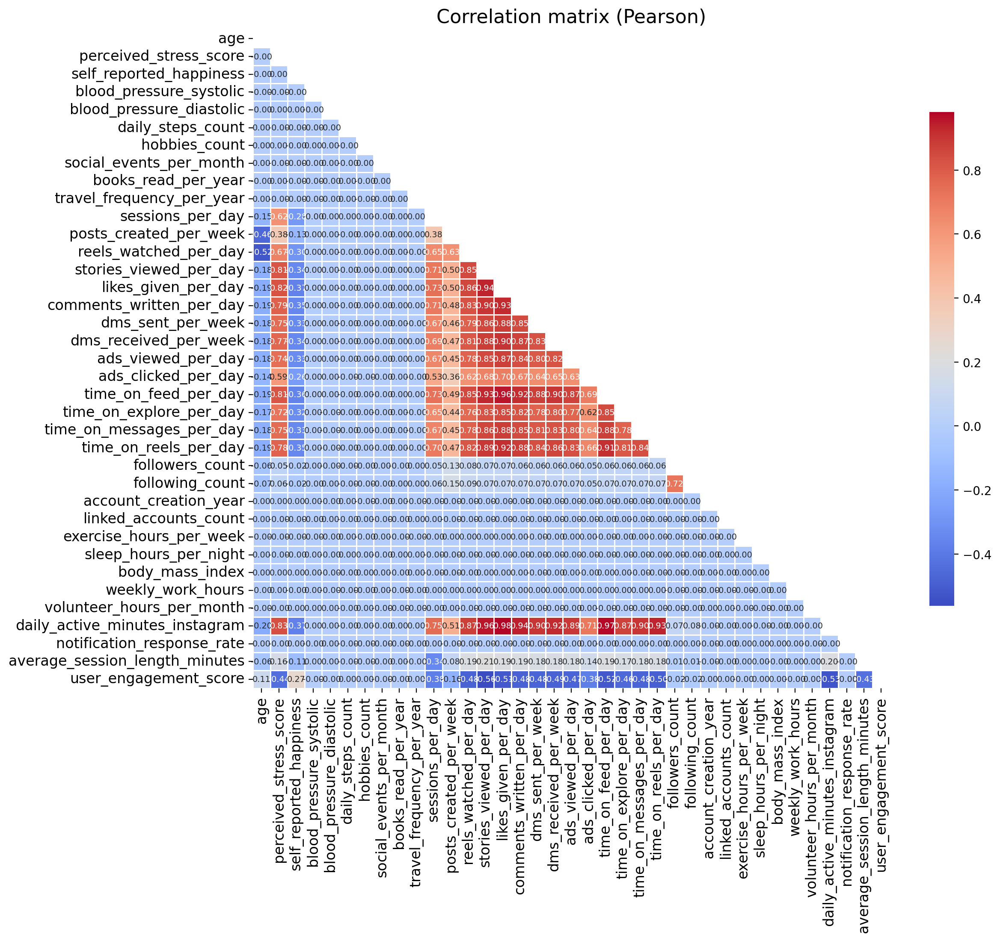
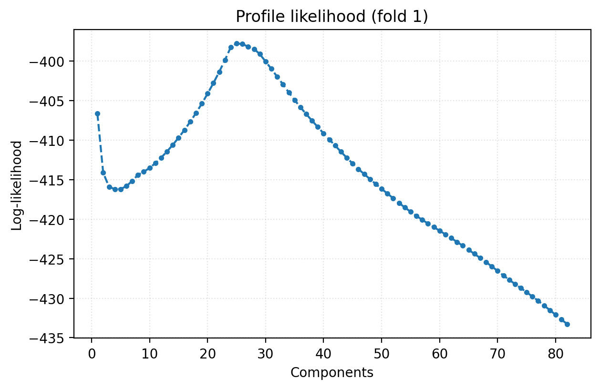
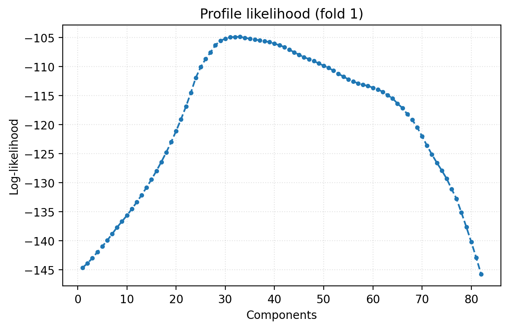
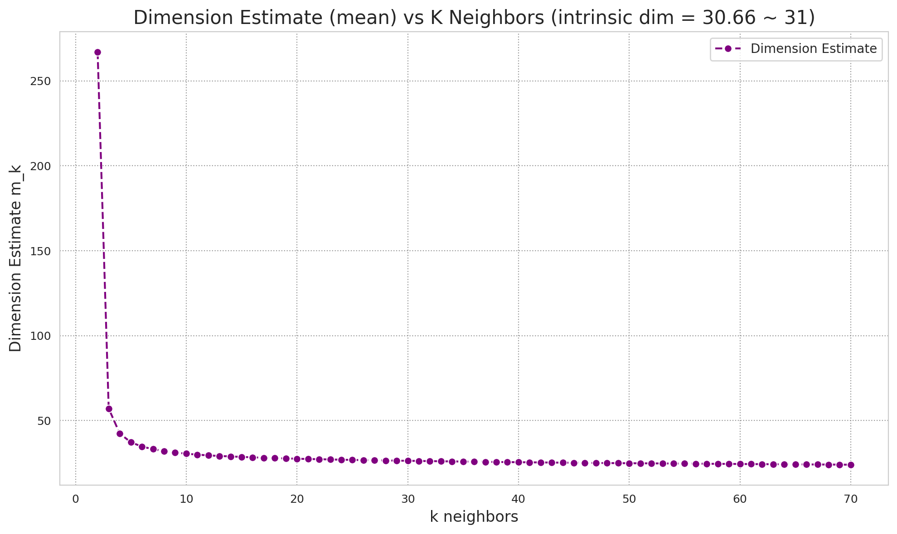
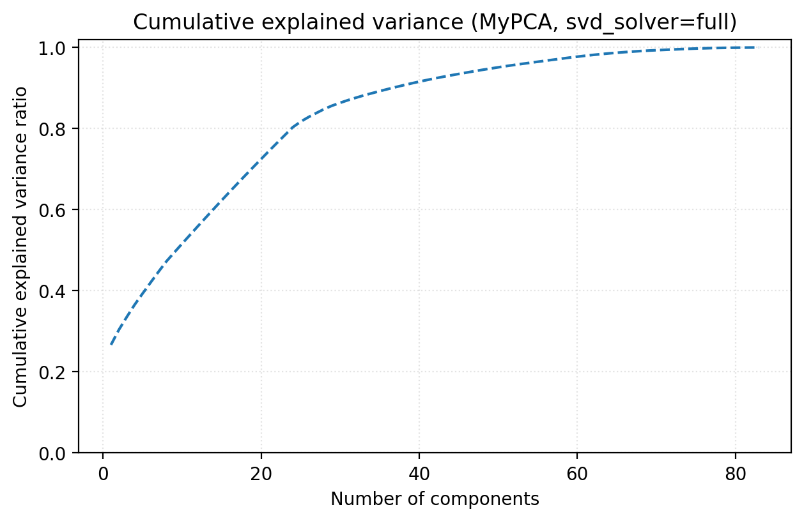

# Отчет по лабораторной работе: PCA через SVD

Работа посвящена реализации метода главных компонент (PCA) через SVD и проверке корректности работы на задаче линейной регрессии.

## Задачи работы
1. Подобрать датасет для линейной регрессии.
2. Реализовать PCA через сингулярное разложение.
3. Определить эффективную размерность выборки.
4. Показать эквивалентность с эталонной реализацией.

## Структура проекта

```
.
├── datasets
│   └── instagram_usage_lifestyle.csv
├── experiments
│   ├── experiments.py
│   ├── main.py
│   ├── preprocess.py
│   └── utils.py
├── results
│   ├── correlation_matrix_pearson.png
│   ├── full
│   └── covariance_eigh
└── src
    ├── intrinsic_dim_mle.py
    └── pca.py
```

Ключевые файлы:
- Реализация PCA: `src/pca.py`.
- Оценка intrinsic dimension (MLE): `src/intrinsic_dim_mle.py`.
- Препроцессинг и корреляционная матрица: `experiments/preprocess.py`.
- Эксперименты, кросс‑валидация и сравнение с sklearn: `experiments/experiments.py`, `experiments/utils.py`.
- Запуск экспериментов: `experiments/main.py`.

Для запуска кода и воспроизведения результатов необходимо вызвать следующие команды из директории `.../lab4`:
```bash
python -m experiments.main --solver full
python -m experiments.main --solver covariance_eigh
```

## Данные и препроцессинг

**Датасет**: *Social Media User Analysis* (Kaggle). Содержит синтетические профили пользователей Instagram и их поведенческие/демографические характеристики.  
**Исходная размерность**: *57 признаков + 1 целевая переменная* `user_engagement_score`.  
После препроцессинга (one‑hot, ordinal‑encoding, стандартализация) эффективная размерность выросла до **83 признаков**.  
Для ускорения экспериментов используется подвыборка из **10 000** наблюдений (исходная выборка содержит более 1 мил. записей).

Корреляционная матрица строится в `experiments/preprocess.py` (функция `plot_cor_mat`).  
Наблюдение: большая часть признаков почти не коррелирует между собой, но есть группы умеренно/сильно коррелированных признаков — признак наличия линейной зависимости между признаками и потенциальной мультиколлинеарности, которая устраняется с помощью PCA. Проблем с плохой обусловленностью матрицы датасета в ходе экспериментов обнаружено не было.



## Реализация PCA

Класс `MyPCA` реализован в `src/pca.py`. Поддерживаются два решения:
- `svd_solver="full"`: классическое SVD разложение.
- `svd_solver="covariance_eigh"`: спектральное разложение ковариационной матрицы (альтернативный подход).

## Определение эффективной размерности

В `MyPCA` поддерживаются разные сценарии задания `n_components`:
- **int** — фиксированное число компонент.
- **float (0..1)** — доля объясненной дисперсии.
- **None** — полный набор компонент.
- **"profile_likelihood"** — автоматическая оценка размера подпространства по методу change‑point (профиль правдоподобия), реализовано в `src/pca.py`. Важно отметить, что в оригинальной формулировке, взятой из книги Kevin P. Murphy, используются собственные значения, однако в реализации в случае SVD-разложения для оценки используются сингулярные числа, обладающие тем же порядком, но другим масштабом и нелинейной связью с собственными числами за счет корня. А для случая спектральной факторизации из-за большего масштаба собственных чисел и их квадратичной природы (квадраты сингулярных чисел) разница между наибольшим собственным числом и последующми приводила к деградации оценки до 1 главной компоненты. Поэтому использовалась логарифмическая шкала для устранения этой разницы. Как показали эксперименты, полученные таким образом оценки оказывались ближе *mle-intrinsic dimensionality* оценке, чем оценки на основе сингулярных чисел.

Также реализован внешней метод оценки intrinsic dimension на основе **MLE по расстояниям k‑NN** (Levina & Bickel). Он универсален для любых методов снижения размерности и находится в `src/intrinsic_dim_mle.py` (`estimate_intrinsic_dim_skidim`).  
В пайплайне кросс‑валидации (`experiments/utils.py`, `cross_validate_with_pca`) этот метод используется при `use_mle_estimator=True`.

Примеры графиков:





## Эксперименты и сравнение с sklearn

Пайплайн экспериментов реализован в `experiments/experiments.py` (функция `run_tests`).  
В `experiments/utils.py` реализованы:
- кросс‑валидация с PCA + линейной регрессией (`cross_validate_with_pca`),
- метрики качества (RMSE, MAE, R²),
- замер времени обучения PCA,
- функции сравнения подпространств (`principal_angles`, `projector_fro_error`, `procrustes_align`).

**principal_angles**: измеряют углы между двумя $k$-мерными подпространствами. Вычисляются как арккосинусы сингулярных чисел матрицы ${V_1}^\intercal V_2$, где ${V_1}^\intercal V_2$ — ортонормированные базисы подпространств. Угол в $0$ — полное совпадение направлений. Если все углы равны нулю, подпространства совпадают точно. Тем самым метод проверяет геометрическое совпадение подпространств, независимо от выбора базиса.

**projector_fro_error**: норма разности проекционных матриц на соответствующие подпространства: 
$$
||V_1 {V_1}^\intercal - V_2 {V_2}^\intercal||_F
$$
Норма равна $0$ тогда и только тогда, когда подпространства совпадают. Оценка инвариантна к перестановкам, знакам и поворотам базиса.

**procrustes_align / procrustes_relative_error**: ищет оптимальное ортогональное преобразование (поворот и/или отражение), которое наилучшим образом выравнивает две проекционные матрицы:
$$
\min_{R^\intercal R=I}{||Z_1 - Z_2R||_F}
$$
После выравнивания считается относительная ошибка:
$$
\frac{||Z_1-Z_2R^*||_F}{||Z_1||_F}
$$
Значение ~ 0 означает, что проекции эквивалентны с точностью до ортогонального преобразования. Оценка учитывает допустимую неоднозначность ориентации PCA-компонент. Метод проверяет эквивалентность самих проекций данных, а не только подпространства.


### Baseline‑модели

Результаты базовых моделей (предсказание среднего, линейная регрессия на всех признаках и линейная регрессия после PCA с 10 компонентами):

| svd_solver | модель | RMSE | MAE | R2 | n_components | pca_fit_time |
| --- | --- | --- | --- | --- | --- | --- |
| full | Mean prediction | 1.8519 | 0.9586 | -0.0000 |  |  |
| full | Linear regression (full features) | 1.2241 | 0.8471 | 0.5631 |  |  |
| full | Linear regression + MyPCA | 1.4678 | 0.9554 | 0.3718 | 10 | 0.1558 |
| full | Linear regression + sklearn PCA | 1.4678 | 0.9554 | 0.3718 | 10 | 0.4663 |
| covariance_eigh | Mean prediction | 1.8519 | 0.9586 | -0.0000 |  |  |
| covariance_eigh | Linear regression (full features) | 1.2241 | 0.8471 | 0.5631 |  |  |
| covariance_eigh | Linear regression + MyPCA | 1.4678 | 0.9554 | 0.3718 | 10 | 0.0115 |
| covariance_eigh | Linear regression + sklearn PCA | 1.4678 | 0.9554 | 0.3718 | 10 | 0.0806 |

### Качество на кросс‑валидации (n_components = 0.95)

Средние значения по 5 фолдам (MyPCA и sklearn совпадают):

| svd_solver | модель | RMSE (mean) | MAE (mean) | R2 (mean) | n_components (mean) |
| --- | --- | --- | --- | --- | --- |
| full | MyPCA | 1.3079 | 0.9058 | 0.4906 | 50 |
| full | sklearn PCA | 1.3079 | 0.9058 | 0.4906 | 50 |
| covariance_eigh | MyPCA | 1.3079 | 0.9058 | 0.4906 | 50 |
| covariance_eigh | sklearn PCA | 1.3079 | 0.9058 | 0.4906 | 50 |

Аналогично, при использовании внешнего MLE‑оценщика (`use_mle_estimator=True`) результаты MyPCA и sklearn также совпадают ($RMSE \approx 1.43$, $R^2 \approx 0.39$).

### Сравнение подпространств (MyPCA vs sklearn PCA)

В `experiments/experiments.py` используется функция `_compare_pca_models`, которая опирается на три сравнения из `experiments/utils.py`.  
Для обоих солверов главные подпространства совпадают (нулевые углы и нулевая ошибка проекторов), что подтверждает эквивалентность реализации.

| svd_solver | n_components_my | n_components_sklearn | mean angle (deg) | max angle (deg) | projector fro error | procrustes relative error |
| --- | --- | --- | --- | --- | --- | --- |
| full | 37 | 37 | 0.0000 | 0.0000 | 0.0000 | 0.0000 |
| covariance_eigh | 37 | 37 | 0.0000 | 0.0000 | 0.0000 | 0.0000 |

## Визуализация PCA

В `experiments/utils.py` реализовано построение 2D‑проекции и кривой накопленной дисперсии. Цветом на графике проекции точек обозначено значение целевой переменной.




2D‑проекция демонстрирует ожидаемую структуру данных после снижения размерности.  
Кривая кумулятивной дисперсии демонстрирует слабо выраженный *локоть* в районе 26 главных компонент, что совпадает с *profile likelihood*-оценкой внутренней размерности. Хотя совпадение скорее подвтерждает именно работоспособность метода *change point*, ведь его суть заключалась как раз в автоматическом определении падения скорости изменения вариации при увеличении числа компонент.

## Итог

Все требования задания выполнены:
- PCA реализован с двумя солверами (SVD и спектральное разложение).
- Реализованы методы оценки эффективной размерности (profile likelihood + MLE).
- Эквивалентность с `sklearn` подтверждена на уровне подпространств и метрик.
- Подготовлен отчет с визуализациями и результатами экспериментов.
