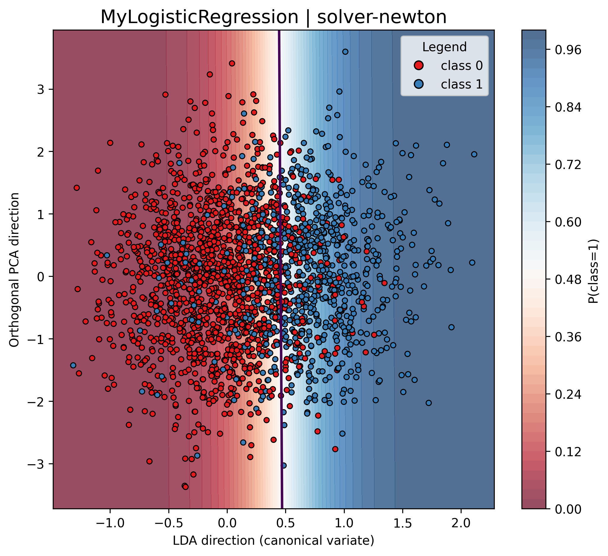
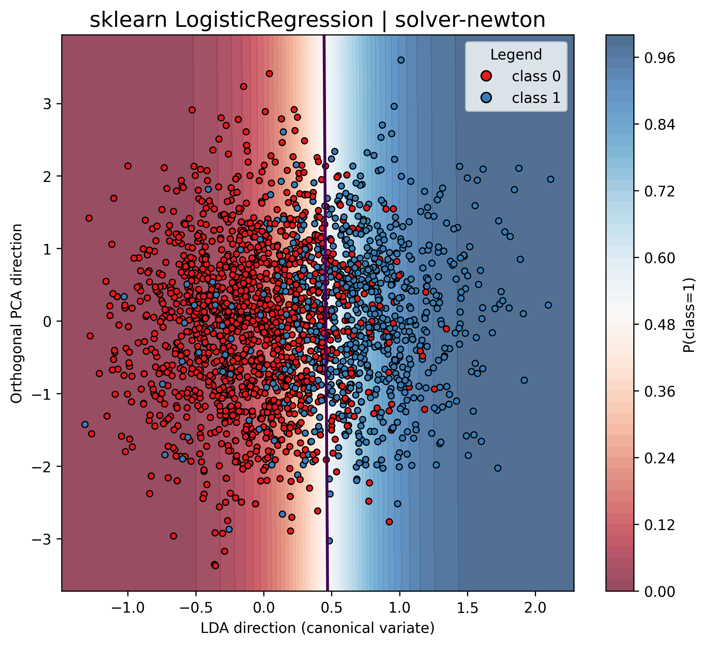
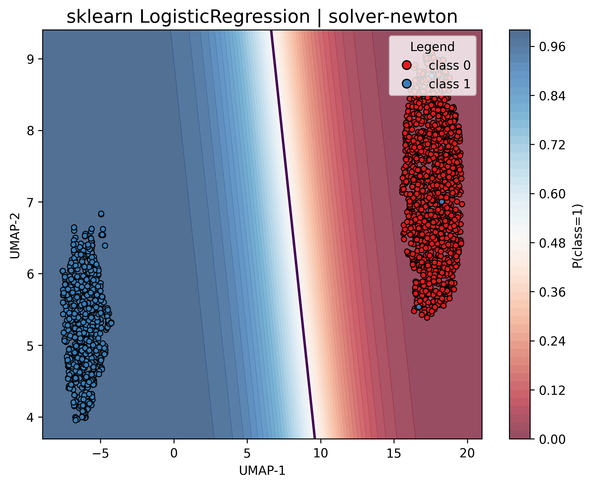
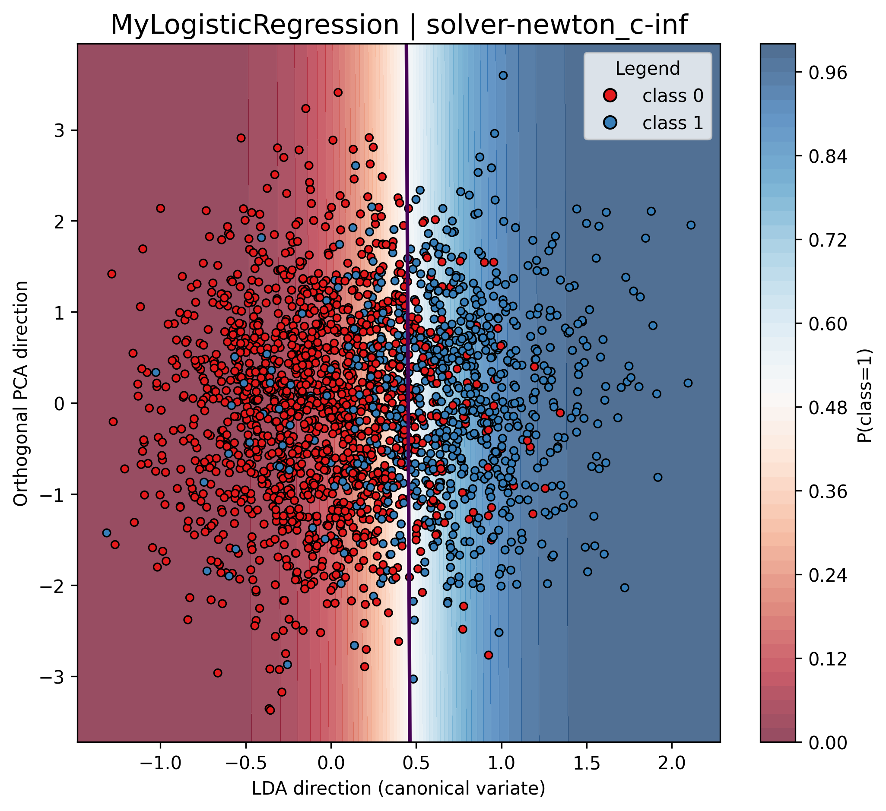
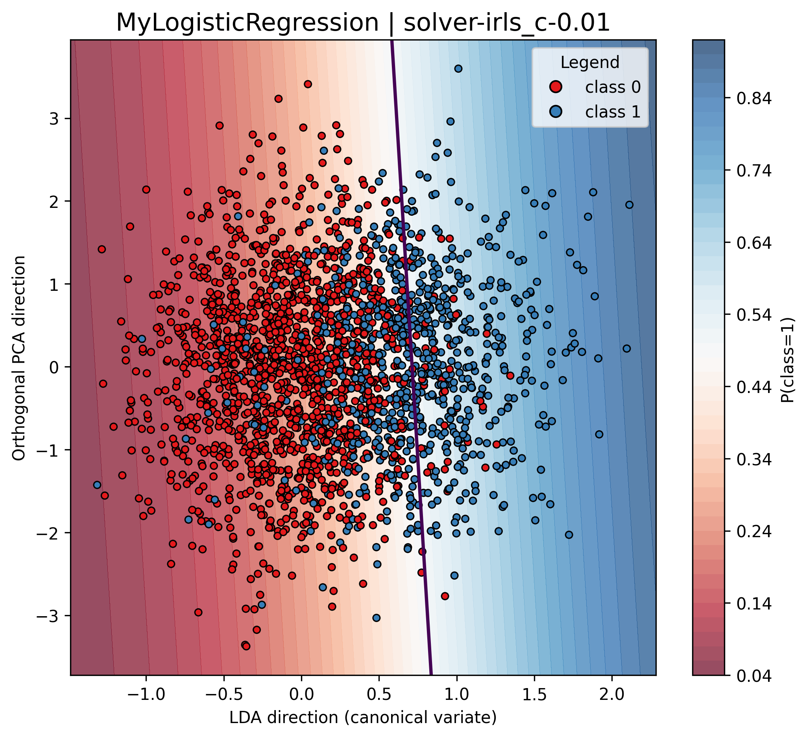

# Отчет по лабораторной работе: реализация логистической регрессии как частный случай GLM

Цель работы — реализовать собственную бинарную логистическую регрессию с оптимизацией методом Ньютона–Рафсона и IRLS, сравнить ее с эталонными реализациями (sklearn и statsmodels) и подготовить отчет.

## Постановка задач

- выбрать датасет для логистической регрессии;
- реализовать логистическую регрессию с помощью метода Ньютона–Рафсона и IRLS;
- показать эквивалентность с эталонной реализацией;
- подготовить отчет.

## Выполнение задач и ссылки на код

- Выбор датасета и предобработка: `src/utils/preprocess.py` (загрузка/чтение, `build_preprocessor`).
- Собственная логистическая регрессия (Ньютон–Рафсон и IRLS): `src/logreg.py` (`MyLogisticRegression._fit_newton`, `MyLogisticRegression._fit_irls`).
- Сравнение с эталонами: `experiments/experiments.py` (запуск трех моделей), `src/logreg.py` (`SMGLMLogitClassifier`), `sklearn.linear_model.LogisticRegression`.
- Отчет и визуализации: `README.md`, графики в `results/`, функции в `src/utils/viz.py`.

## Структура проекта

```
.
├── datasets
│   └── alzheimers_disease_data.csv
├── experiments
│   ├── __init__.py
│   ├── experiments.py
│   ├── helpers.py
│   └── main.py
├── results
│   └── solver-*/...
└── src
    ├── __init__.py
    ├── logreg.py
    └── utils
        ├── __init__.py
        ├── preprocess.py
        └── viz.py
```

Ключевой файл с реализацией — `src/logreg.py`. Экспериментальный пайплайн — `experiments/experiments.py`.

## Датасет и предобработка

Датасет — табличные данные о пациентах с бинарным признаком наличия болезни Альцгеймера.  
Скачивание и чтение реализованы в `src/utils/preprocess.py`:

```python
url = (
    "https://www.kaggle.com/api/v1/datasets/download/"
    "rabieelkharoua/alzheimers-disease-dataset"
)
...
df = pd.read_csv(input_dir, header=0)
df = df.drop(columns=["PatientID", "DoctorInCharge"])
```

Предобработка строится через `ColumnTransformer`: масштабирование числовых признаков, one‑hot для категориальных и passthrough для бинарных:

```python
preprocessing = ColumnTransformer(
    transformers=[
        ("float_cols", StandardScaler(), float_cols + int_cols + [cat_cols[1]]),
        ("cat_cols", OneHotEncoder(drop="first", sparse_output=False, handle_unknown="ignore"), [cat_cols[0]]),
        ("bin_cols", "passthrough", bin_cols),
    ],
    remainder="passthrough"
)
```

## Реализация MyLogisticRegression (`src/logreg.py`)

Класс `MyLogisticRegression` реализует бинарную логистическую регрессию и повторяет ключевые элементы интерфейса sklearn: `fit`, `predict`, `predict_proba`, `decision_function`, а также атрибуты `coef_`, `intercept_`, `classes_`.

### 1) Функция потерь и регуляризация

Для обучения бинарной логистической регрессии используется классическая для этой задачи функция потерь *Negative Log-Likelihood*, записанная для бинарного случая:  
```math
\mathrm{NLL}(w)
=
-\frac{1}{N}\sum_{n=1}^N \Big[y_n\log \mu_n + (1-y_n)\log(1-\mu_n)\Big].
```

К mean NLL добавляется L2-регуляризация:
```math
\mathrm{PNLL}(w) = \mathrm{NLL}(w) + \lambda\,\|w\|_2^2.
```

По аналогии с sklearn *не штрафуется свободный член*, поэтому вводится маска регуляризации $m = (0,1,1,\dots,1)$. Тогда регуляризуемая норма считается как $\|m\odot w\|^2$, где $\odot$ — поэлементное умножение.

В реализации используется параметр `C` по аналогии с sklearn: чем больше \(C\), тем слабее регуляризация.
Чтобы значение `C=1` было разумным по масштабу для широкого класса задач и было сопоставимо с типичными библиотечными реализациями, коэффициент регуляризации выбирается как:
```math
{
\lambda = \frac{1}{2 N C}
}
```
Тогда $PNLL$ принимает вид:
```math
{
J(w)=
-\frac{1}{N}\sum_{n=1}^N \Big[y_n\log\mu_n+(1-y_n)\log(1-\mu_n)\Big]
\;+\;
\frac{1}{2NC}\|m\odot w\|_2^2
}
```

Интуитивно это означает, что вклад регуляризации масштабируется согласованно с тем, что основная часть потерь уже усреднена по $N$. Без такой нормализации при фиксированном $C$ влияние регуляризации может становиться слишком сильным на больших выборках (или наоборот — слишком слабым на малых).

Фрагмент реализации из файла `src/logreg.py`:
```python
lam = 1.0 / (2.0 * n * self.C)  # sklearn-like
...
nll_mean = -np.mean(y * np.log(mu) + (1.0 - y) * np.log(1.0 - mu))
reg = lam * float((reg_mask * w) @ (reg_mask * w))
return nll_mean + reg
```

### 2) Решение методом Ньютона–Рафсона

Метод Ньютона–Рафсона — это метод второго порядка. На каждом шаге используется градиент и гессиан функции потерь.

Обозначим матрицу признаков $X \in \mathbb{R}^{N\times D}$ (строки — $x_n^\top$), вектор вероятностей $\mu \in \mathbb{R}^N$, где $\mu_n = \sigma(x_n^\top w)$, и диагональную матрицу весов:
```math
S = \mathrm{diag}(s_1,\dots,s_N), \qquad s_n = \mu_n(1-\mu_n).
```

Тогда для mean NLL:
```math
g(w) = \nabla\mathrm{NLL}(w) = \frac{1}{N}X^\top(\mu - y),
```
```math
H(w) = \nabla^2\mathrm{NLL}(w) = \frac{1}{N}X^\top S X.
```

#### Добавление регуляризации

Для $J(w)=\mathrm{NLL}(w) + \lambda\|m\odot w\|^2$ получаем:
```math
g_J(w) = \frac{1}{N}X^\top(\mu-y) + 2\lambda\,(m\odot w),
```
```math
H_J(w) = \frac{1}{N}X^\top S X + 2\lambda\,\mathrm{diag}(m).
```

#### Итерация Ньютона

Шаг Ньютона записывается так:
```math
{
\delta_t = H_J(w_t)^{-1} g_J(w_t), \qquad
w_{t+1} = w_t - \delta_t
}
```

На практике не вычисляют $H^{-1}$ явно, вместо этого решают СЛАУ:
```math
H_J(w_t)\,\delta_t = g_J(w_t),
```
что численно устойчивее и быстрее.

Чтобы гарантировать уменьшение $J(w)$ (на редких примерах при плохой обусловленности), может применяться демпфирование: пробуется шаг $w - \alpha\delta$ с $\alpha=1$, а если $J$ не уменьшается — $\alpha$ последовательно уменьшается (в моем случае вдвое).

Реализация: `MyLogisticRegression._fit_newton`.

### 3) Решение методом IRLS

IRLS — это та же самая итерация Ньютона, переписанная в форме *взвешенной линейной регрессии*. На текущем шаге $t$ вычисляются:
```math
a_t = Xw_t, \quad \mu_t = \sigma(a_t), \quad S_t = \mathrm{diag}(\mu_{t,n}(1-\mu_{t,n})).
```

Вводится working response $z_t = a_t + S_t^{-1}(y-\mu_t)$. Тогда нерегуляризованный IRLS шаг эквивалентен решению weighted least squares:
```math
w_{t+1} = \arg\min_w \ (z_t - Xw)^\top S_t (z_t - Xw),
```
что дает систему уравнений:
```math
(X^\top S_t X) w_{t+1} = X^\top S_t z_t.
```

С учетом L2-регуляризации получаем:
```math
\left(\frac{1}{N}X^\top S_t X + 2\lambda\,\mathrm{diag}(m)\right) w_{t+1}
=
\frac{1}{N}X^\top S_t z_t.
```

Умножив на $N$, получаем удобную для вычислений форму:
```math
{
\left(X^\top S_t X + 2N\lambda\,\mathrm{diag}(m)\right) w_{t+1}
=
X^\top S_t z_t
}
```

Именно в таком виде система решается в коде (через `np.linalg.solve`), где:
- $s_n = \mu_n(1-\mu_n)$ соответствует вектору `s`,
- $z$ соответствует `z`,
- матрица $X^\top S X$ строится как `(X.T * s) @ X` (без явного построения диагональной матрицы).

Реализация: `MyLogisticRegression._fit_irls`.

### 4) Эквивалентность Ньютона и IRLS

Для логистической регрессии IRLS — это *переписанный шаг Ньютона*, где задача на каждом шаге сводится к взвешенному МНК. Поэтому при одинаковых условиях останова и одинаковой регуляризации оба метода дают совпадающие решения (с поправкой на машинную точность).

## Эталонные модели

- `sklearn.linear_model.LogisticRegression`: используется как основной эталон в экспериментах, поддерживает параметр регуляризации `C`.
- `SMGLMLogitClassifier` (`src/logreg.py`): sklearn-wrapper над `statsmodels.GLM` с Binomial‑семейством. Поддерживает `solver="irls"|"newton"`, что близко к способу оптимизации в кастомной реализации.

Пример настройки statsmodels‑модели:

```python
model = sm.GLM(y01, Xb, family=sm.families.Binomial())
res = model.fit(method=method, maxiter=self.max_iter, tol=self.tol)
```

## Визуализация (`src/utils/viz.py`)

Используются два типа визуализаций:

- `plot_logreg_solution_lda_pca2`: проекция на 2D (LDA + ортогональная PCA‑ось) и отображение границы решений/уверенности.
- `plot_clf_solution_umap2_fit`: UMAP‑проекция в 2D, повторное обучение копии модели и визуализация границы в 2D.

Примеры (solver=newton, C=1):

LDA+PCA:



UMAP‑2D (переобучение на проекции):



## Эксперименты и сравнение с эталонами

Экспериментальный пайплайн (`experiments/experiments.py`) формирует `Pipeline` из предобработки и модели, считает метрики на 5‑fold CV и сохраняет результаты:

```python
my_pipe = Pipeline([("preprocess", preprocessor), ("model", my_logreg)])
sk_pipe = Pipeline([("preprocess", preprocessor), ("model", sk_logreg)])
...
my_metrics = score_model_cv(my_pipe, X, y, cv=cv, include_timing=True)
```

Для каждого solver выполняются варианты с разными значениями `C`:
- `C=1` (базовый случай);
- `C=inf` для solver=`newton` (без регуляризации);
- `C=0.01` для solver=`irls` (сильная регуляризация).


## Сводные таблицы метрик (из `results/`)

Примечание: в таблицах ниже `SMGLMLogitClassifier` показан только для базового случая (`C=1`), так как у statsmodels‑реализации нет L2‑регуляризации через `C`.

### solver=newton, C=1 (по умолчанию)

| Model                      |       F1 |   Accuracy |   Precision |   Recall |   Fit Time (s) |
|:---------------------------|---------:|-----------:|------------:|---------:|---------------:|
| MyLogisticRegression       | 0.760481 |    0.83807 |     0.79671 | 0.727632 |     0.00923486 |
| sklearn LogisticRegression | 0.760481 |    0.83807 |     0.79671 | 0.727632 |     0.0131688  |
| SMGLMLogitClassifier       | 0.760481 |    0.83807 |     0.79671 | 0.727632 |     0.0321075  |

### solver=newton, C=inf (без регуляризации)

| Model                      |       F1 |   Accuracy |   Precision |   Recall |   Fit Time (s) |
|:---------------------------|---------:|-----------:|------------:|---------:|---------------:|
| sklearn LogisticRegression | 0.761013 |   0.838535 |    0.797871 | 0.727632 |     0.0192129  |
| MyLogisticRegression       | 0.760481 |   0.83807  |    0.79671  | 0.727632 |     0.00715051 |

### solver=irls, C=1 (по умолчанию)

| Model                      |       F1 |   Accuracy |   Precision |   Recall |   Fit Time (s) |
|:---------------------------|---------:|-----------:|------------:|---------:|---------------:|
| MyLogisticRegression       | 0.760481 |    0.83807 |     0.79671 | 0.727632 |     0.00800319 |
| sklearn LogisticRegression | 0.760481 |    0.83807 |     0.79671 | 0.727632 |     0.0120007  |
| SMGLMLogitClassifier       | 0.760481 |    0.83807 |     0.79671 | 0.727632 |     0.0324036  |

### solver=irls, C=0.01 (сильная регуляризация)

| Model                      |       F1 |   Accuracy |   Precision |   Recall |   Fit Time (s) |
|:---------------------------|---------:|-----------:|------------:|---------:|---------------:|
| MyLogisticRegression       | 0.688958 |   0.811551 |    0.827175 | 0.590789 |     0.00743179 |
| sklearn LogisticRegression | 0.688958 |   0.811551 |    0.827175 | 0.590789 |     0.00997071 |

## Влияние регуляризации на границу решений

Ниже показаны LDA+PCA‑проекции с уровнем уверенности для `MyLogisticRegression`. Они демонстрируют влияние масштаба регуляризации (`C`) на форму границы и уверенность классификации:

solver=newton, C=1:


solver=newton, C=inf:


solver=irls, C=1:


solver=irls, C=0.01:


## Краткие выводы

- Кастомная реализация логистической регрессии корректно воспроизводит поведение эталонных моделей на выбранном датасете.
- Метрики `MyLogisticRegression` совпадают со `sklearn LogisticRegression` на одинаковых `C`, что подтверждает корректность реализации модели.
- Уменьшение `C` (усиление регуляризации) сглаживает границу решений и снижает уверенность в пограничных областях, что отражается в метриках.
- Обертка `SMGLMLogitClassifier` на statsmodels служит дополнительной проверкой эквивалентности алгоритмов оптимизации модели (IRLS/Newton).
