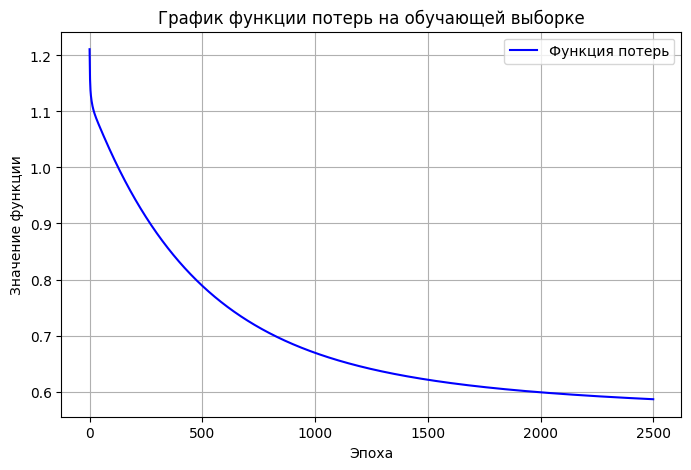
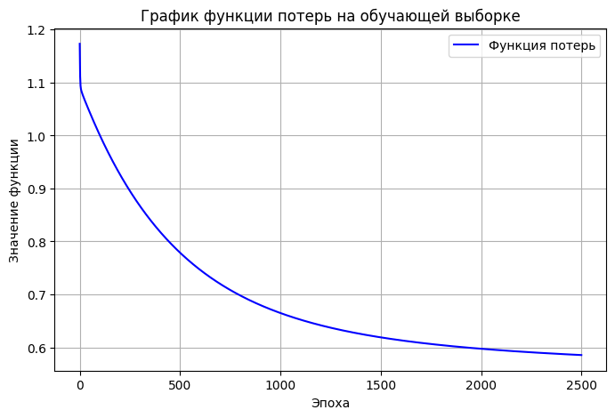
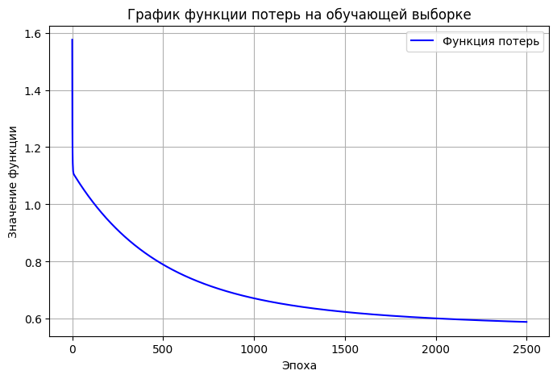
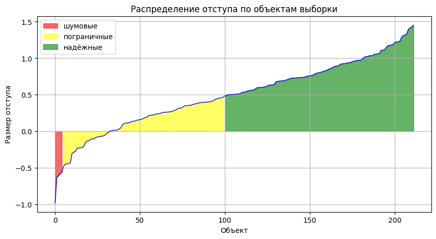
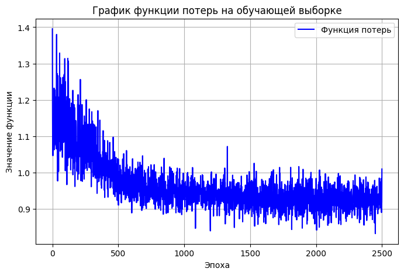
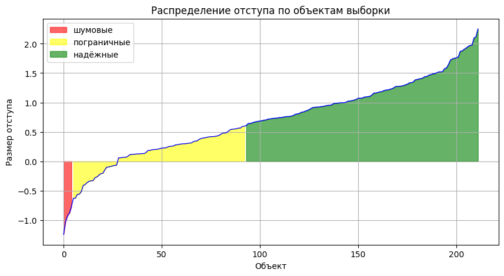
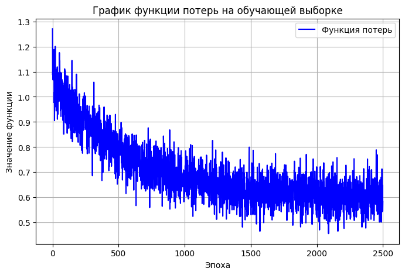
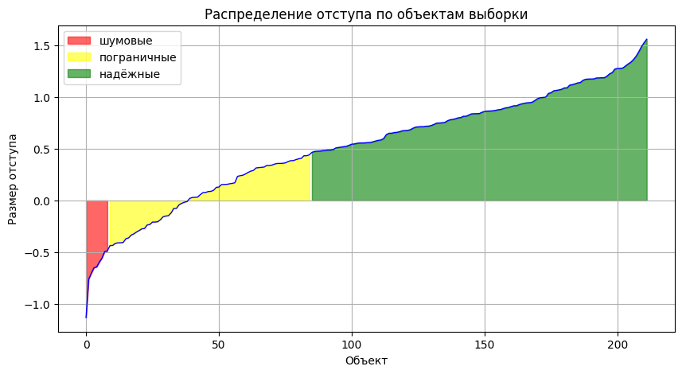
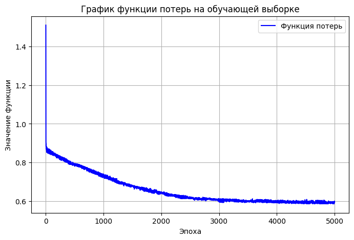
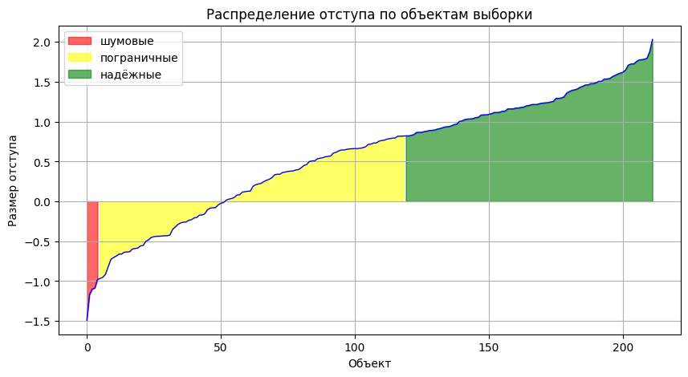

# Лабораторная работа №1 (Линейный Классификатор)

Задача: реализовать функционал Линейного классификатора, а также оптимизатора первого порядка (стохастический спуск) вместе с L2-регуляризацией и функцией потерь MSE. Обучить модель, построить графики отступа, сравнить с эталлоной реализацией.

Дополнительное задание от преподователя: обучить собственную и эталонную модели с помощью любой другой функции потерь.

## Навигация по директориям и файлам

- images - каталог с изображениями графиков, полученных в результате с экспериментов с моделями;
- source - директория с файлами исходного кода;
    - core.py - файл с основными модулями разработанной модели;
    - experiments.py - файл с различными экспериментами с моделями, а также вспомогательными функциями;

# Отчет по проделанной работе

## Выбранный датасет

Задача бинарной классификации болезни средца [https://www.kaggle.com/datasets/yasserh/heart-disease-dataset]

Датасет без пропусков, значения таргета приведены к виду -1 / 1, дополнительная предобработка не проводилась.

### Реализация
- Для реализации указанного функционала, в основном использовались библиотеки numpy и pandas. Графики построены с помощью matplotlib. 

- Представленная реализация воплощает в себе не только линейный классификатор но и полносвзяную нейронную сеть в зависимости от указанной конфигурации.

- Написанный класс модели иницализирует значения весов по нормальному распределению, а также, при подаче вектора корелляции параметров к таргету, к полученному значению добавляется коэффициент корелляции с таргетом.

- Реализовано два сэмплера для определения порядка предявления объетов датасета. на основе отступа и в случайном порядке.

- В рамках персонального задания, помимо реализации алгоритма среднеквадратичной ошибки также реализована ошибка.

- Эталонным алгоритмом выступает SGDClassifier из фреймворка scikit-learn

## Ход работы и Визуализация

Датасет разделен на обучающую и валидационную выборки 0.7 и 0.3 от датасета соотвественно. Для каждой модели берем один random seed.

Гиперпараметры для собственных моделей:
- Эпох: 2500
- Размер батча: 1
- Квадратичная функция потерь
- Шаг обучения: 1e-6
- Момент: 0.5
- Коэффициент L2 регуляризации: 1e-5

### Обучение модели Baseline

Полученные метрики на валидационной выборке:
| Метрика   | Значение           |
|-----------|--------------------|
| accuracy  | 0.8461538461538461 |
| loss      | 0.6153846153846154 |
| precision | 0.8461538461538461 |
| recall    | 0.88               |
| f1        | 0.8627450980392157 |
| Q | 49.902911838892834 |

Бэйзлайн неплохо справился с разделением классов.

### Обучение модели с инициализацией весов по корреляции

Полученные метрики на валидационной выборке:
| Метрика   | Значение           |
|-----------|--------------------|
| accuracy  | 0.8461538461538461 |
| loss      | 0.6153846153846154 |
| precision | 0.8461538461538461 |
| recall    | 0.88               |
| f1        | 0.8627450980392157 |
| Q | 49.85578582527701 |

С помощью инициализации веосв на основе корреляции ускорилась сходимость!

### Обучение модели с мультистартом

Полученные метрики на валидационной выборке:
| Метрика   | Значение           |
|-----------|--------------------|
| accuracy  | 0.8461538461538461 |
| loss      | 0.6153846153846154 |
| precision | 0.8461538461538461 |
| recall    | 0.88               |
| f1        | 0.8627450980392157 |
| Q | 49.525001118664115 |

Обучено 20 вариантов модели с разными начальными весами, лучшая реализация определялась по наименьшему эмпирическому риску. Качество модели не возросло, возможно не хватило итераций цикла до удачного определения стартовой точки.

### Обучение модели с предъявлением объектов по модулю отступа

Берем объект с наименьшим отступом от разделяющей гиперплоскости, пытаемся различить пограничные объекты.

Полученные метрики на валидационной выборке:
| Метрика   | Значение           |
|-----------|--------------------|
| accuracy  | 0.8571428571428571 |
| loss      | 0.5714285714285714 |
| precision | 0.8627450980392157 |
| recall    | 0.88               |
| f1        | 0.8712871287128713 |
| Q | 64.97815506795088 |

Метрики точности и f1 меры увеличились. Хотя заметно упала стабильность обучения, возможно стоит снизить регуляризацию и скорость обучения. Размер отступа значительно увеличился, что и следовало ожидать.

### Обучение модели с предъявлением объектов в случайном порядке.

Полученные метрики на валидационной выборке:
| Метрика   | Значение           |
|-----------|--------------------|
| accuracy  | 0.8571428571428571 |
| loss      | 0.5714285714285714 |
| precision | 0.8363636363636363 |
| recall    | 0.92               |
| f1        | 0.8761904761904762 |
| Q | 46.65718782374835 |

Обучение менее стабильно, но достигнутые показатели качества выше остальных реализаций, сходимость, при этом, значительно ускорилась.

### Обучение эталонного алгоритма (SGDClassifier)

В имплементации sklearn нет гиперпараметра момента, поэтому увеличиваем количество эпох до сходимости **(10000 эпох)**

Полученное значение Accuracy: **0.8571428571428571**

Достигнут лучший резульат по точности на равне со случайным предъявлением, скорее всего алгоритмы сошлись в одной точке на пространстве весов.

## Доп.задание Используем другую функцию потерь - Средняя абсолютная ошибка

Для собственной реализации увеличим цикл обучения вдвое, до **5000 эпох**, т.к. абсолютная ошибка меньше штрафует веса -> замедляется сходимость.

### Собственная реализация

Полученные метрики на валидационной выборке:
| Метрика   | Значение           |
|-----------|--------------------|
| accuracy  | 0.8241758241758241 |
| loss      | 0.3516483516483517 |
| precision | 0.7833333333333333 |
| recall    | 0.94               |
| f1        | 0.8545454545454545 |
| Q | 52.26559971285308 |

Значения качетсва точности и f1 уменьшились по сравнению с baseline, но значение полноты на достаточно высоком уровне **0.94**

### Scikit-Learn

Для эмитации MAE возьмем ошибку "epsilon_sensetive" с параметром epsilon=0, что математически эквиваленто MAE. Также увеличим кол-во **эпох до 30000** (в 3 раза).

Достигнутая точность: **0.8241758241758241**

Производительность на уровне собственной реализации.

## Выводы по работе

В результате выполнения лабораторной работы был реализован функционал линейного классификатора вместе с оптимизатором градиентного спуска. Полученная модель по результатам экспериментов сравнима по точности с эталонным алгоритмом из scikit-learn. Протестированы различные подходы к обучению, на основе чего сформированы выводы о их применимости для решения практических ML задач.
