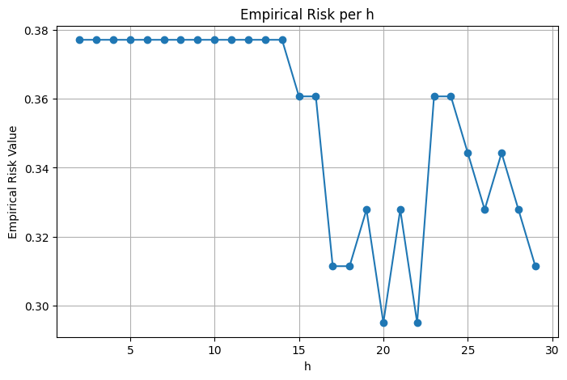
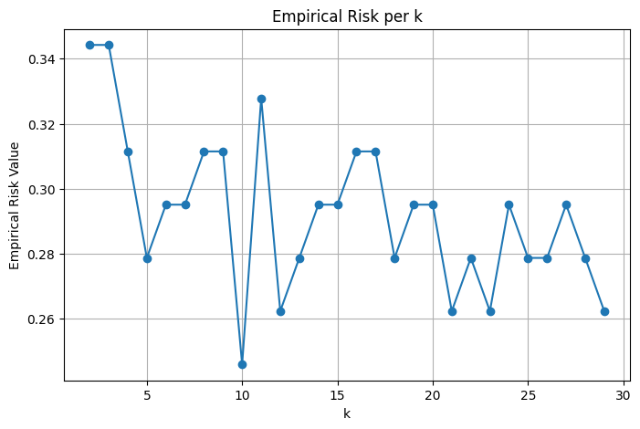
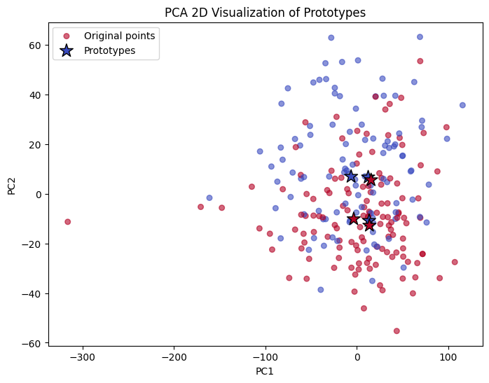

# Лабораторная работа №2 (Метрическая классификация)

Задача: реализовать алгоритм классификации KNN и подобрать параметр k методом скользящего контроля, сравнить с эталонной реализацией.

## Навигация по директориям и файлам

- images - каталог с изображениями графиков, полученных в результате с экспериментов с моделями;
- source - директория с файлами исходного кода;
    - knn.py - файл с описанием алгоритам k соседей на основе парзеновского окна с различными типами оконо (с динамической и статичекской шириной);
    - proto.py - файл с описанием алгоритма отбора эталонов;
    - utils.py - файл с вспомогательными функциями и визуализацией;
    - experiments.py - файл с различными экспериментами с моделями, а также вспомогательными функциями;

# Отчет по проделанной работе

## Выбранный датасет

Задача бинарной классификации болезни средца [https://www.kaggle.com/datasets/yasserh/heart-disease-dataset]

Датасет без пропусков, значения таргета приведены к виду -1 / 1, дополнительная предобработка не проводилась.

### Реализация
- В качестве ядра выступает Гауссово ядро;
- Число соседей задется параметром k;
- Линия уровня задается параметром p;
- Для фиксированного Парзеновского окна ширина задается параметром h;
- Если размер окна динамический, то ширина окна определяется на основе k-го соседа, что обеспечивает адаптацию масштаба сглаживания к локальной плотности данных.;
- Эталонным алгоритмом выступает KNeighborsClassifier из фреймворка scikit-learn;
- Параметр k можно подобрать через алгоритм LOO;
- Можно отобрать эталонные объекты с выборки, как пограничные случаи между классами так и центроид для каждого класса.

## Ход работы и Визуализация

Датасет разделен на обучающую и валидационную выборки 0.8 и 0.2 от датасета соотвественно. Для каждой модели берем один random seed.

### Эксперимент № 1 (Окно Парзена фиксированной ширины)

- k (neighbours): 5;
- h (window width): 11;
- p (window form): 2;
- window: fixed;

Accuracy:

**Train score: 0.9710743801652892**

**Test score: 0.6229508196721312**

График для валидационной выборки:

 Видно что произвольное значение h в 11 дало очень высокие показатели качества, а на тестовой выборке результаты сильно хуже, что говорит о плохой обобщающей способности модели. Модель переобучилась.

### Эксперимент № 2 (Окно Парзена переменной ширины)

- k (neighbours): 5;
- p (window form): 2;
- window: dynamic;

Accuracy:

**Train score: 0.8388429752066116**

**Test score: 0.7213114754098361**

График для валидационной выборки:

Значения на тестовой выборке хуже, зато есть значительный прирост на тесте. Генерализация выглядит лучше. Модель имеет лучшую обобщающую способность за счет снижения variance.

### Эксперимент № 3 (Эталон)

- k (neighbours): 5;
- p (window form): 2;

Accuracy:

**Train score: 0.8388429752066116**

**Test score: 0.7213114754098361**

Результаты совпали с реализацией через динамическое окно Парзена, что ожидаемо для небольшого k. Веса для объектов в рамках Парезновского окна отличаются **незанчительно**.

### Эксперимент № 4 (Подбор k через LOO)

- p (window form): 2;
- window: dynamic;

K = 24 (достигнутое значение эмпирического риска 0.32644628099173556)

Accuracy:

**Train score: 0.6983471074380165**

**Test score: 0.7049180327868853**

Модель усреднила влияние соседей что вылилось в почти идентичные значения качества для тестовой и обучающей выборки. Локальные признаки ближайших объектов (с высокой плотностью) "размылись".

### Эксперимент № 5 (Отбор эталонов)

- Два эталона центроида;
- Один пограничный эталон;

Accuracy:

**Train score: 0.6600660066006601**

**Test score: 0.7704918032786885**

Малое количество объектов-эталнов привел к ухудшению результата для тествой выборки, зато подход показывает лучшие результаты на тестовой выборке (bias/variance balance). Отличная генерализация модели.

## Выводы по работе

В результате выполнения лабораторной работы был реализован функционал алгоритма классификации KNN на основе Парзеновского окна с Гауссовым ядром. Разобраны различные подходы к обучению, подборы гиперпараметров. Проведены несколько экспериментов результаты которых были интерпретированы с точки зрения теории. Получен опыт в решении классичской задачи классификации с помощью KNN.
