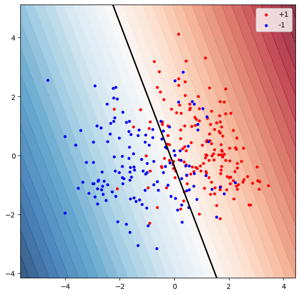
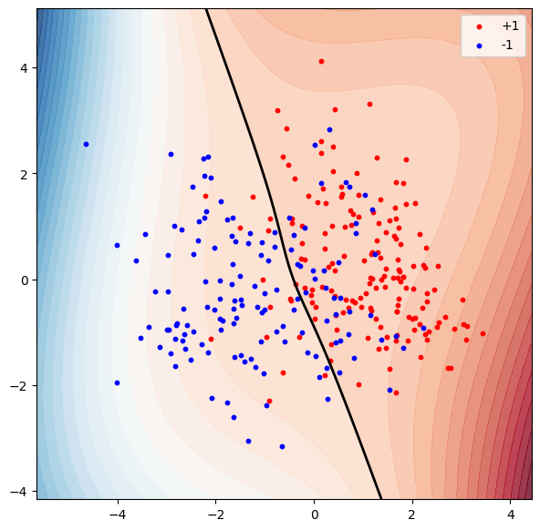
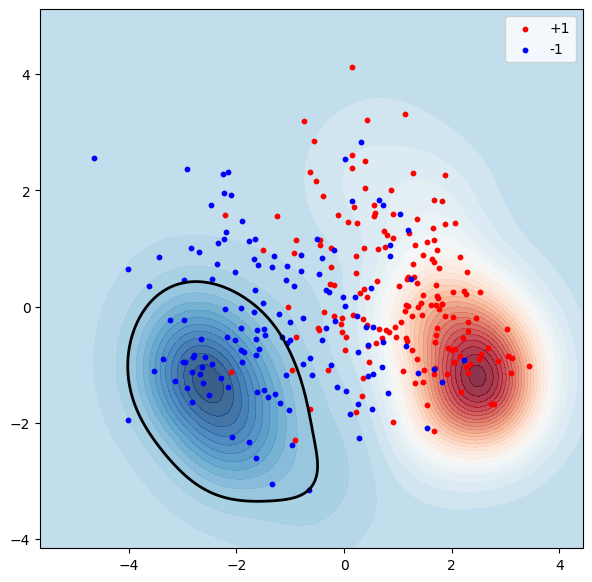

# Лабораторная работа №3 (SVM)

Задача: реализовать SVM и сравнить с эталонной реализацией алгоритма для решения задачи бинарной классификации.

## Навигация по директориям и файлам

- images - каталог с изображениями графиков, полученных в результате с экспериментов с моделями;
- source - директория с файлами исходного кода;
    - svm_dual.py - файл с реализацией алгоритма опорных векторов и решения двойственной задачи;
    - visualize.py - файл c вспомогательными функциями для визуализации;
    - experiments.py - файл с различными экспериментами с моделямии;

# Отчет по проделанной работе

## Выбранный датасет

Задача бинарной классификации болезни средца [https://www.kaggle.com/datasets/yasserh/heart-disease-dataset]

Датасет без пропусков, значения таргета приведены к виду -1 / 1, дополнительная предобработка не проводилась.

### Теория и реализация
Для решения задачи классификации линейно неразделимых данных, с помощью линейного метода опорных векторов воспользуемся kernel trick, переведем параметры в новое линейно разделимое пространство с помощью нелинейных ядер.

В рамках работы определены три ядра:
- линейное ядро;
- полиномиальное ядро;
- ядро на основе радиально-базисной функции, функции Гаусса;

Решение фукнции Лагранжа представлено как решение двойственной задачи с минимизацией по лямбде с помощью функции scipy.optimize.minimize().

Для валидации работы собственных алгоритмов будет произведено сравнения с эталонной реализацией из библиотеки scikit-learn.

## Ход работы 

Гиперпараметры для собственных и эталлонных алгоритмов одинаковы.

### Эксперимент № 1 (Эталоны)

Accuracy:

- Линейное ядро: **0.855**;
- Полиномиальное ядро: **1.0**;
- RBF ядро: **1.0**;

Как видно по результам работы алгоримов, благодаря использованию нелинейных ядер алгоритм SVM смог однозначно разделить выборку на два класса.

### Эксперимент № 2 (Собственная реализация)

Accuracy:

- Линейное ядро: **0.855**;
- Полиномиальное ядро: **1.0**;
- RBF ядро: **1.0**;

Метрики по собственной реализации полностью сошлись с метриками по эталонному алгоритму SVM из фреймворка scikit-learn.

## Визуализация

Для визуалиазции в двумерном пространстве был реализован следующий алгоритм:

1. Находим две главные компоненты с помощью PCA
2. Выборка X проецируется на получившеся двумерное пространство
3. Строим координатную сетку с помощью метода numpy.meshgrid
4. Проецируем получившуюся сетку в исходное пространство
5. Определяем значения решающей функции SVM для каждой точки
6. Визуализируем точки и классы на двумерной сетке

**Важно отметить что визуализация не точная, используется всего две компоненты, которые не могут описать всю дисперсию данных. По-сути мы смотрим на работу SVM в двумерном подпространстве исходных данных.**

### Линейное ядро

### Полиномиальное ядро

### RBF ядро

## Выводы по работе

В результате выполнения лабораторной работы был реализован функционал алгоритма классификации SVM на основе трех ядер: линейного, полиномиального и на основе ядра радиально базисной функции (RBF). Проведены несколько экспериментов, результаты которых были интерпретированы с точки зрения теории, в частности, применение нелинейных ядер позволяет решать задачи классификации изначально линейно-неразделимых данных линейными методами. Разработанный алгоритм продемонстрировала ту же точность, что и у алгоритма SVM из scikit-learn, что говорит о правильно реализации алгоритма.