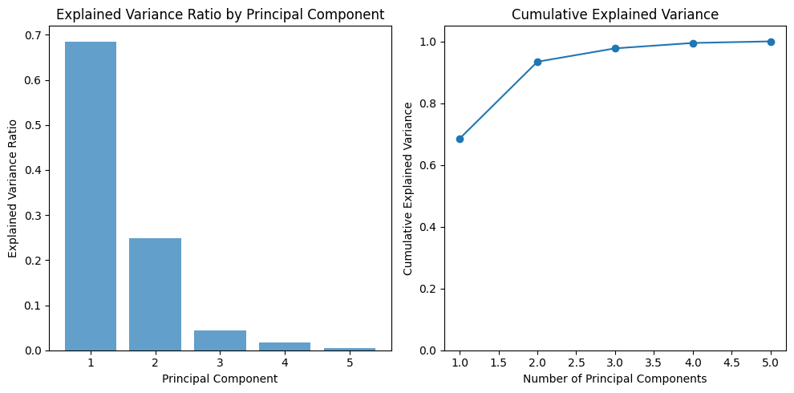
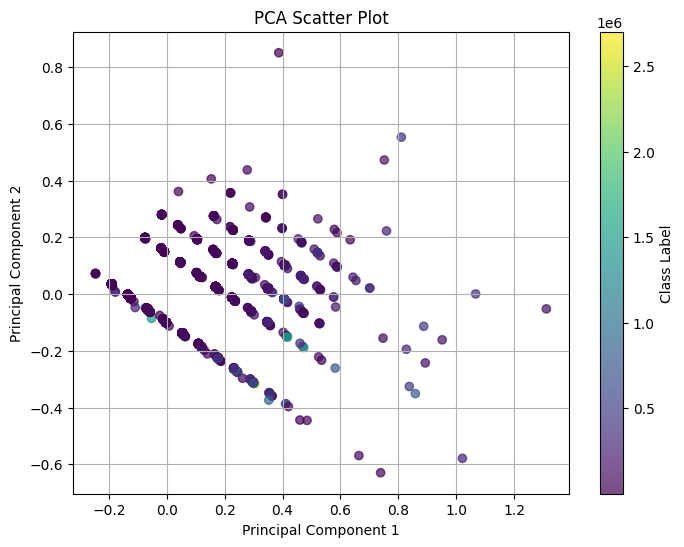

# Лабораторная работа №4 (PCA)

Задача: В рамках лабораторной работы предстоит реализовать PCA и сравнить с эталонной реализацией алгоритма.

## Навигация по директориям и файлам

- images - каталог с изображениями графиков, полученных в результате с экспериментов с моделями;
- source - директория с файлами исходного кода;
    - experiments.py - исходный код с экспериментами
    - pca.py - код для алгоритма МГК
    - visualize.py - код для визуализации

# Отчет по проделанной работе

## Выбранный датасет

Задача регрессии по предсказанию стоимости домов в индии [https://www.kaggle.com/datasets/pranavshinde36/india-house-rent-prediction]

В качестве предобработки были удалены столбцы с категориальными признаками для более простой интерпретации работы алгоритмов.

### Теория и реализация
Алгоритм отбора главных компонент (PCA) - мощный инструмент для поиска линейно-зависимых данных и устранения проблемы мультиколлинеарности, также часто использующийся для визуализации данных.

## Ход работы 

Гиперпараметры для эталонного алгоритма PCA в scikit-learn и собственного алгоитма одинаковы. Требование к доле объясненной дисперсии: 95%;

### Эксперимент № 1 проба линейного регрессора

Accuracy:

- Train: **0.536**;
- Test: **0.336**;

### Эксперимент № 2 Применение собственного PCA

Выбранное число компонент:
- 3;

Accuracy:
- Train: **.298**;
- Test: **0.319**;

### Эксперимент № 3 Применение эталонного PCA

Выбранное число компонент:
- 3;

Accuracy:
- Train: **.298**;
- Test: **0.319**;

## Визуализация

### Доля объясненной дисперсии после собственного PCA

### Визуализация первых двух компонент собственного PCA

### Визуализация первых двух компонент эталонного PCA

## Выводы по работе

В результате выполнения лабораторной работы был реализован функционал метода главных компонент (PCA). Алгоритм работает верно, полностью сходится с эталонной реализацией. Для тестирования алгоритмов был выбран алгоритм линейной регресии. Важно упомнуть, что доля объясненной дисперсии и была равна 95%, алгоритм, после PCA, стал выдывать точность ниже чем до преобразования, а значит были потеряны важные предикторы с малой долей объясненной дисперсии.